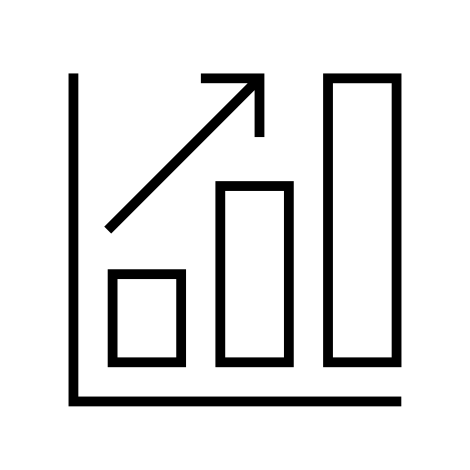
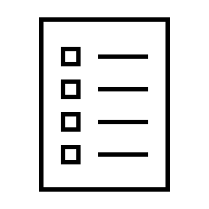
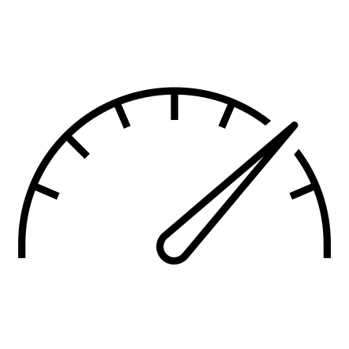

# NVIDIA PhysicsNeMo

<!-- markdownlint-disable -->

📝 NVIDIA Modulus has been renamed to NVIDIA PhysicsNeMo

[](https://www.repostatus.org/#active)
[](https://github.com/NVIDIA/physicsnemo/blob/master/LICENSE.txt)
[](https://github.com/psf/black)
<!-- markdownlint-enable -->
[**Getting Started**](#getting-started)
| [**Install guide**](#installation)
| [**Contributing Guidelines**](#contributing-to-physicsnemo)
| [**Resources**](#resources)
| [**PhysicsNeMo Migration Guide**](#physicsnemo-migration-guide)
| [**Communication**](#communication)
| [**License**](#license)

## What is PhysicsNeMo?

NVIDIA PhysicsNeMo is an open-source deep-learning framework for building, training,
and fine-tuning deep learning models using state-of-the-art SciML methods for
AI4science and engineering.

PhysicsNeMo provides utilities and optimized pipelines to develop AI models that combine
physics knowledge with data, enabling real-time predictions.

Whether you are exploring the use of Neural operators, GNNs, or transformers or are
interested in Physics-informed Neural Networks or a hybrid approach in between, PhysicsNeMo
provides you with an optimized stack that will enable you to train your models at scale.

<!-- markdownlint-disable -->
<p align="center">
  
</p>
<!-- markdownlint-enable -->

<!-- toc -->

- [More About PhysicsNeMo](#more-about-physicsnemo)
  - [Scalable GPU-optimized training Library](#scalable-gpu-optimized-training-library)
  - [A suite of Physics-Informed ML Models](#a-suite-of-physics-informed-ml-models)
  - [Seamless PyTorch Integration](#seamless-pytorch-integration)
  - [Easy Customization and Extension](#easy-customization-and-extension)
  - [AI4Science Library](#ai4science-library)
    - [Domain Specific Packages](#domain-specific-packages)
- [Who is contributing to PhysicsNeMo](#who-is-using-and-contributing-to-physicsnemo)
- [Why use PhysicsNeMo](#why-are-they-using-physicsnemo)
- [Getting Started](#getting-started)
- [Resources](#resources)
- [Installation](#installation)
- [Contributing](#contributing-to-physicsnemo)
- [Communication](#communication)
- [License](#license)
  
<!-- tocstop -->

## More About PhysicsNeMo

At a granular level, PhysicsNeMo provides a library of a few key components:

<!-- markdownlint-disable -->
Component | Description |
---- | --- |
[**physicsnemo.models**](https://docs.nvidia.com/deeplearning/physicsnemo/physicsnemo-core/api/physicsnemo.models.html) | A collection of optimized, customizable, and easy-to-use models such as Fourier Neural Operators, Graph Neural Networks, and many more|
[**physicsnemo.datapipes**](https://docs.nvidia.com/deeplearning/physicsnemo/physicsnemo-core/api/physicsnemo.datapipes.html) | A data pipeline and data loader library, including benchmark datapipes, weather daptapipes, and graph datapipes|
[**physicsnemo.distributed**](https://docs.nvidia.com/deeplearning/physicsnemo/physicsnemo-core/api/physicsnemo.distributed.html) | A distributed computing library build on top of `torch.distributed` to enable parallel training with just a few steps|
[**physicsnemo.sym.geometry**](https://docs.nvidia.com/deeplearning/physicsnemo/physicsnemo-sym/user_guide/features/csg_and_tessellated_module.html) | A library to handle geometry for DL training using the Constructive Solid Geometry modeling and CAD files in STL format.|
[**physicsnemo.sym.eq**](https://docs.nvidia.com/deeplearning/physicsnemo/physicsnemo-sym/user_guide/features/nodes.html) | A library to use PDEs in your DL training with several implementations of commonly observed equations and easy ways for customization.|
<!-- markdownlint-enable -->

For a complete list, refer to the PhysicsNeMo API documentation for
[PhysicsNeMo Core](https://docs.nvidia.com/deeplearning/physicsnemo/physicsnemo-core/index.html)
and
[PhysicsNeMo Sym](https://docs.nvidia.com/deeplearning/physicsnemo/physicsnemo-sym/api/api_index.html).

Usually, PhysicsNeMo is used either as:

- A complementary tool to Pytorch when exploring AI for SciML and AI4Science applications.
- A deep learning research platform that provides scale and optimal performance on
NVIDIA GPUs.

Elaborating Further:

### Scalable GPU-optimized training Library

PhysicsNeMo provides a highly optimized and scalable training library for maximizing the
power of NVIDIA GPUs.
[Distributed computing](https://docs.nvidia.com/deeplearning/physicsnemo/physicsnemo-core/api/physicsnemo.distributed.html)
utilities allow for efficient scaling from a single GPU to multi-node GPU clusters with
a few lines of code, ensuring that large-scale.
physics-informed machine learning (ML) models can be trained quickly and effectively.
The framework includes support for advanced.
[optimization utilities](https://docs.nvidia.com/deeplearning/physicsnemo/physicsnemo-core/api/physicsnemo.utils.html#module-physicsnemo.utils.capture),
[tailor made datapipes](https://docs.nvidia.com/deeplearning/physicsnemo/physicsnemo-core/api/physicsnemo.datapipes.html),
[validation utilities](https://github.com/NVIDIA/physicsnemo-sym/tree/main/physicsnemo/sym/eq)
to enhance the end to end training speed.

### A suite of Physics Informed ML Models

PhysicsNeMo offers a comprehensive library of state-of-the-art models specifically designed
for physics-ML applications.
The [Model Zoo](https://docs.nvidia.com/deeplearning/physicsnemo/physicsnemo-core/api/physicsnemo.models.html#model-zoo)
includes generalizable model architectures such as
[Fourier Neural Operators (FNOs)](physicsnemo/models/fno),
[DeepONet](https://docs.nvidia.com/deeplearning/physicsnemo/physicsnemo-sym/user_guide/neural_operators/deeponet.html),
[Physics-Informed Neural Networks (PINNs)](https://docs.nvidia.com/deeplearning/physicsnemo/physicsnemo-sym/user_guide/foundational/1d_wave_equation.html),
[Graph Neural Networks (GNNs)](physicsnemo/models/gnn_layers),
and generative AI models like [Diffusion Models](physicsnemo/models/diffusion)
as well as domain-specific models such as [Deep Learning Weather Prediction (DLWP)](physicsnemo/models/dlwp)
and [Super Resolution Network (SrNN)](physicsnemo/models/srrn) among others.
These models are optimized for various physics domains, such as computational fluid
dynamics, structural mechanics, and electromagnetics. Users can download, customize, and
build upon these models to suit their specific needs, significantly reducing the time
required to develop high-fidelity simulations.

### Seamless PyTorch Integration

PhysicsNeMo is built on top of PyTorch, providing a familiar and user-friendly experience
for those already proficient with PyTorch.
This includes a simple Python interface and modular design, making it easy to use
PhysicsNeMo with existing PyTorch workflows.
Users can leverage the extensive PyTorch ecosystem, including its libraries and tools
while benefiting from PhysicsNeMo's specialized capabilities for physics-ML. This seamless
integration ensures users can quickly adopt PhysicsNeMo without a steep learning curve.

For more information, refer [Converting PyTorch Models to PhysicsNeMo Models](https://docs.nvidia.com/deeplearning/physicsnemo/physicsnemo-core/api/physicsnemo.models.html#converting-pytorch-models-to-physicsnemo-models)

### Easy Customization and Extension

PhysicsNeMo is designed to be highly extensible, allowing users to add new functionality
with minimal effort. The framework provides Pythonic APIs for
defining new physics models, geometries, and constraints, making it easy to extend its
capabilities to new use cases.
The adaptability of PhysicsNeMo is further enhanced by key features such as
[ONNX support](https://docs.nvidia.com/deeplearning/physicsnemo/physicsnemo-core/api/physicsnemo.deploy.html)
for flexible model deployment,
robust [logging utilities](https://docs.nvidia.com/deeplearning/physicsnemo/physicsnemo-core/api/physicsnemo.launch.logging.html)
for streamlined error handling,
and efficient
[checkpointing](https://docs.nvidia.com/deeplearning/physicsnemo/physicsnemo-core/api/physicsnemo.launch.utils.html#module-physicsnemo.launch.utils.checkpoint)
to simplify model loading and saving.

This extensibility ensures that PhysicsNeMo can adapt to the evolving needs of researchers
and engineers, facilitating the development of innovative solutions in the field of physics-ML.

Detailed information on features and capabilities can be found in the [PhysicsNeMo documentation](https://docs.nvidia.com/physicsnemo/index.html#core).

[Reference samples](examples/README.md) cover a broad spectrum of physics-constrained
and data-driven
workflows to suit the diversity of use cases in the science and engineering disciplines.

> [!TIP]
> Have questions about how PhysicsNeMo can assist you? Try our [Experimental] chatbot,
> [PhysicsNeMo Guide](https://chatgpt.com/g/g-PXrBv20SC-modulus-guide), for answers.

### Hello world

You can start using PhysicsNeMo in your PyTorch code as simple as shown here:

```python
python
>>> import torch
>>> from physicsnemo.models.mlp.fully_connected import FullyConnected
>>> model = FullyConnected(in_features=32, out_features=64)
>>> input = torch.randn(128, 32)
>>> output = model(input)
>>> output.shape
torch.Size([128, 64])
```

### AI4Science Library

- [PhysicsNeMo Symbolic](https://github.com/NVIDIA/physicsnemo-sym): This repository of
  algorithms and utilities allows SciML researchers and developers to physics inform model
  training and model validation. It also provides a higher level abstraction
  for domain experts that is native to science and engineering.

#### Domain Specific Packages

The following are packages dedicated for domain experts of specific communities catering
to their unique exploration needs.

- [Earth-2 Studio](https://github.com/NVIDIA/earth2studio): Open source project
  to enable climate researchers and scientists to explore and experiment with
  AI models for weather and climate.

#### Research packages

The following are research packages that get packaged into PhysicsNeMo once they are stable.

- [PhysicsNeMo Makani](https://github.com/NVIDIA/modulus-makani): Experimental library
  designed to enable the research and development of machine-learning based weather and
  climate models.
- [Earth2 Grid](https://github.com/NVlabs/earth2grid): Experimental library with
  utilities for working geographic data defined on various grids.
- [Earth-2 MIP](https://github.com/NVIDIA/earth2mip): Experimental library with
  utilities for model intercomparison for weather and climate models.

## Who is using and contributing to PhysicsNeMo

PhysicsNeMo is an open source project and gets contributions from researchers in
the SciML and AI4science fields. While PhysicsNeMo team works on optimizing the
underlying SW stack, the community collaborates and contributes model architectures,
datasets, and reference applications so we can innovate in the pursuit of
developing generalizable model architectures and algorithms.

Some latest examples of community contributors are [HP Labs 3D Printing team](https://developer.nvidia.com/blog/spotlight-hp-3d-printing-and-nvidia-physicsnemo-collaborate-on-open-source-manufacturing-digital-twin/),
[Stanford Cardiovascular research team](https://developer.nvidia.com/blog/enabling-greater-patient-specific-cardiovascular-care-with-ai-surrogates/),
[UIUC team](https://github.com/NVIDIA/physicsnemo/tree/main/examples/cfd/mhd_pino),
[CMU team](https://github.com/NVIDIA/physicsnemo/tree/main/examples/generative/diffusion)
etc.

Latest examples of research teams using PhysicsNeMo are
[ORNL team](https://arxiv.org/abs/2404.05768),
[TU Munich CFD team](https://www.nvidia.com/en-us/on-demand/session/gtc24-s62237/) etc.

Please navigate to this page for a complete list of research work leveraging PhysicsNeMo.
For a list of enterprises using PhysicsNeMo refer [here](https://developer.nvidia.com/physicsnemo).

Using PhysicsNeMo and interested in showcasing your work on
[NVIDIA Blogs](https://developer.nvidia.com/blog/category/simulation-modeling-design/)?
Fill out this [proposal form](https://forms.gle/XsBdWp3ji67yZAUF7) and we will get back
to you!

## Why are they using PhysicsNeMo

Here are some of the key benefits of PhysicsNeMo for SciML model development:

<!-- markdownlint-disable -->
 |  | 
---|---|---|
|SciML Benchmarking and validation|Ease of using generalized SciML recipes with heterogenous datasets |Out of the box performance and scalability
|PhysicsNeMo enables researchers to benchmark their AI model against proven architectures for standard benchmark problems with detailed domain-specific validation criteria.|PhysicsNeMo enables researchers to pick from SOTA SciML architectures and use built-in data pipelines for their use case.| PhysicsNeMo provides out-of-the-box performant training pipelines including optimized ETL pipelines for heterogrneous engineering and scientific datasets and out of the box scaling across multi-GPU and multi-node GPUs.
<!-- markdownlint-enable -->

See what your peer SciML researchers are saying about PhysicsNeMo (Coming soon).

## Getting started

The following resources will help you in learning how to use PhysicsNeMo. The best
way is to start with a reference sample and then update it for your own use case.

- [Using PhysicsNeMo with your PyTorch model](https://docs.nvidia.com/deeplearning/physicsnemo/physicsnemo-core/tutorials/simple_training_example.html#using-custom-models-in-physicsnemo)
- [Using PhysicsNeMo built-in models](https://docs.nvidia.com/deeplearning/physicsnemo/physicsnemo-core/tutorials/simple_training_example.html#using-built-in-models)
- [Getting started Guide](https://docs.nvidia.com/deeplearning/physicsnemo/getting-started/index.html)
- [Reference Samples](https://github.com/NVIDIA/physicsnemo/blob/main/examples/README.md)
- [User guide Documentation](https://docs.nvidia.com/deeplearning/physicsnemo/physicsnemo-core/index.html)

## Resources

- [Getting started Webinar](https://www.nvidia.com/en-us/on-demand/session/gtc24-dlit61460/?playlistId=playList-bd07f4dc-1397-4783-a959-65cec79aa985)
- [AI4Science PhysicsNeMo Bootcamp](https://github.com/openhackathons-org/End-to-End-AI-for-Science)
- [PhysicsNeMo Pretrained models](https://catalog.ngc.nvidia.com/models?filters=&orderBy=scoreDESC&query=Modulus&page=&pageSize=)
- [PhysicsNeMo Datasets and Supplementary materials](https://catalog.ngc.nvidia.com/resources?filters=&orderBy=scoreDESC&query=Modulus&page=&pageSize=)
- [Self-paced PhysicsNeMo DLI training](https://learn.nvidia.com/courses/course-detail?course_id=course-v1:DLI+S-OV-04+V1)
- [Deep Learning for Science and Engineering Lecture Series with PhysicsNeMo](https://www.nvidia.com/en-us/on-demand/deep-learning-for-science-and-engineering/)
  - [PhysicsNeMo: purpose and usage](https://www.nvidia.com/en-us/on-demand/session/dliteachingkit-setk5002/)
- [Video Tutorials](https://www.nvidia.com/en-us/on-demand/search/?facet.mimetype[]=event%20session&layout=list&page=1&q=modulus&sort=relevance&sortDir=desc)
  
## Installation

### PyPi

The recommended method for installing the latest version of PhysicsNeMo is using PyPi:

```Bash
pip install nvidia-physicsnemo
```

The installation can be verified by running the hello world example as demonstrated [here](#hello-world).

#### Optional dependencies

PhysicsNeMo has many optional dependencies that are used in specific components.
When using pip, all dependencies used in PhysicsNeMo can be installed with
`pip install nvidia-physicsnemo[all]`. If you are developing PhysicsNeMo, developer dependencies
can be installed using `pip install nvidia-physicsnemo[dev]`. Otherwise, additional dependencies
can be installed on a case by case basis. Detailed information on installing the
optional dependencies can be found in the
[Getting Started Guide](https://docs.nvidia.com/deeplearning/physicsnemo/getting-started/index.html).

### NVCR Container

The recommended PhysicsNeMo docker image can be pulled from the
[NVIDIA Container Registry](https://catalog.ngc.nvidia.com/orgs/nvidia/teams/physicsnemo/containers/physicsnemo)
(refer to the NGC registry for the latest tag):

```Bash
docker pull nvcr.io/nvidia/physicsnemo/physicsnemo:25.03
```

Inside the container, you can clone the PhysicsNeMo git repositories and get
started with the examples. The below command shows the instructions to launch
the physicsnemo container and run examples from this repo.

```bash
docker run --shm-size=1g --ulimit memlock=-1 --ulimit stack=67108864 --runtime nvidia \
--rm -it nvcr.io/nvidia/physicsnemo/physicsnemo:25.03 bash
git clone https://github.com/NVIDIA/physicsnemo.git
cd physicsnemo/examples/cfd/darcy_fno/
pip install warp-lang # install NVIDIA Warp to run the darcy example
python train_fno_darcy.py
```

For enterprise supported NVAIE container, refer [PhysicsNeMo Secured Feature Branch](https://catalog.ngc.nvidia.com/orgs/nvidia/teams/modulus/containers/modulus-sfb)

## From Source

### Package

For a local build of the PhysicsNeMo Python package from source use:

```Bash
git clone git@github.com:NVIDIA/physicsnemo.git && cd physicsnemo

pip install --upgrade pip
pip install .
```

### Source Container

To build PhysicsNeMo docker image:

```bash
docker build -t physicsnemo:deploy \
    --build-arg TARGETPLATFORM=linux/amd64 --target deploy -f Dockerfile .
```

Alternatively, you can run `make container-deploy`

To build CI image:

```bash
docker build -t physicsnemo:ci \
    --build-arg TARGETPLATFORM=linux/amd64 --target ci -f Dockerfile .
```

Alternatively, you can run `make container-ci`.

Currently, only `linux/amd64` and `linux/arm64` platforms are supported. If using
`linux/arm64`, some dependencies like `warp-lang` might not install correctly.

## PhysicsNeMo Migration Guide

NVIDIA Modulus has been renamed to NVIDIA PhysicsNeMo. For migration:

- Use `pip install nvidia-physicsnemo` rather than `pip install nvidia-modulus`
  for PyPi wheels.
- Use `nvcr.io/nvidia/physicsnemo/physicsnemo:<tag>` rather than
  `nvcr.io/nvidia/modulus/modulus:<tag>` for Docker containers.
- Replace `nvidia-modulus` by `nvidia-physicsnemo` in your pip requirements
  files (`requirements.txt`, `setup.py`, `setup.cfg`, `pyproject.toml`, etc.)
- In your code, change the import statements from `import modulus` to
  `import physicsnemo`

The old PyPi registry and the NGC container registry will be deprecated soon
and will not receive any bug fixes/updates. The old checkpoints will remain
compatible with these updates.

More details to follow soon.

## Contributing to PhysicsNeMo

PhysicsNeMo is an open source collaboration and its success is rooted in community
contribution to further the field of Physics-ML. Thank you for contributing to the
project so others can build on top of your contribution.

For guidance on contributing to PhysicsNeMo, please refer to the
[contributing guidelines](CONTRIBUTING.md).

## Cite PhysicsNeMo

If PhysicsNeMo helped your research and you would like to cite it, please refer to the [guidelines](https://github.com/NVIDIA/physicsnemo/blob/main/CITATION.cff)

## Communication

- Github Discussions: Discuss new architectures, implementations, Physics-ML research, etc.
- GitHub Issues: Bug reports, feature requests, install issues, etc.
- PhysicsNeMo Forum: The [PhysicsNeMo Forum](https://forums.developer.nvidia.com/t/welcome-to-the-physicsnemo-ml-model-framework-forum/178556)
hosts an audience of new to moderate-level users and developers for general chat, online
discussions, collaboration, etc.

## Feedback

Want to suggest some improvements to PhysicsNeMo? Use our feedback form
[here](https://docs.google.com/forms/d/e/1FAIpQLSfX4zZ0Lp7MMxzi3xqvzX4IQDdWbkNh5H_a_clzIhclE2oSBQ/viewform?usp=sf_link).

## License

PhysicsNeMo is provided under the Apache License 2.0, please see [LICENSE.txt](./LICENSE.txt)
for full license text. Enterprise SLA, support and preview access are available
under NVAIE.
