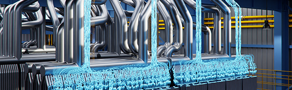

# Modulus (Alpha)

[](https://www.repostatus.org/#wip)
[](https://github.com/NVIDIA/modulus/blob/master/LICENSE.txt)
[](https://github.com/psf/black)

Modulus is a PyTorch based deep-learning toolkit for developing deep learning models for physical systems. This package aims to provide useful utilities for physics-constrained and data-driven workflows.

**This is an early-access alpha release**

<p align="center">
  
</p>

## Modulus Packages

- [Modulus (Alpha)](https://github.com/NVIDIA/modulus)
- [Modulus Launch (Alpha)](https://github.com/NVIDIA/modulus-launch)
- [Modulus Symbolic (Alpha)](https://github.com/NVIDIA/modulus-sym)

## Installing 

Modulus is coming to PyPi soon! In the mean time the best way is to install from source:

```Bash
git clone git@github.com:NVIDIA/modulus.git && cd modulus

pip install --upgrade pip
pip install .
```

## Contributing

Modulus is in an open-source alpha. We are not accepting external contributions at this time.

## Contact

Reach out to Modulus team members and user community on the [NVIDIA developer forums](https://forums.developer.nvidia.com/c/physics-simulation/modulus-physics-ml-model-framework).

## License
Modulus is provided under the Apache License 2.0, please see [LICENSE.txt](./LICENSE.txt) for full license text.