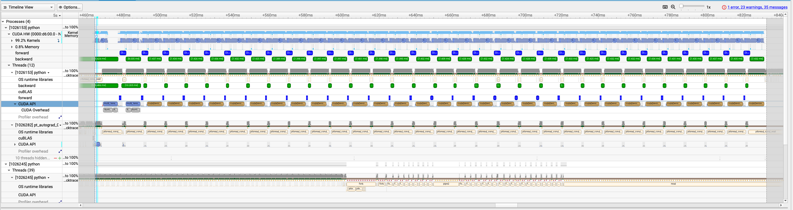

Profiling Applications in PhysicsNeMo
======================================

In this tutorial, we'll learn about profiling your scientific AI applications in PhysicsNeMo.
First, we'll discuss the high-level philosophy of profiling AI applications, then get 
in to the profiling tools available to understand performance.  We'll look at the 
features available in physicsnemo to deploy these tools easily on your model, and finally
we'll walk through a full example of profiling a PhysicsNeMo model (FigConvNet) with these 
tools.

Profiling Techniques
---------------------

Before we get in to the details of profiling AI applications in PhysicsNeMo, it's worth
discussing a few general techniques and terminologies of profiling - and especially 
how they relate to profiling AI applications and PhysicsNeMo.  There are some links
to other resources here as well, and deeper resources on profiling are abudant.  For 
example, 
`Nvidia's Nsight User Guide <https://docs.nvidia.com/nsight-systems/UserGuide/index.html>`_
is a useful reference for the many options available.  In many profiling guides, you'll
find the following terms discussed:

* **Profiling Overhead** When you run an application with profiling enabled, 
  be aware that you are nearly always *changing* the application and it's performance.
  The amount an application's performance is affected by the profiling tools is often
  called the **profiling overhead** and can, potentially, skew profiling results
  and conclusions.  In many cases, this is just fine and even necessary.  
  In general, profiling tools try to limit performance overhead. For AI applications,
  overhead can vary by profiling tool (python vs. lower-level profilers, for example)
  as well the type of profiler (sampling, tracing, or another)

* **Hotspots** in an application are performance critical regions that the application
  spends significant time in.  Application optimization is a data-driven endeavor, 
  and the **hotspots** of an application are typically the highest priority code regions
  for optimization.  The goal of profiling is first to discover hotspots, and subsequently
  to find optimizations and measure their impact.  For AI Applications, hotspots
  can take many forms and not all can be found in one pass.  As an example, a poorly
  configured dataloader can easily stall an AI application by starving the GPU
  of data.  In this case, no amount of CUDA optimization will make a significant
  impact on application performance.  On the other hand, if your application
  uses custom kernels or experimental features, they may be a hotspot and target 
  for tuning.  These two examples typically require separate profiling tools 
  to discover effectively in AI applications.

* **Sampling** is the process of periodically asking an application, "What are 
  you doing right now?".  Sampling-based profiling techniques can be very powerful:
  they are low-overhead (small impact on application's performance) and when 
  analyzed with statistical methods, they can quickly identify hotspots.  Sampling
  can sometimes be considered a "bottom-up" view of an application.  Profilers with
  sampling capabilities include 
  `Nvidia's Nsight <https://developer.nvidia.com/nsight-systems>`_,
  `HPCToolkit <https://hpctoolkit.org/index.html>`_,
  `Tau <https://www.cs.uoregon.edu/research/tau/home.php>`_,
  `Scalene <https://github.com/plasma-umass/scalene>`_, and many others.  For AI
  applications, sampling both Python and CUDA code can be beneficial.

* **Tracing** an application is the "top-down" profiling of an application and 
  the logical opposite of sampling.  When **tracing** an application, the profilers
  follow execution call paths and measure execution time.  Depending on the 
  application, tracing can have a relatively high overhead but also provides
  more detailed information for function execution times.  A common and useful
  tracing tool in AI Applications if the profiler built in to 
  `pytorch <https://pytorch.org/tutorials/recipes/recipes/profiler_recipe.html>`_
  but other tools also offer tracing capabilities: 
  `Nvidia's Nsight <https://developer.nvidia.com/nsight-systems>`_,
  Python's built-in `CProfile <https://docs.python.org/3/library/profile.html>`_,
  and others.

* **Instrumentation** is the act of modifying your code to produce more useful 
  profiling results.  A familiar and accesible (but not recommended) method of
  **instrumentation** is to simply wrap your code blocks of interest in timing-
  measuring logic (like using `std::chrono::steady_clock::time_point` in C++
  or `time.perf_countner()` in Python).
  Instrumentation can sometimes be done semi-automatically,
  though even in those cases it often requires programmer intervention to insert
  (and later, possibly, remove) instrumentation.  A useful instrumentation tool 
  for Python level code is, for example, 
  `line_profiler <https://github.com/pyutils/line_profiler>`_
  which requires manually decorating functions to be profiled, and executing them
  in a specific context.

* **Annotations** are a 
  common and useful type of instrumentation: programmers can **annotate** their
  application with sensible, user-friendly names and regions to more easily
  detangle the results of profiling and map back to application code.  One of the 
  most useful annotation tools in AI Applications is `Nvidia's Tools Extension
  Library <https://github.com/NVIDIA/NVTX>`_, available in both C and Python.
  Annotations are also useful for marking regions or events of specific interest.

* **Application Timelines** are a visual representation of an application's 
  operations, as well as the order they are executed and - potentially - visualization
  of idle time and unusued compute resources.  Often the **timeline** is the end 
  product of a profiler (though not always) and robust visualization tools
  such as `Nsight <https://developer.nvidia.com/nsight-systems>`_ as well as 
  the `Perfetto Viewer <https://perfetto.dev/>`_ built into chrome can be
  critical to producing actionable output when profiling.

* **Asynchronous Execution and Concurrency** is an incredibly powerful tool 
  for obtaining high application performance, but also a potential challenge 
  in capturing application profiles and reliably detecting hotspots and 
  performance bottlenecks.  Specifically, **concurrency** can mislead you in analyzing
  total time spent in functions (does a function with 100x calls more than 
  another function constitute a bottleneck?  Are they all running and 
  finishing concurrently?), while **asynchronous execution** can lead you 
  to the wrong conclusions in sampling-based profiling methods.  A very important
  example of this, in AI Application performance measurements, is the fact
  that Pytorch submits kernels to GPUs asynchronously and returns control flow
  to python immediately, and imperatively.  This can lead to situations where one
  pytorch operation, `B` is awaiting the output of another operation `A` as input.
  A python-level, sampling-based profile will indicate that the application is 
  spending too much time in operation `B`, while the reality may be that kernel `A`
  is the true hotspot.  Mixed-language tracing tools, such as pytorch's own 
  `profiler <https://pytorch.org/tutorials/recipes/recipes/profiler_recipe.html>`_,
  are powerful ways to visualize

Profiling AI Applications and PhysicsNeMo
------------------------------------------

As described in brief above, many of the tools and tricks of profiling applications
have corner cases and sharp edges when applied to AI Applications.  First and foremost,
the incredible benefits of executing GPU kernels asynchronously leads to misleading
conclusions about hotspots if you use the wrong tool.  Second, 
mixed-language applications like Python + C++ + CUDA seen in most AI workloads can make
it challenging to see entire application performance at once.  

Because of these challenges, and because the end goal of profiling is to study an
application to determine hotspots that the user can take action on, profiling AI
workloads almost always employs multiple tools in multiple passes.  In PhysicsNeMo, we have
designed profiling tool integration to make profiling your workloads straightforward,
without introducing additional overhead, and we've designed these tools to be "leave-in".

In the rest of this tutororial, we'll look at how to use PhysicsNeMo's profiling tools to 
profile a simple application, as well as how to extend the tools to new profilers.
PhysicsNeMo's tools are designed to be inserted into your workload once, and generally
provide no significant overhead (or even do anything at all!) until enabled.

PhysicsNeMo Profiling Tools
^^^^^^^^^^^^^^^^^^^^^^^^^^^^

PhysicsNeMo provides three high level tools for profiling utilities:

.. code-block:: python

    from physicsnemo.utils.profiling import Profiler, profile, annotate

We'll get more into the details of some of these tools later, but at a high level:

* The `Profiler` is the core utility of `physicsnemo`'s profiling features.
  Similar to the `physicsnemo` DistributedManager, this class is a singleton instance
  designed to enable easy access to profiling handles and propogate configurations.
  The Profiler is meant to be your steering wheel for driving different profiling
  techniques, without having to go into your code and change annotations or decorations.
  We'll see how to enable the profiler with different techniques below. An instance of the 
  PhysicsNeMo Profiler can be used as a context for profiling.

* `profile` is a function decorator that you can use to mark specific functions
  in your code for profiling.  It is targeting tools like python's `line_profiler`
  utility, and generally most useful for python operations that aren't backed by
  an asynchronous backend like CUDA.  You can freely decorate functions with 
  `@profile` but it is not a context manager.  `@profile` takes no arguments.

* `annotate` is context-decorator and shortcut to `nvtx` annotations.
  `annotate` can also be used as a context just like `nvtx.annotate`.

The Workload
^^^^^^^^^^^^

This is a toy workload, using an Attention layer on randomly generated data. But, to
make it look like the tools you're familiar with in PhysicsNeMo, it is configured with
Hydra and uses the usual tools (Pytorch Dataloader, for example).  Here's the workload:

.. literalinclude:: ../test_scripts/profiling/original_code/workload.py
    :language: python

The Attention layer is fairly simple:

.. literalinclude:: ../test_scripts/profiling/original_code/attn.py
    :language: python

And the dataset is even more crude, using randomly generated data from numpy:

.. literalinclude:: ../test_scripts/profiling/original_code/dataset.py
    :language: python

The results below are captured on an A100 platform, using the 25.01 pytorch container.
To run the workload, you'll need hydra installed (`pip install hydra-core`).

Baseline measurements
^^^^^^^^^^^^^^^^^^^^^

One small piece of instrumentation this code already does - as many training models do -
is to instrument the main loop to capture the time it takes per batch.  The table below captures
some information about the performance as a function of batch size and train/inference.

Training:

+------------+--------------------+----------------------+
| Batch Size | Seconds/Iteration  | Examples/Second      |
+============+====================+======================+
| 1          | 0.039              | 25.530               |
+------------+--------------------+----------------------+
| 2          | 0.072              | 27.964               |
+------------+--------------------+----------------------+
| 4          | 0.147              | 27.295               |
+------------+--------------------+----------------------+
| 8          | 0.289              | 27.642               |
+------------+--------------------+----------------------+

Inference:

+------------+--------------------+----------------------+
| Batch Size | Seconds/Iteration  | Examples/Second      |
+============+====================+======================+
| 1          | 0.030              | 32.935               |
+------------+--------------------+----------------------+
| 2          | 0.062              | 32.223               |
+------------+--------------------+----------------------+
| 4          | 0.130              | 30.835               |
+------------+--------------------+----------------------+
| 8          | 0.258              | 31.044               |
+------------+--------------------+----------------------+

.. note::
    These numbers are approximate measurements and the workload, as written, 
    has some variations in performance.  Dont' worry if your results 
    differ a little - if you're following along with the example, just capture
    your baseline measurements to compare with later!

.. warning::
    These numbers should give you pause.  Most models don't have the
    such similar execution time in training vs. inference mode... 
    We will debug this below!

Python Level Profiling
^^^^^^^^^^^^^^^^^^^^^^

A great place to start when running profiles of AI code is the python level
profilers.  They are quick, easy, and generally low overhead.  PhysicsNeMo
has support to enable `line_profiler` built in - all you might need is to
run `pip install line_profiler` to ensure you've installed the base package too.

Next, take a look at the first instrumented version of the model code, 
compared to the original:

.. code-block:: diff

    *** attn_baseline.py	2025-01-27 07:41:37.749753000 -0800
    --- attn_instrumented.py	2025-01-27 11:27:09.162202000 -0800
    ***************
    *** 1,6 ****
    --- 1,8 ----
      import torch
      from torch import nn

    + from physicsnemo.utils.profiling import profile, annotate
    +
      class Attention(nn.Module):
          """Dummy example Attention mechanism.  Meant not for efficienct computation
          but to show how to use the profiling tools!
    ***************
    *** 26,31 ****
    --- 28,34 ----
              self.proj = nn.Linear(dim, dim)
              self.proj_drop = nn.Dropout(proj_drop)

    +     @profile
          def forward(self, x: torch.Tensor) -> torch.Tensor:

              B, N, C = x.shape
    ***************
    *** 59,64 ****
    --- 62,68 ----
              self.fc2 = nn.Linear(hidden_features, out_features)
              self.drop2 = nn.Dropout(drop)

    +     @profile
          def forward(self, x):
              x = self.fc1(x)
              x = self.gelu(x)
    ***************
    *** 97,102 ****
    --- 101,107 ----
                  drop=proj_drop,
              )

    +     @profile
          def forward(self, x: torch.Tensor) -> torch.Tensor:
              x = x + self.attn(self.norm1(x))
              x = x + self.mlp(self.norm2(x))

As you can see, we added a profile decorator around each forward pass.  Note that
this code will run just fine if you have these annotations but aren't profiling!

If you replace the model code with the instrumented code, nothing
significant will change.  To actually see changes, we have to enable the 
profiling tools dynamically at runtime:

.. code-block:: python

    # configure the profiling tools:
    p = Profiler()
    
    print(p)
    
    for key, val in config.profile.items():
        # This is not the mandatory way to enable tools
        # I've set up the config to have the keys match
        # the registered profilers.  You can do it manually
        # too such as `p.enable("line_profiler")`
        if val: p.enable(key)
    
    # The profiler has to be initilized before use.  Using it in a context
    # will do it automatically, but to use it as a decorator we should do
    # it manually here:
    p.initialize()
    print(p)

    workload(config)

In the instrumented version of the workload, you can see we've even decorated 
the `workload` function itself.

.. note::
    The profiler interface - and all tools it pulls in - is unintialized until
    told otherwise.  If you don't call `p.initialize()`, the profiler will 
    generally do nothing.
 
.. warning::
    The one time the profiler will initialize itself is if you use it as a context!
    Upon entering the context, if the profiler interface isn't initialized
    it will trigger automatically.

Once the profiled run has completed, physicsnemo will automatically deposit the outputs
into a folder `physicsnemo_profiling_ouputs`.

.. note:: 
    You can change the location of the output.  Call `Profiler().output_dir(your_path)`
    before initialization.

Run the workload with python's line profiling enabled (`pip install line_profiler` if you don't have it):

.. code-block:: bash

    python workload.py +profiler.line_profiler=true

Looking into the results, which for line profiler are a text file, we see the `workload`
function breakdown looks like this (for an inference run):

.. code-block:: text

    Total time: 4.54253 s
    File: /root/physicsnemo/docs/test_scripts/profiling/annotated_code/workload.py
    Function: workload at line 30

    Line #      Hits         Time  Per Hit   % Time  Line Contents
    ==============================================================
        30                                           @profile
        31                                           def workload(cfg):
        32
        33         1     304686.0 304686.0      0.0      ds = RandomNoiseDataset(cfg["shape"])
        34
        35         2     202324.0 101162.0      0.0      loader = DataLoader(
        36         1        170.0    170.0      0.0          ds,
        37         1      42921.0  42921.0      0.0          batch_size=cfg["batch_size"],
        38         1        180.0    180.0      0.0          shuffle = True,
        39                                               )
        40
        41
        42                                               # Initialize the model:
        43         3   79343062.0    3e+07      1.7      model = Block(
        44         1      79202.0  79202.0      0.0          dim = cfg["shape"][-1],
        45         1      73421.0  73421.0      0.0          num_heads = cfg.model["num_heads"],
        46         1      52831.0  52831.0      0.0          qkv_bias  = cfg.model["qkv_bias"] ,
        47         1      50570.0  50570.0      0.0          attn_drop = cfg.model["attn_drop"],
        48         1      50352.0  50352.0      0.0          proj_drop = cfg.model["proj_drop"],
        49         1  109143037.0    1e+08      2.4      ).to("cuda")
        50
        51         1     107952.0 107952.0      0.0      if cfg["train"]:
        52         1 2059751411.0    2e+09     45.3          opt = torch.optim.SGD(model.parameters(), lr=0.0001, momentum=0.9)
        53
        54         1        270.0    270.0      0.0      times = []
        55         2      74021.0  37010.5      0.0      with Profiler() as p:
        56         1       1521.0   1521.0      0.0          start = time.perf_counter()
        57         9 2022090217.0    2e+08     44.5          for i, batch in enumerate(loader):
        58         8      74692.0   9336.5      0.0              image = batch["image"]
        59         8   47176297.0    6e+06      1.0              image = image.to("cuda")
        60        16     364408.0  22775.5      0.0              with annotate(domain="forward", color="blue"):
        61         8   85942255.0    1e+07      1.9                  output = model(image)
        62         8     871577.0 108947.1      0.0              if cfg["train"]:
        63         8    1728264.0 216033.0      0.0                  opt.zero_grad()
        64                                                           # Compute the loss:
        65         8   24881952.0    3e+06      0.5                  loss = loss_fn(output)
        66                                                           # Do the gradient calculation:
        67        16     181082.0  11317.6      0.0                  with annotate(domain="backward", color="green"):
        68         8   50119067.0    6e+06      1.1                      loss.backward()
        69                                                               # Apply the gradients
        70         8   58985347.0    7e+06      1.3                      opt.step()
        71         8      35302.0   4412.8      0.0              p.step()
        72         8      27261.0   3407.6      0.0              end = time.perf_counter()
        73         8     352396.0  44049.5      0.0              print(f"Finished step {i} in {end - start:.4f} seconds")
        74         8       4790.0    598.8      0.0              times.append(end - start)
        75         8       6301.0    787.6      0.0              start = time.perf_counter()
        76
        77         1      84802.0  84802.0      0.0      times = torch.tensor(times)
        78                                               # Drop first and last:
        79         1     117812.0 117812.0      0.0      avg_time = times[1:-1].mean()
        80                                               # compute throughput too:
        81         1     152063.0 152063.0      0.0      throughput = cfg["batch_size"] / avg_time
        82         1      60321.0  60321.0      0.0      print(f"Average time per iteration: {avg_time:.3f} ({throughput:.3f} examples / s)")

.. note::
    PhysicsNeMo does not depend on `line_profiler`.  If you want to see these results yourself,
    run `pip install line_profiler` and rerun the script.

And of course, when presented like this, the issue is clear.  The dataloader is too slow!
Here' what's in the dataloader that's problematic:

.. code-block:: python

    def gen_single_image(self, idx):
        
        return self.rng.normal(loc=idx, scale=idx, size=self.shape).astype(np.float32)

We can instrument this, but the obvious problem is that the 
CPU is generating the data!  Let's convert it to GPU-driven data generation.  Instead of 

.. code-block:: python
    
    return self.rng.normal(loc=idx, scale=idx, size=self.shape).astype(np.float32)

we can use

.. code-block:: python

    return torch.normal(idx, idx, self.shape, device="cuda" )

Running again with the fixed data loader (in the `fixed_data_loader` directory):

Training:

+------------+--------------------+----------------------+
| Batch Size | Seconds/Iteration  | Examples/Second      |
+============+====================+======================+
| 1          | 0.008              | 132.717              |
+------------+--------------------+----------------------+
| 2          | 0.014              | 140.548              |
+------------+--------------------+----------------------+
| 4          | 0.027              | 145.709              |
+------------+--------------------+----------------------+
| 8          | 0.054              | 148.801              |
+------------+--------------------+----------------------+

Inference:

+------------+--------------------+----------------------+
| Batch Size | Seconds/Iteration  | Examples/Second      |
+============+====================+======================+
| 1          | 0.002              | 404.637              |
+------------+--------------------+----------------------+
| 2          | 0.005              | 427.025              |
+------------+--------------------+----------------------+
| 4          | 0.009              | 440.119              |
+------------+--------------------+----------------------+
| 8          | 0.018              | 447.086              |
+------------+--------------------+----------------------+

Things are moving a litle faster now.  Let's look again at the python level profiling (batch size 8):

.. code-block:: text

    Total time: 4.17338 s
    File: /root/physicsnemo/docs/test_scripts/profiling/fixed_data_loader/workload.py
    Function: workload at line 30

    Line #      Hits         Time  Per Hit   % Time  Line Contents
    ==============================================================
        30                                           @profile
        31                                           def workload(cfg):
        32
        33         1     171133.0 171133.0      0.0      ds = RandomNoiseDataset(cfg["shape"])
        34
        35         2     196464.0  98232.0      0.0      loader = DataLoader(
        36         1        180.0    180.0      0.0          ds,
        37         1      36851.0  36851.0      0.0          batch_size=cfg["batch_size"],
        38         1        130.0    130.0      0.0          shuffle = True,
        39                                               )
        40
        41
        42                                               # Initialize the model:
        43         3   82353268.0    3e+07      2.0      model = Block(
        44         1      77192.0  77192.0      0.0          dim = cfg["shape"][-1],
        45         1      63191.0  63191.0      0.0          num_heads = cfg.model["num_heads"],
        46         1      51041.0  51041.0      0.0          qkv_bias  = cfg.model["qkv_bias"] ,
        47         1      50101.0  50101.0      0.0          attn_drop = cfg.model["attn_drop"],
        48         1      49201.0  49201.0      0.0          proj_drop = cfg.model["proj_drop"],
        49         1  175327898.0    2e+08      4.2      ).to("cuda")
        50
        51         1      92762.0  92762.0      0.0      if cfg["train"]:
        52         1 2057720596.0    2e+09     49.3          opt = torch.optim.SGD(model.parameters(), lr=0.0001, momentum=0.9)
        53
        54         1        291.0    291.0      0.0      times = []
        55         2      51720.0  25860.0      0.0      with Profiler() as p:
        56         1       1000.0   1000.0      0.0          start = time.perf_counter()
        57        33   13798367.0 418132.3      0.3          for i, batch in enumerate(loader):
        58        32      60001.0   1875.0      0.0              image = batch["image"]
        59        32     141264.0   4414.5      0.0              image = image.to("cuda")
        60        64     371210.0   5800.2      0.0              with annotate(domain="forward", color="blue"):
        61        32  138465597.0    4e+06      3.3                  output = model(image)
        62        32    1610176.0  50318.0      0.0              if cfg["train"]:
        63        32    3365720.0 105178.8      0.1                  opt.zero_grad()
        64                                                           # Compute the loss:
        65        32   26326041.0 822688.8      0.6                  loss = loss_fn(output)
        66                                                           # Do the gradient calculation:
        67        64     391251.0   6113.3      0.0                  with annotate(domain="backward", color="green"):
        68        32   47678375.0    1e+06      1.1                      loss.backward()
        69                                                               # Apply the gradients
        70        32   86094217.0    3e+06      2.1                      opt.step()
        71        32      74102.0   2315.7      0.0              p.step()
        72        32 1538087077.0    5e+07     36.9              torch.cuda.synchronize()
        73        32      26761.0    836.3      0.0              end = time.perf_counter()
        74        32     419832.0  13119.8      0.0              print(f"Finished step {i} in {end - start:.4f} seconds")
        75        32      13928.0    435.2      0.0              times.append(end - start)
        76        32      16313.0    509.8      0.0              start = time.perf_counter()
        77
        78         1      42171.0  42171.0      0.0      times = torch.tensor(times)
        79                                               # Drop first and last:
        80         1      58101.0  58101.0      0.0      avg_time = times[1:-1].mean()
        81                                               # compute throughput too:
        82         1      71402.0  71402.0      0.0      throughput = cfg["batch_size"] / avg_time
        83         1      29390.0  29390.0      0.0      print(f"Average time per iteration: {avg_time:.3f} ({throughput:.3f} examples / s)")

This elucidates a very important detail in profiling your pytorch code at a python level:
python timings are not representative of the actual runtime of the code.  This is because
pytorch is launching kernels asynchronously, and the CPU-based python thread will continue
queueing kernels until it is forced to wait for results.  In this case, the `torch.cuda.synchronize()`
is the trigger to wait for all the kernels to finish.

To look a little deeper and see what is happening in the attention steps as well as the backward pass,
we'll need different tools that have access to under-the-python-hood profiling techniques.

Pytorch Profiler
^^^^^^^^^^^^^^^^^

A common and useful tool in AI profiling is the pytorch profiler.  PhysicsNeMo wraps
this profiler too, and we can enable it easily with a flip of a configuration switch:

.. code-block:: python

    p.enable("torch")

    workload(config)

Or, set profile.torch to true in the config file.

The output of the torch profiler will be in the `physicsnemo_profiling_outputs/torch` directory.
The most useful output produced is a trace of the operations in the workload.  This can be
viewed by copying the file to a system that has the chrome browser, and viewing the file
at ui.perfetto.dev:

   
   Chrome trace view showing CPU threads and CUDA kernels. The top bars show CPU threads while the bottom shows CUDA kernel execution.

The top two bars in this image represent the CPU threads: the top is the main thread (and
captures the forward pass) and the bottom is the backward pass.  The orange blocks are the 
calls to `cudaDeviceSynchronize()`, which is the trigger for the pytorch runtime to wait
for all the launched kernels to finish.  In the lower region of the image, however, you can
see the cuda kernels chugging away during that synchronization.  So - python **is** 
stalled in the synchronization, but the GPU is still working!

If you click on some of the larges kernels in the bottom, this profiler will show
you which CPU operations launched these kernels.  The most obvious ones are softmax,
both forward and backward:

   
   Zoom in on the forward pass in the torch profiler.  The softmax kernel is the dominant operation.

   
   Zoom in on the backward pass in the torch profiler. The softmax gradient kernel is a dominant operation.

Further, if you zoom in on the end of the orange `cudaDeviceSynchronize()` block,
you can see clearly the optimizer kernels finish immediately before the synchronization
releases.  The data loader fires up right away for the next batch.

   
   End of synchronization showing optimizer kernels completing and data loader starting.

Flash Attention
^^^^^^^^^^^^^^^

If you've followed so far, you probably already knew where this was going.
The implementation of the attention layer is known to be inefficient, and a much 
faster implementation exists called Flash Attention.

In the folder `optimized_code_1`, you'll find a version of the attention layer that uses
flash attention.  If you run this workload, you'll see that it is **NOT** much faster than the
original implementation:

Training:

+------------+----------------------+----------------------+
| Batch Size | Examples/Second      | Flash Attention      |
+============+======================+======================+
| 1          | 132.717              | 137.065              |
+------------+----------------------+----------------------+
| 2          | 140.548              | 147.341              |
+------------+----------------------+----------------------+
| 4          | 145.709              | 155.647              |
+------------+----------------------+----------------------+
| 8          | 148.801              | 160.469              |
+------------+----------------------+----------------------+

Inference:

+------------+----------------------+----------------------+
| Batch Size | Examples/Second      | Flash Attention      |
+============+======================+======================+
| 1          | 404.637              | 452.962              |
+------------+----------------------+----------------------+
| 2          | 427.025              | 498.080              |
+------------+----------------------+----------------------+
| 4          | 440.119              | 519.582              |
+------------+----------------------+----------------------+
| 8          | 447.086              | 533.435              |
+------------+----------------------+----------------------+

Why not?  The answer is in the profile:

   
   Flash attention kernel in float32 precision.

The flash attention kernel here is not using mixed precision, and therefore likely unoptimized on the GPU.
Let's use autocasting in `optimized_code_2`, and enable torch cudnn benchmaring,
to see if the performance improves.  Here's the diff only in the workload:

.. code-block:: diff

    < torch.backends.cudnn.benchmark = True
    52,53d50
    <     model = torch.compile(model)
    <
    63,65c60,61
    <             with torch.amp.autocast(device_type="cuda", dtype=torch.float16):
    <                 with annotate(domain="forward", color="blue"):
    <                     output = model(image)
    ---
    >             with annotate(domain="forward", color="blue"):
    >                 output = model(image)
    106d101

The performance results are encouraging:

Training:

+------------+----------------------+----------------------+----------------------+
| Batch Size | Examples/Second      | Flash Attention      | FA (mixed precision) |
+============+======================+======================+======================+
| 1          | 132.717              | 137.065              | 372.424              |
+------------+----------------------+----------------------+----------------------+
| 2          | 140.548              | 147.341              | 513.969              |
+------------+----------------------+----------------------+----------------------+
| 4          | 145.709              | 155.647              | 599.336              |
+------------+----------------------+----------------------+----------------------+
| 8          | 148.801              | 160.469              | 647.252              |
+------------+----------------------+----------------------+----------------------+

Inference:

+------------+----------------------+----------------------+----------------------+
| Batch Size | Examples/Second      | Flash Attention      | FA (mixed precision) |
+============+======================+======================+======================+
| 1          | 404.637              | 452.962              | 1218.758             |
+------------+----------------------+----------------------+----------------------+
| 2          | 427.025              | 498.080              | 1582.922             |
+------------+----------------------+----------------------+----------------------+
| 4          | 440.119              | 519.582              | 1887.888             |
+------------+----------------------+----------------------+----------------------+
| 8          | 447.086              | 533.435              | 2026.366             |
+------------+----------------------+----------------------+----------------------+

And in the profile, we can see that the total time spent in the flash attention kernel 
is more than 10% of the original time.  Other kernels are also running significantly faster 
in mixed precision.

   
   Profile of Flash Attention with mixed precision (FP16) showing significant
   speedup in attention computation. 

Finally, in `optimized_code_3`, we'll use the `torch.compile` to see if
we can get any performance gains. This is a newer feature in pytorch that can 
trace your model, identify fuseable kernels, and transparently compile them to
single CUDA kernels with `triton`.  The syntax is simple:

.. code-block:: python

    model = torch.compile(model)

We see a modest improvement:

Training:

+------------+----------------------+----------------------+----------------------+----------------------+
| Batch Size | Examples/Second      | Flash Attention      | FA (mixed precision) | FA (fp16, compiled)  |
+============+======================+======================+======================+======================+
| 1          | 132.717              | 137.065              | 372.424              | 376.741              |
+------------+----------------------+----------------------+----------------------+----------------------+
| 2          | 140.548              | 147.341              | 513.969              | 566.597              |
+------------+----------------------+----------------------+----------------------+----------------------+
| 4          | 145.709              | 155.647              | 599.336              | 660.578              |
+------------+----------------------+----------------------+----------------------+----------------------+
| 8          | 148.801              | 160.469              | 647.252              | 725.194              |
+------------+----------------------+----------------------+----------------------+----------------------+

Inference:

+------------+----------------------+----------------------+----------------------+----------------------+
| Batch Size | Examples/Second      | Flash Attention      | FA (mixed precision) | FA (fp16, compiled)  |
+============+======================+======================+======================+======================+
| 1          | 404.637              | 452.962              | 1218.758             | 1212.066             |
+------------+----------------------+----------------------+----------------------+----------------------+
| 2          | 427.025              | 498.080              | 1582.922             | 1627.413             |
+------------+----------------------+----------------------+----------------------+----------------------+
| 4          | 440.119              | 519.582              | 1887.888             | 1986.898             |
+------------+----------------------+----------------------+----------------------+----------------------+
| 8          | 447.086              | 533.435              | 2026.366             | 2163.309             |
+------------+----------------------+----------------------+----------------------+----------------------+

but also note that this
makes the torch profiler more challenging to use in some cases 
(see `Profiling torch.compile() <https://pytorch.org/docs/stable/torch.compiler_profiling_torch_compile.html#working-around-cuda-graph-profiling-issues>`_)

To understand what the latest version of this code is doing, let's use Nvidia's
NSight tools to look at this.  Unlike the profiling tools we've used so far, nsight 
wraps the application in a profiler.  But, the `annotate` decorator in physicsnemo 
is directly tied to `nvtx` annotations and all the code annotations we've already
inserted will show up as regions in the nsight trace.

Capture the trace with:

.. code-block:: bash

    nsys profile --python-sampling=true --trace=cuda,nvtx,osrt,cublas,cudnn --python-backtrace=cuda python workload.py

When you open the trace in the nsight visual tools, you'll see a big picture view:

   Overview of NSight Systems trace showing CPU and GPU activity.

A lot of the time in this trace is spent in set up and compilation of the model.  Our actual 
performance measurement is on the right side of the trace, here:

   Zoomed in view of the core training loop.

You can see clearly here  the blue `forward` and green `backward` regions.  Note that they
align to different regions in the CPU threads vs. the GPU threads - just like in the pytorch trace,
the CPU here is running ahead of the GPU kernels and spends most of it's time in a synchronization.

There are many informative documents on the nsight tools and how to use them, but let's highlight 
a few observations about this application.

First, the top kernels are still flash attention.  A close second is several different matmuls, which 
you can identify by the `gemm` terminonlogy in the kernel names.  We **do** see triton compiled kernels, 
but they are a subset of the total runtime: the longest one contributes only about 2% of the backwards pass.

   Triton compiled kernels in the backward pass.

Where to go from here?
^^^^^^^^^^^^^^^^^^^^^^^

We've spent some detail in this tutorial looking at profiling techniques for AI applications, and how
to easily enable them in PhysicsNeMo.  As a recap:

* PhysicsNeMo makes it easy to enable AI profiling with a simple interface, `Profiler()`, which you can
  modify to use different profiling tools.

* The `profile` decorator from physicsnemo is a dynamic decorator that you can leave in your code,
  and it will only perform functions when a profiling tool from `Profiler()` is enabled.

* The `annotate` decorator is a conviencence decorator that is directly tied to `nvtx` annotations.
  You can freely use them interchangeably.

* The `pytorch` and `nsight` profilers make it easy to profile your pytorch code.  Pytorch's profiler
  can be activated in PhysicsNeMo with a configuration switch, and nsight can be activated with a simple
  bash command wrapping your script.

* The `torch.compile` decorator can be used to compile your model for even better performance, but can 
  make the profiles more challenging to understand if a significant portion of the runtime is spent in compiled kernels.

That said, what happens when you *do* find a bottleneck?  The answer can vary.  Here are some common
cases that can help guide you in the right direction:

* If the bottleneck is in the data loader, there are a few things you can try:

    - Use a more efficient data loader, such as a prefetch loader.
    - Use a more efficient data format, such as a compressed numpy array.

* If the bottleneck is in the model:

    - Make sure you have the most efficient implementation of the model's layers.
      Transformer operations (attention, layernorm, etc.) are a common source of
      inefficient kernels in older versions of pytorch, and the most optimized 
      implementations are a matter of ongoing research.

    - If your model has a lot of small operations, `torch.compile` can be a good
      option to see if it can be fused.  Alternatively, you can try to capture the
      kernels into a single kernal replay launch with cuda graphs - PhysicsNeMo provides
      easy to use tools to do this with `StaticCapture <https://docs.nvidia.com/deeplearning/physicsnemo/physicsnemo-core-v030/api/modulus.utils.html>`_.

    - If your model is dominated by just a few large, long running kernels, you can explore
      optimizations with custom fusion or kernel implementations.  Try `triton <https://openai.com/index/triton/>`_ and `NVIDIA Warp <https://github.com/NVIDIA/warp>`_
      to explore python-level kernel languages, which can provide 
      significant performance improvements when deployed appropriately.

That's the end of the PhysicsNeMo tutorial on profiling.  We hope this has been useful!  If there 
are developments in python profiling that you'd like to see enabled natively in PhysicsNeMo, please reach 
out to the PhysicsNeMo team via a github issue or submit a PR!

      
      