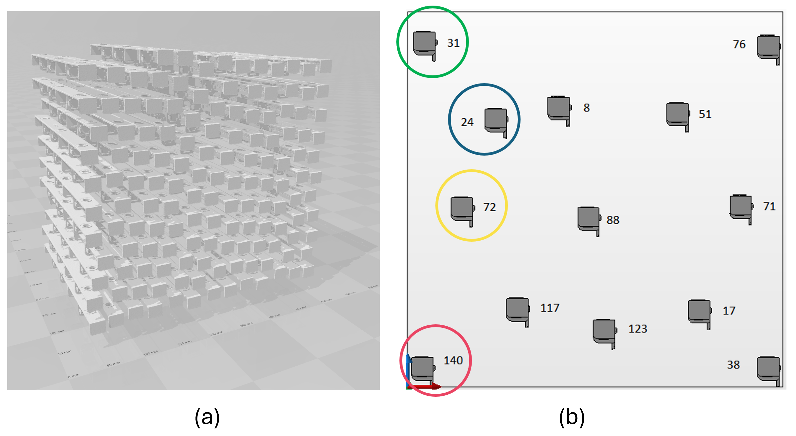
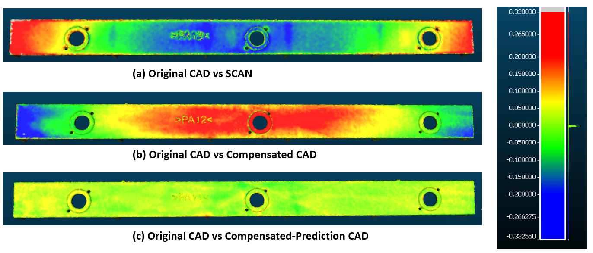
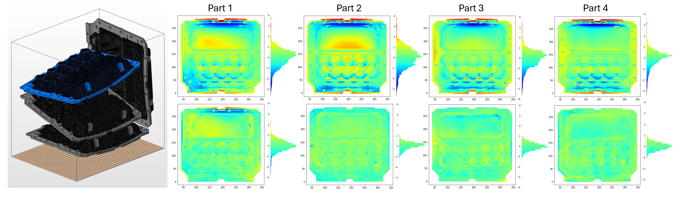

# PyTorch version of deformation predictor & compensation

## Introduction 

This work addresses shape deviation modeling and compensation in additive manufacturing (AM) to improve geometric accuracy for industrial-scale production. While traditional methods laid the groundwork, recent machine learning (ML) advancements offer better precision. However, challenges remain in generalizing across complex geometries and adapting to position-dependent variations in batch production. We introduce GraphCompNet, a novel framework combining graph-based neural networks with GAN-inspired training to model geometries and incorporate position-specific thermal and mechanical variations. Through a two-stage adversarial process, the framework refines compensated designs, improving accuracy by 35-65% across the print space. This approach enhances AM's real-time, scalable compensation capabilities, paving the way for high-precision, automated manufacturing systems.


[//]: # (<p align="center">)

[//]: # ()

[//]: # (</p>)

## Sample results 

Prediction & compensation accuracy  (mm) to be updated

[//]: # (<p align="center">)

[//]: # ()

[//]: # (</p>)

[//]: # (Compensation on Molded fiber dataset:)

[//]: # ()
[//]: # (Comparison of four sample parts in one print run, the top row illustrates the difference between the design CAD file and the scanned printed part geometry before applying compensation, the bottom row shows the difference between the design CAD file and the scanned printed part geometry after applying compensation using our trained prediction and compensation engine.)

[//]: # ()
[//]: # (<p align="center">)

[//]: # ()

[//]: # (</p>)

## Key requirments

1. ``Torch_Geometric 2.5.1 or above``: PyTorch based geometric/graph neural network library
   
   - https://pytorch-geometric.readthedocs.io/en/latest/install/installation.html#installation-via-anaconda
   
   - conda install pyg=*=*cu* -c pyg

2. ``pip install trimesh``

3. ``pip install matplotlib``

4. ``pip install pandas``

5. ``pip install hydra-core --upgrade --pre``

6. ``PyTorch3D``: PyTorch based 3D computer vision library 

   - Check requirements from official install page: https://github.com/facebookresearch/pytorch3d/blob/main/INSTALL.md
   - when tested, Pytorch3D requires Python 3.8, 3.9 or 3.10
   
   - ``pip install -U iopath``
    
   - Install directly from the source ``pip install "git+https://github.com/facebookresearch/pytorch3d.git@stable" ``

7. ``pip install torch-cluster``

To test in customized CUDA environment, install compatible torch version compatible with cudatoolkit, i.e.

``pip install torch==2.2.1 torchvision==0.17.1 torchaudio==2.2.1 --index-url https://download.pytorch.org/whl/cu121``

 Refer to: 
https://pytorch.org/get-started/previous-versions/

Other dependencies for development: 

- ``open3d``: pip install open3d, tested version 0.18.0
- ``torch-cluster``: conda install pytorch-cluster -c pyg


## Dataset
- Currently available: 
  - Bar repository [link not working yet](https://drive.google.com/file/d/1inUN4KIg8NOtuwaJa2d1j3tssRGUxgAQ/view?usp=sharing)
  - Molded-fiber repository [Download sample data](https://drive.google.com/file/d/1inUN4KIg8NOtuwaJa2d1j3tssRGUxgAQ/view?usp=sharing)

- Sample input data folder format: 
  
   -  input_data.txt: logs for each row, the build geometry folder 
  
      - /part_folder_i:

         - cad_<part_id>.txt: contains 3 columns for point location 

         - scan_red<part_id>.csv: contains 3 columns for point location 

[//]: # (- Post-processing: )

[//]: # (  )
[//]: # (    - https://github.azc.ext.hp.com/Shape-Compensation/Shape_compensator)


## Training

- To test running with cpu ``Connfig.yaml`` setting (not recommended): 
  
    - `` cuda: False ``
    - ``use_distributed: False``
    - ``use_multigpu: False``
- Gpu training: set params listed above to True

- There are two training codes that need to run in sequential manner.
1. ``train_dis.py``: This code trains the discriminator (predict part deformations with its position and geometry) 
2. ``train_gen.py``: This code trains the generator (compensate part geometry)

## Inference

[Download pre-trained model checkpoint](https://drive.google.com/file/d/1Htd7MLGgvjmidIGyYquDtLkZe0gSEqRu/view?usp=drive_link)

- Supported 3D formats: 
    - Stereolitography (STL)
    - Wavefront file (OBJ)
- How to run: 
  - ``python inference.py`` 


## References 

[GraphCompNet: A Position-Aware Model for Predicting and Compensating Shape Deviations in 3D Printing](to be added)

```text

```
