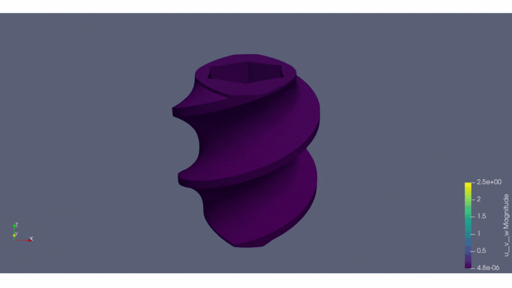

<!-- markdownlint-disable MD033 -->

# Virtual Foundary GraphNet

## Introduction

Metal sintering is a necessary step for Metal Injection Molded parts and
binder jetting such as
[HP’s metal 3D printer (MetJet)](https://www.hp.com/us-en/printers/3d-printers/products/metal-jet.html).
The metal sintering process introduces large deformation varying from 25% to 50%
depending on
the green part porosity. The final part's geometrical accuracy and consistency
remain the top challenge to manufacturing yield.
This is due to:

1. Green parts out of MetJet printer are much more porous than
other technologies (e.g., MIM);
2. Such shrinkage is not isotropic depending on non-uniform stress
built up during the sintering process,
e.g., gravitational sag, gravitational slump, surface drag.  

<p align="center">

</p>

In this work, we use a graph-based deep learning approach to
predict the part deformation,
which can speed up the deformation simulation substantially
at the voxel level. Running a well-trained Metal sintering
inferencing engine only takes a range of seconds to
obtain the final sintering deformation value.
The tested accuracy on example complex geometry achieves 0.7um mean
deviation for a 63mm testing part, for a single sintering step
(equivalent to 8.3 minutes physical sintering time), and a 0.3mm
mean deviation for the complete sintering cycle (~4 hrs physical sintering time).  
<p align="center">

</p>

Full paper on:
[Virtual Foundry Graphnet for Metal Sintering Deformation Prediction](https://arxiv.org/abs/2404.11753)

For more sample parts simulation:
<p align="center">

</p>
<p align="center">

</p>
<p align="center">

</p>
<p align="center">

</p>

## Setup with PhysicsNeMo package

- Download PhysicsNeMo, make or install

- Find the matching torch-scatter version with torch and cuda version enabled:
  - i.e. pip install torch-scatter-f `https://data.pyg.org/whl/torch-2.2.0%2Bcu121/torch_scatter-2.1.2%2Bpt22cu121-cp311-cp311-linux_x86_64.whl`
    (replace the torch-scatter wheel with the matching cuda, torch version )
  - torch-scatter installation guide: `https://pypi.org/project/torch-scatter/`
  - wheels source: `https://data.pyg.org/whl/`

- pip install tensorflow

  - test version: tensorflow-2.15.0.post1-cp311-cp311-manylinux_2_17_x86_64.manylinux2014_x86_64.whl

- for logging:
  - pip install wandb
  - pip install mlflow

- For training with mixed precision:
  - `https://github.com/NVIDIA/apex`
- pyvista is required only if need to run data proprocessing with the raw
simulation data files
  
- Dev:

  - install pytest
  - pip install importlib-metadata
  - pip install hydra-core --upgrade

## Train

Change the params in conf/config.yaml for training:

- mode: "train"
- ckpt_path_vfgn={path to save model trained ckpt}, i.e. "models/test24"
- data_path: {data path for the pre-processed data in tfrecord}, i.e. "./data/test_validation"
- noise_std: i.e.1e-9
- loss: i.e. me loss # options: ['standard', 'anchor',
'me', 'weighted', '''correlation', 'anchor_me']

Then run:

```bash
python train.py
```

Currently default params:

- INPUT_SEQUENCE_LENGTH = 5
- PREDICT_LENGTH = 1
- NUM_PARTICLE_TYPES = 3
- Provided ckpt trained at every 100 step of Physcis sintering simulation data

## Test (with the provided sample data)

Change the params in conf/config.yaml for testing:

- mode: "eval_rollout"
- eval_split: "test"
- batch_size: 1
- noise_std: 0
- ckpt_path_vfgn={path to model trained ckpt}, i.e. "models/ckpt/model_loss-4.17E-06_step-1113000.pt"
- output_path: {path to store outputs}, i.e. "rollouts/test24"
- data_path: {preprocessed test data tfrecord}, i.e. "./data/test_validation"

Then run:

```bash
python train.py
```

## Visualize test result

Change the params in conf/config.yaml:

- rollout_path={selected_prediction_output.json}, i.e. "rollouts/rollout_test_0.json"
- metadata_path={metadata path}, i.e. "./data/test_validation"
- test_build_name={test file name}, i.e. "test0"

```bash
python render_rollout.py
```

## Inference

Change the params in conf/config.yaml for inference run:

(model tested with spliting the entire sintering profile into 2 stages,
can combine the entire sintering profile inferencing according to train schema)

- mode: "rollout"
- eval_split: "inference"  # name of the tfrecord dataset
- noise_std: 0
- batch_size: 1
- ckpt_path_vfgn={path to model trained ckpt}, i.e. "models/ckpt/models/ckpt/model_loss-4.17E-06_step-1113000.pt"
- output_path: {path to store outputs}, i.e. "rollouts/test24"
- data_path: {preprocessed test data tfrecord}, i.e. "./data/test_validation"

```bash
python inference.py
```

## Data

- Test data

  - Same voxel resolution as train

- To generate your own tfrecord from Physical simulation output:
  
```bash
python data_process/rawdata2tfrecord.py
```

Defition of step_context & methods tried:

- appending only the previous step global context / ( sinter temperature)

  ```bash
    tensor_dict['step_context'] =tensor_dict['step_context'][-predict_length - 1][tf.newaxis]
  ```

- appending previous sequence of global context / (sequence of sinter temperature)

  ```bash
    tensor_dict['step_context'] = tf.reshape(tensor_dict['step_context'][:-1], [1, -1])
  ```

- appending the entire sequence of sintering profile

  ```bash
    tensor_dict['step_context'] = tf.reshape(tensor_dict['step_context'],[1, -1])
  ```

## Disclaimer and future work

With the model prediction accuracy and fast inference speed,
this work, as a component of HP’s Digital Twin effort,
Virtual Foundry Graphnet led by HP Labs, aims to apply Physics-ML
to significantly accelerate the computation that predicts the
metal powder material phase transition. It has achieved orders
of magnitude speed-up compared to physics simulation software while
preserving reasonable accuracy. Furthermore, Virtual Foundry Graphnet
has demonstrated an outstanding path forward to scaling for
diverse parts of arbitrary geometrical complexity
and scaling for different process parameter configurations.

## Reference

[Learning to Simulate Complex Physics with Graph Networks](https://arxiv.org/abs/2002.09405)

```text
@inproceedings{sanchezgonzalez2020learning,
  title={Learning to Simulate Complex Physics with Graph Networks},
  author={Alvaro Sanchez-Gonzalez and
          Jonathan Godwin and
          Tobias Pfaff and
          Rex Ying and
          Jure Leskovec and
          Peter W. Battaglia},
  booktitle={International Conference on Machine Learning},
  year={2020}
}
```
