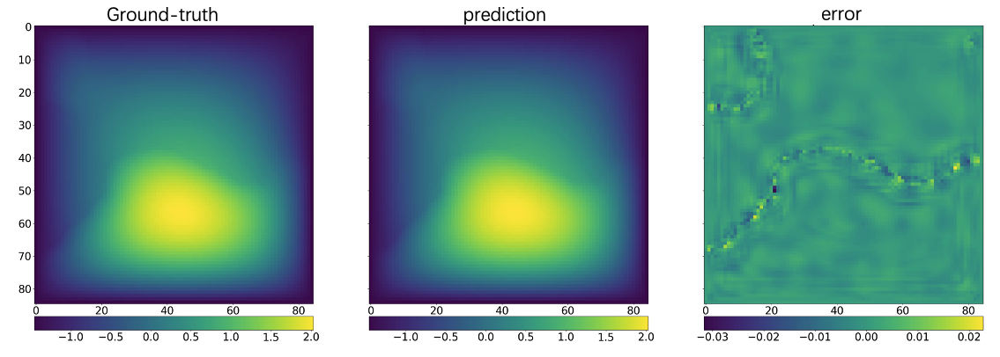

<!-- markdownlint-disable MD033 -->

# Transolver for Darcy Flow

This example demonstrates how to set up a data-driven model for a 2D Darcy flow using
the Transolver inside of PhysicsNeMo.

<p align="center">

</p>

Training progress can be tracked through [MLFlow](https://mlflow.org/docs/latest/index.html).
This example runs on a single GPU.

## Getting Started

To train the model following physicsnemo's settings, simply run

```bash
python train_transolver_darcy.py
```

Each batch is a new data generated by equation, which is different from commonly-used settings.

To reproduce the results in the paper, run

```bash
python train_transolver_darcy_fix.py
```

In this case, the train set and test set are fixed after the construction of Dataset,
corresponding to Transolver's setting.

## Additional Information

In the fixed case, extra data is needed for training and the data path should be added when
Darcy_2D_fix dataset is constructed. You can download the data
[here](https://drive.google.com/drive/folders/1UnbQh2WWc6knEHbLn-ZaXrKUZhp7pjt-).

More components are added for convenience. `Validators` calculate the loss between
ground-truth and prediction, and visualize them in `./mlruns`. Below is a simple example
of visualization.

[](https://imgse.com/i/pAlis3T)

## References

- [Transolver: A Fast Transformer Solver for PDEs on General Geometries](https://arxiv.org/abs/2402.02366)
