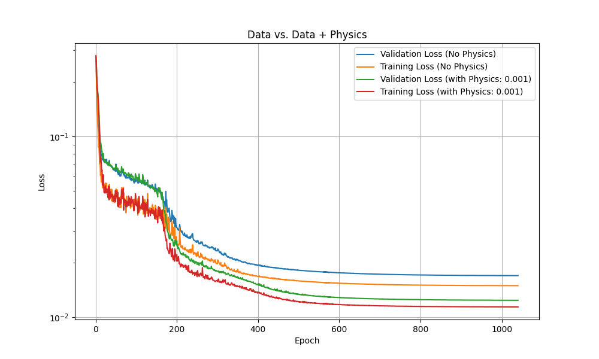

# Thermal and airflow surrogate model for Datacenter design

This example demonstrates the use of a Deep Learning model (3D UNet) for training a
surrogate model for datacenter airflow to enable real-time datacenter design.
The aim of this workflow is to train a Deep Learning model that can predict the
temperature and airflow distribution within a hot aisle of a typical datacenter.
For any given geometry of the hot aisle (height, width, and length) and the number
of IT racks inside it, the trained model can predict the temperature, velocity,
and pressure distribution inside the hot aisle instantaneously. Such an approach
can be very useful from a datacenter design perspective where iterating through
various design combinations is crucial to obtain optimal cooling and minimize
hotspots.


## Dataset

The model is trained on OpenFOAM simulation data. Based on the variables, i.e.,
Length, Height, Width, and Number of Racks, several hot aisle configurations are
generated. These configurations are solved with OpenFOAM assuming maximum flow
rate and rack exit temperature (max load condition). Steady state simulations
are used and the resulting OpenFOAM data is exported in VTK format for training
of the AI surrogate. The dataset is then normalized using the mean and standard
deviation statistics of the dataset. The normalized dataset, along with a sample
OpenFOAM configuration, can be downloaded using the NGC link: [Link to be added].

**Note:** Access to NVAIE is required to download the dataset
and the reference OpenFOAM configuration.

**Note:** The OpenFOAM configuration provided is only representative.
Several key aspects have been masked to protect the IP.
Users should not expect to generate the training data
exactly using this setup, and one will have to change
it using their own geometries and boundary conditions.

## Training

A UNet model is used in this problem. The hex-dominant mesh used in this problem
makes this model an attractive choice offering good speed and accuracy. Since
the model is primarily trained to capture the changes in geometry, we use the
Signed Distance Field of the interior of the hot aisle to capture the parameter
variation. Additionally, we add sinusoidal embeddings to enable the model to
capture sharp features in the flow field. Finally, to make the different
datacenter sizes uniform (for ingestion into UNet), we pad the geometry for the
maximum hot aisle dimensions. This padding is removed before computing the loss.

The model can be trained by executing the below commands:

```bash
python train.py
```

To train on multiple GPUs,

```bash
mpirun -np <#GPUs> python train.py
```

Once the model is trained, you can use the inference.py script to compute the
model inference. For generating the Signed Distance Field and geometry for the
inference, we make use of the utilities from Modulus-Sym.

### Training of Physics-Informed model

We also train a variant where we add the physics losses to the data loss.
The physics-informed training can be executed using the below commands:

```bash
python train_physics_informed.py
```

Addition of such physics data losses proves very beneficial in the low-data
regime where the physics losses can compensate for the lack of enough data.



## Contributors

This example was developed as a part of collaboration between NVIDIA and Wistron.

## Resources

1. [Wistron Uses NVIDIA Omniverse and NVIDIA Modulus to Build Digital Twin Platform, Transforming Factory Planning and Operations](https://www.wistron.com/en/Newsroom/2024-03-19-1)
2. [Model Innovators: How Digital Twins Are Making Industries More Efficient](https://blogs.nvidia.com/blog/digital-twins-modulus-wistron/)
