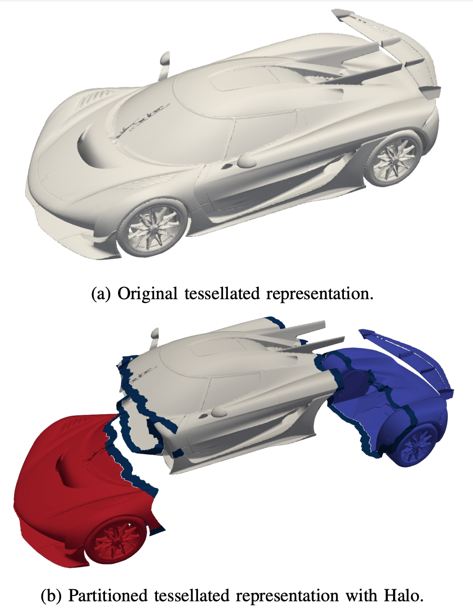
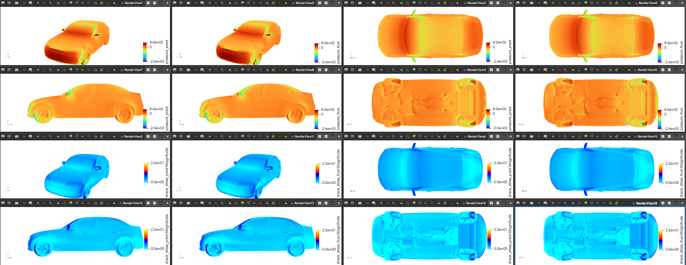
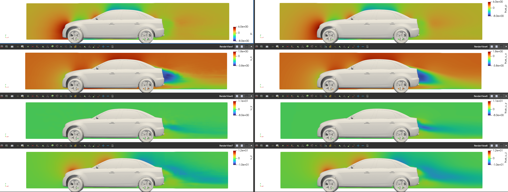

# X-MeshGraphNet for Scalable Automotive Aerodynamics
X-MeshGraphNet is a scalable, multi-scale extension of MeshGraphNet designed to
address key challenges in GNN-based physical simulations including scalability,
mesh requirements for the inference, and multi-scale modeling. Here we leverage 
X-MeshGraphNet for accurate aerodynamic predictions in passenger car designs.
We demonstrate how X-MeshGraphNet scales to large meshes while
providing accurate predictions of surface pressure and wall
shear stresses for various car designs, effectively addressing
some of the key limitations of traditional GNN-based methods. 
Additionally, we extend X-MeshGraphNet’s underlying halo-based
partitioning with gradient aggregation scheme to other neural
architectures, including UNets, to highlight the versatility of
the proposed approach. To this end, we train a scalable 3D
UNet model for volumetric predictions such as pressure and
velocity within a bounding box around the car body.
For more information about X-MeshGraphNet,
please refer to the [paper](https://arxiv.org/pdf/2411.17164)

{width=50%}


## Problem overview

External aerodynamics plays a crucial role in the design and optimization of vehicles,
aircraft, and other transportation systems. Accurate predictions of aerodynamic
properties such as drag, pressure distribution, and airflow characteristics are
essential for improving fuel efficiency, vehicle stability, and performance.
Traditional approaches, such as computational fluid dynamics (CFD) simulations,
are computationally expensive and time-consuming, especially when evaluating multiple
design iterations or large datasets.

Our models address these challenges by leveraging neural network-based surrogate
models to provide fast, scalable, and accurate predictions for both surface-level
and volume-level aerodynamic properties. By using the DrivAerML dataset, which
contains high-fidelity CFD data for a variety of vehicle geometries, X-MeshGraphNet aims
to significantly reduce the computational cost while maintaining high prediction
accuracy. The two surface and volume models enable rapid aerodynamic evaluations
across different design
configurations, making it easier to incorporate aerodynamic considerations early in
the design process.

## Model Overview and Architecture

### The surface model

X-MeshGraphNet is a scalable MeshGraphNet model that partitions large input graphs into
smaller subgraphs to reduce training memory overhead. Halo regions are added to these
subgraphs to prevent message-passing truncations at the boundaries. Gradient aggregation
is employed to accumulate gradients from each partition before updating the model parameters.
This approach ensures that training on partitions is equivalent to training on the entire
graph in terms of model updates and accuracy. Additionally, X-MeshGraphNet does not rely on
simulation meshes for training and inference, overcoming a significant limitation of
GNN models in simulation tasks.

The input to the training pipeline is STL files, from which the model samples a point cloud
on the surface. It then constructs a connectivity graph by linking the N nearest neighbors.
This method also supports multi-mesh setups, where point clouds with different resolutions
are generated, their connectivity graphs are created, and all are superimposed. The Metis
library is used to partition the graph for efficient training.

For the surface model, STL files are used to generate point clouds and establish graph
connectivity. Additionally, the .vtp files are used to interpolate the solution fields onto
the point clouds.

### The volume model

The volume model is a scalable 3D UNet model with attention gates.
It demonstrates the application of the partitioning with halo regions in X-MeshGraphNet
to other architectures like 3D UNets. It is designed to partition large
voxel grids into smaller sub-grids to reduce memory overhead during training. Halo regions
are added to these partitions to avoid convolution truncations at the boundaries.
Gradient aggregation is used to accumulate gradients from each partition before updating
the model parameters, ensuring that training on partitions is equivalent to training on
the entire voxel grid in terms of model updates and accuracy. Additionally, this model
incorporates a continuity constraint as an additional loss term during training to
enhance model interpretability.

For the volume model, the .vtu files are used to interpolate the volumetric
solution fields onto a voxel grid, while the .stl files are utilized to compute
the signed distance field (SDF) and its derivatives on the voxel grid.

## Dataset

We trained our models using the DrivAerML dataset from the [CAE ML Dataset collection](https://caemldatasets.org/drivaerml/).
This high-fidelity, open-source (CC-BY-SA) public dataset is specifically designed
for automotive aerodynamics research. It comprises 500 parametrically morphed variants
of the widely utilized DrivAer notchback generic vehicle. Mesh generation and scale-resolving
computational fluid dynamics (CFD) simulations were executed using consistent and validated
automatic workflows that represent the industrial state-of-the-art. Geometries and comprehensive
aerodynamic data are published in open-source formats. For more technical details about this
dataset, please refer to their [paper](https://arxiv.org/pdf/2408.11969).

## Training the surface model

To train the surface model, follow these steps:

1. Download the DrivAer ML dataset using the provided `download_aws_dataset.sh` script.

2. Navigate to the `surface` folder.

3. Specify the configurations in `conf/config.yaml`. Make sure path to the dataset
   is specified correctly.

4. Run `combine_stl_solids.py`. The STL files in the DriveML dataset consist of multiple
   solids. Those should be combined into a single solid to properly generate a surface point
   cloud using the Modulus Tesselated geometry module.

5. Run `preprocessing.py`. This will prepare and save the partitioned graphs.

6. Create a `partitions_validation` folder, and move the samples you wish to use for
   validation to that folder.

7. Run `compute_stats.py` to compute the global mean and standard deviation from the
   training samples.

8. Run `train.py` to start the training.

9. Download the validation results (saved in form of point clouds in `.vtp` format),
   and visualize in Paraview.



## Training the volume model

To train the volume model, follow these steps:

1. Download the DrivAer ML dataset using the provided `download_aws_dataset.sh` script.

2. Navigate to the `volume` folder.

3. Specify the configurations in `conf/config.yaml`. Make sure path to the dataset
   is specified correctly.

4. Run `preprocessing.py`. This will prepare and save the voxel grids.

5. Create a `drivaer_aws_h5_validation` folder, and move the samples you wish to
   use for validation to that folder.

6. Run `compute_stats.py` to compute the global mean and standard deviation from
   the training samples.

7. Run  `train.py` to start the training. Partitioning is performed prior to training.

8. Download the validation results (saved in form of voxel grids in `.vti` format),
   and visualize in Paraview.



## Logging

We mainly use TensorBoard for logging training and validation losses, as well as
the learning rate during training. You can also optionally use Weight & Biases to
log training metrics. To visualize TensorBoard running in a
Docker container on a remote server from your local desktop, follow these steps:

1. **Expose the Port in Docker:**
     Expose port 6006 in the Docker container by including
     `-p 6006:6006` in your docker run command.

2. **Launch TensorBoard:**
   Start TensorBoard within the Docker container:

     ```bash
     tensorboard --logdir=/path/to/logdir --port=6006
     ```

3. **Set Up SSH Tunneling:**
   Create an SSH tunnel to forward port 6006 from the remote server to your local machine:

     ```bash
     ssh -L 6006:localhost:6006 <user>@<remote-server-ip>
     ```

    Replace `<user>` with your SSH username and `<remote-server-ip>` with the IP address
    of your remote server. You can use a different port if necessary.

4. **Access TensorBoard:**
   Open your web browser and navigate to `http://localhost:6006` to view TensorBoard.

**Note:** Ensure the remote server’s firewall allows connections on port `6006`
and that your local machine’s firewall allows outgoing connections.

## References

- [X-MeshGraphNet: Scalable Multi-Scale Graph Neural Networks for Physics Simulation](https://arxiv.org/pdf/2411.17164)
- [Learning Mesh-Based Simulation with Graph Networks](https://arxiv.org/pdf/2010.03409)
- [DrivAerML: High-Fidelity Computational Fluid Dynamics Dataset for Road-Car External Aerodynamics](https://arxiv.org/pdf/2408.11969)
