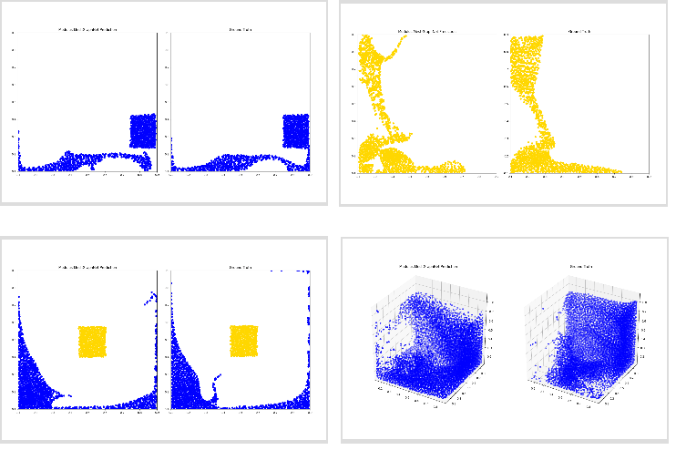

# MeshGraphNet with Lagrangian mesh

This is an example of MeshGraphNet for particle-based simulation, based on the
[Learning to Simulate](https://sites.google.com/view/learning-to-simulate/)
work. It demonstrates how to use PhysicsNeMo to train a Graph Neural Network (GNN)
to simulate Lagrangian fluids, solids, and deformable materials.

## Problem overview

In this project, we provide an example of Lagrangian mesh simulation for fluids. The
Lagrangian mesh is particle-based, where vertices represent fluid particles and
edges represent their interactions. Compared to an Eulerian mesh, where the mesh
grid is fixed, a Lagrangian mesh is more flexible since it does not require
tessellating the domain or aligning with boundaries.

As a result, Lagrangian meshes are well-suited for representing complex geometries
and free-boundary problems, such as water splashes and object collisions. However,
a drawback of Lagrangian simulation is that it typically requires smaller time
steps to maintain physically valid prediction.

## Dataset

For this example, we use [DeepMind's particle physics datasets](https://sites.google.com/view/learning-to-simulate).
Some of these datasets contain particle-based simulations of fluid splashing and bouncing
within a box or cube while others use materials like sand or goop.
There are a total of 17 datasets, with some of them listed below:

| Datasets     | Num Particles | Num Time Steps |    dt    | Ground Truth Simulator |
|--------------|---------------|----------------|----------|------------------------|
| Water-3D     | 14k           | 800            | 5ms      | SPH                    |
| Water-2D     | 2k            | 1000           | 2.5ms    | MPM                    |
| WaterRamp    | 2.5k          | 600            | 2.5ms    | MPM                    |
| Sand         | 2k            | 320            | 2.5ms    | MPM                    |
| Goop         | 1.9k          | 400            | 2.5ms    | MPM                    |

See the section **B.1** in the [original paper](https://arxiv.org/abs/2002.09405).

## Model overview and architecture

This model uses MeshGraphNet to capture the dynamics of the fluid system.
The system is represented as a graph, where vertices correspond to fluid particles,
and edges represent their interactions. The model is autoregressive,
utilizing historical data to predict future states. Input features for the vertices
include current position, velocity, node type (e.g., fluid, sand, boundary),
and historical velocity. The model’s output is acceleration, defined as the difference
between current and next velocity. Both velocity and acceleration are derived from
the position sequence and normalized to a standard Gaussian distribution
for consistency.

For computational efficiency, we do not explicitly construct wall nodes for
square or cubic domains. Instead, we assign a wall feature to each interior
particle node, representing its distance from the domain boundaries. For a
system dimensionality of $d = 2$ or $d = 3$, the features are structured
as follows:

- **Node features**:
  - position ($d$)
  - historical velocity ($t \times d$),
    where the number of steps $t$ can be set using `data.num_history` config parameter.
  - one-hot encoding of node type (e.g. 6),
  - wall feature ($2 \times d$)
- **Edge features**: displacement ($d$), distance (1)
- **Node target**: acceleration ($d$)

We construct edges based on a predefined radius, connecting pairs of particle
nodes if their pairwise distance is within this radius. During training, we
shuffle the time sequence and train in batches, with the graph constructed
dynamically within the dataloader. For inference, predictions are rolled out
iteratively, and a new graph is constructed based on previous predictions.
Wall features are computed online during this process. To enhance robustness,
a small amount of noise is added during training.

The model uses a hidden dimensionality of 128 for the encoder, processor, and
decoder. The encoder and decoder each contain two hidden layers, while the
processor consists of ten message-passing layers. We use a batch size of
20 per GPU (for Water dataset), and summation aggregation is applied for
message passing in the processor. The learning rate is set to 0.0001 and decays
using cosine annealing schedule. These hyperparameters can be configured using
command line or in the config file.

## Getting Started

This example requires the `tensorflow` library to load the data in the `.tfrecord`
format. Install with:

```bash
pip install "tensorflow<=2.17.1"
```

To download the data from DeepMind's repo, run:

```bash
cd raw_dataset
bash download_dataset.sh Water /data/
```

This example uses [Hydra](https://hydra.cc/docs/intro/) for [experiment](https://hydra.cc/docs/patterns/configuring_experiments/)
configuration. Hydra offers a convenient way to modify nearly any experiment parameter,
such as dataset settings, model configurations, and optimizer options,
either through the command line or config files.

To view the full set of training script options, run the following command:

```bash
python train.py --help
```

If you encounter issues with the Hydra config, you may receive an error message
that isn’t very helpful. In that case, set the `HYDRA_FULL_ERROR=1` environment
variable for more detailed error information:

```bash
HYDRA_FULL_ERROR=1 python train.py ...
```

To train the model with the Water dataset, run:

```bash
python train.py +experiment=water data.data_dir=/data/Water
```

Progress and loss logs can be monitored using Weights & Biases. To activate that,
set `loggers.wandb.mode` to `online` in the command line:

```bash
python train.py +experiment=water data.data_dir=/data/Water loggers.wandb.mode=online
```

An active Weights & Biases account is required. You will also need to set your
API key either through the command line option `loggers.wandb.wandb_key`
or by using the `WANDB_API_KEY` environment variable:

```bash
export WANDB_API_KEY=key
python train.py ...
```

## Inference

The inference script, `inference.py`, also supports Hydra configuration, ensuring
consistency between training and inference runs.

Once the model is trained, run the following command:

```bash
python inference.py +experiment=water \
    data.data_dir=/data/Water \
    data.test.num_sequences=4 \
    resume_dir=/data/models/lmgn/water \
    output=/data/models/lmgn/water/inference
```

Use the `resume_dir` parameter to specify the location of the model checkpoints.

This will save the predictions for the test dataset as animated `.gif` files in the
`/data/models/lmgn/water/inference/animations` directory.

The script will also generate an `error.png` file,
which displays a visualization of the rollout error.

The results may resemble one of the following, depending on the
material selected for training the model:



## References

- [Learning to simulate complex physicswith graph networks](arxiv.org/abs/2002.09405)
- [Dataset](https://sites.google.com/view/learning-to-simulate)
- [Learning Mesh-Based Simulation with Graph Networks](https://arxiv.org/abs/2010.03409)
