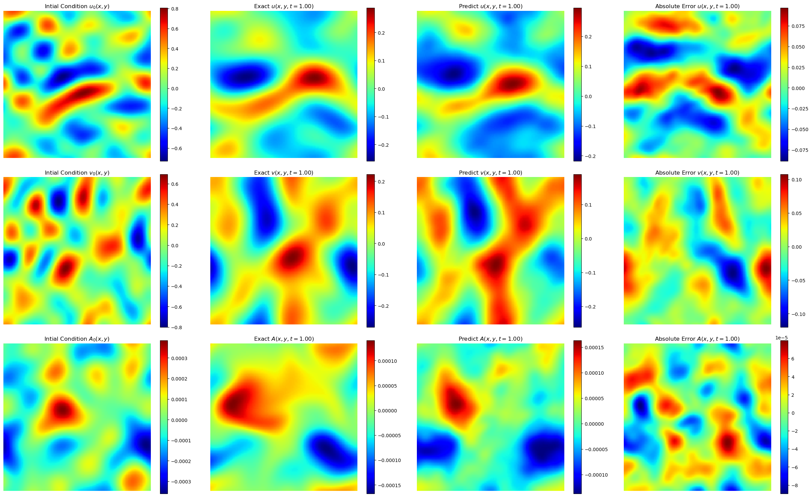

# Physics Informed FNO for Magnetohydrodynamics Equations

This example demonstrates physics informing of a
data-driven model using numerical derivatives (PINO).

## Problem overview

To examine the properties of PINOs with multiple complex equations, we
examined the ability of the networks to reproduce the incompressible
magnetohydrodynamics (MHD) equations representing an incompressible fluid
in the presence of a magnetic field $\mathbf{B}$.
These equations are present in several astrophysical
phenomena, including black hole accretion and binary neutron star mergers.
These equations are given by

$$\begin{align}
\partial_t \mathbf{u}+\mathbf{u} \cdot \nabla \mathbf{u} &=
-\nabla \left( p+\frac{B^2}{2} \right)/\rho_0 +\mathbf{B}
\cdot \nabla \mathbf{B}+\nu \nabla^2 \mathbf{u}, \\
\partial_t \mathbf{B}+\mathbf{u} \cdot \nabla \mathbf{B} &=
\mathbf{B} \cdot \nabla \mathbf{u}+\eta \nabla^2 \mathbf{B}, \\
\nabla \cdot \mathbf{u} &= 0, \\
\nabla \cdot \mathbf{B} &= 0,
\end{align}$$

where $\mathbf{u}$ is the velocity field, $p$ is
the pressure, $B$ is the magnitude of the magnetic field, $\rho_0=1$
is the density of the fluid, $\nu$ is the kinetic viscosity,
and $\eta$ is the magnetic resistivity.  We have two equations
for evolution and two constraint equations.

For the magnetic field divergence equation, we can either include it
in the loss function or instead evolve the magnetic vector potential
$\mathbf{A}$. This quantity is defined such that

$$\begin{align}
\mathbf{B} = \nabla \times \mathbf{A},
\end{align}$$

which ensures that the divergence of $\mathbf{B}$ is zero. By evolving
magnetic vector potential $\mathbf{A}$
instead of the magnetic field $\mathbf{B}$, we have a new
evolution equation for the vector potential $\mathbf{A}$. This equation is given by

$$\begin{align}
\partial_t \mathbf{A} + \mathbf{u} \cdot \nabla \mathbf{A}=\eta \nabla^2 \mathbf{A}.
\end{align}$$

Both scripts to evolve the magnetic field $\mathbf{B}$ or vector potential
$\mathbf{A}$ are included.
In the vector potential case, below we plot how each of these
fields evolves in space and time according to the PINO predictions and the
simulated data.  We observe that the error in each of these cases is relatively small.

<!-- {: .center} -->


We will demonstrate the use of data loss and physics constraints,
specifically the equation residual loss, to create accurate predictions.
[PhysicsNeMo Sym](https://github.com/NVIDIA/modulus-sym)
has utilities tailored for physics-informed machine learning. It also presents
abstracted APIs that allow users to think and model the problem from the lens of
equations, constraints, etc. In this example, we will only leverage the physics-informed
utilities to see how we can add physics to an existing data-driven model with ease while
still maintaining the flexibility to define our own training loop and other details.
For a more abstracted definition of these type of problems, where the training loop
definition and other things is taken care of implicitly, you may refer
[PhysicsNeMo Sym](https://github.com/NVIDIA/modulus-sym)

## Dataset

The code to generate the training and validation datasets for this example
can be found on the
[MHD PINO Github page](https://github.com/shawnrosofsky/mhd_pino/tree/master).
You will also need to install Dedalus to generate the data. More information
can be found on through the
[Dedalus project documentation](https://dedalus-project.readthedocs.io/en/latest/pages/installation.html)
After this, generating the data can be done by running
the below set of commands:

```bash
pip install -r requirements.txt
python3 dedalus_mhd.py
```

or

```bash
pip install -r requirements.txt
python3 dedalus_mhd_parallel.py
```

The first script is not parallelized while the second script is parallelized based
on the CPU count.
To demonstrate the usefulness of the Physics loss, we will deliberately choose a smaller
dataset size of 100 samples. In such regimes, the effect of physics loss is more
evident, as it regularizes the model in the absence of large data. However, the tensor
factorized Fourier Neural Operator (TFNO) model requires
1000 samples to reproduce the results from the paper.

## Model overview and architecture

In this example, we will use a Fourier Neural Operator (FNO) and then compute the
derivatives in a PINO style, using Numerical differentiation with Fourier derivatives.
With this example, we intend to demonstrate how to implement multiple
equations into the loss function. We will also use a tensor factorized Fourier Neural
Operator (TFNO) in the same pipeline. The only difference with a TFNO model
is that the weights are factorized using TensorLy.

In this example, we will also use the `PDE` class from PhysicsNeMo-Sym to symbolically define
the PDEs. This is very convinient and most natural way to define these PDEs and allows
us to print the equations to check for correctness. This also abstracts out the
complexity of converting the equation into a pytorch representation. PhysicsNeMo Sym also
provides several complex, well-tested PDEs like 3D Navier-Stokes, Linear elasticity,
Electromagnetics, etc. pre-defined which can be used directly in physics-informing
applications. We will also give you the option to choose between the
derivative functions from PhysicsNeMo-Sym or from the original paper.  

## Getting Started

To get started with the example that evolves the magnetic field with a
FNO model,
simply run,

```bash
torchrun --standalone --nnodes=1 --nproc_per_node=<num_gpus> train_mhd.py
```

To get started with the example that evolves the vector potential with a
FNO model, simply run,

```bash
torchrun --standalone --nnodes=1 --nproc_per_node=<num_gpus> train_mhd_vec_pot.py
```

To get started with the example that evolves the vector potential
with a TFNO model, simply run,

```bash
torchrun --standalone --nnodes=1 --nproc_per_node=<num_gpus> train_mhd_vec_pot_tfno.py
```

## References

- [Magnetohydrodynamics with Physics Informed Neural Operators](https://arxiv.org/abs/2302.08332)
- [Fourier Neural Operator for Parametric Partial Differential Equations](https://arxiv.org/abs/2010.08895)
- [Physics-Informed Neural Operator for Learning Partial Differential Equations](https://arxiv.org/abs/2111.03794)
