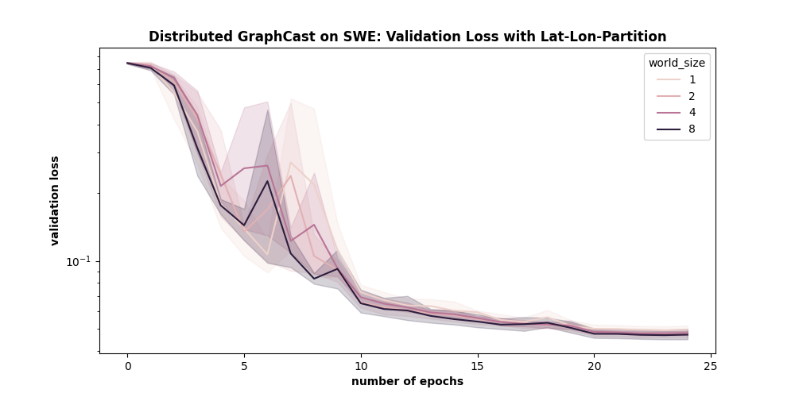

# Shallow Water Equations - Distributed GraphCast

This example demonstrates how to leverage a distributed version of GraphCast to scale
to larger Graph Neural Network (GNN) workloads.

## Problem Overview

Similar to the example of using Physics Informed Neural Operators in `../swe_nonlinear_pino`,
we consider the setting of the nonlinear shallow water equations. These equations are
applicable in several physical scenarios including tsunami modeling.  We assumed that
the total fluid column height $\eta(x,y,t)$ was composed of a mean height plus some
perturbation, but the initial velocity fields $u(x,y,t)$ and $v(x,y,t)$ were initially
zero. These equations are given by

$$\begin{align}
\frac{\partial(\eta)}{\partial t}+\frac{\partial(\eta u)}{\partial x}+
\frac{\partial(\eta v)}{\partial y}&=0,  \\
\frac{\partial(\eta u)}{\partial t}+
\frac{\partial}{\partial x}\left(\eta u^{2}+\frac{1}{2} g
\eta^{2}\right)+
\frac{\partial(\eta u v)}{\partial y}&=\nu\left(u_{xx} + u_{yy}\right), \\
\frac{\partial(\eta v)}{\partial t}+\frac{\partial(\eta u v)}{\partial x}+
\frac{\partial}{\partial y}\left(\eta v^{2}+\frac{1}{2} g
\eta^{2}\right)&=\nu\left(v_{xx} + v_{yy}\right),
\end{align}$$

$$\begin{align}
\textrm{with} \quad \eta(x,y,0) = \eta_{0}(x,y),\ u(x,y,0)=0,\
v(x,y,0)=0,\ \quad
x,y \in[0,1), \ t \in[0,1],
\end{align}$$

where the gravitational coefficient $g=1$ and the viscosity coefficient
$\nu=0.002$ to prevent the formation of shocks.

Unlike the example of using Neural Operators in a Physics-Informed fashion, we consider
a purely data-drive example where loss targets are generated by a traditional solver.
In its minimal nature, the focus is rather on the aspect of distributed this model
in a tensor-parallel fashion. Training Data is generated on the fly in the corresponding
`ShallowWaterPDEDataset` class supporting both random initial conditions and the
Galewsky intial condition which will rather be suited to evaluated things on a static
dataset. Note that this is not intended to be fully fledged recipe for training models
on any PDE dataset but should showcase how to setup the distributed training accordingly.

The example is also setup in such a fashion to sketch how one would setup a training
setup to be both model and data parallel while also noting that this example mainly
has been tested in a model-parallel fashion only.

## Distributed Message Passing

GNNs - roughly spoken - can be seen as neural networks operating on graph data.
A graph in this context can be represented as a tuple of source node IDs
$\mathcal{V}_{src}$, of destination node IDs $\mathcal{V}_{dst}$, and edges
$\mathcal{E} \sub \mathcal{V}_{src} \times \mathcal{V}_{dst}$
which denotes all edges $e_{uv}$ between source and destination nodes rectively.
We then have the number of source nodes give as $N_{src} = |\mathcal{V}_{scr}|$,
number of destination nodes as $N_{dst} = |\mathcal{V}_{dst}|$, and number of
edges $E = |\mathcal{E}|$. In the context of machine learning, we also assume
that both and source and destination nodes and edges might cary feature vectors
Futhermore assuming contiguous IDs, we can arange them in contigous feature
tensors of the following shapes.

- source node features: $H_{src}$ of shape $[N_{src} \times D_{src}]$
where $H_{src}[u] = h_{src,u}$
- destination node features: $H_{dst}$ of shape $[N_{dst} \times D_{dst}]$
where $H_{dst}[u] = h_{dst,v}$
- edge features $H_{edge}$ of shape $[E \times D_{edge}]$
where $H_{edge}[uv] = h_{edge,uv}$

Message passing itself then is often denoted as as an alternating step of
preparing messages between nodes u and v

$$m_{uv}^{(k)} = COMBINE^{(k)} \left(
f_{\theta_{src}}^{(k)}\left(h_{src,u}^{(k-1)}\right),
f_{\theta_{dst}}^{(k)}\left(h_{dst,v}^{(k-1)}\right),
f_{\theta_{edge}}^{(k)}\left(h_{edge,uv}^{(k-1)}
\right)\right)$$

and aggregation of messages.

$$h_{dst,v}^{(k)} = AGG_{u: u\in \mathcal{N}(v)} \left(m_{uv}^{(k)}\right)$$

Transormation functions $f_{\theta}^{(k)}$ in each lyer $k$ usually are just
simple Multilayer Perceptrons (MLPs) which transform the corresponding hidden
representation of the previous layer. In its simplest form, the aggregation
operation just corresponds to summing up all incoming messages from each
of the destination node's neighbors.

In the case of attention or other specialized aggregation schemes, this
operation can correspond to a weighted aggregation based on scaled dot-product
based attention scores. The overall message passing scheme then is rather just
a single aggregation step

$$h_{dst,v}^{(k)} = AGG_{u: u\in \mathcal{N}(v)} \left(
f_{\theta_{src}}^{(k)}\left(h_{src,u}^{(k-1)}\right),
f_{\theta_{dst}}^{(k)}\left(h_{dst,v}^{(k-1)}\right),
f_{\theta_{edge}}^{(k)}\left(h_{edge,uv}^{(k-1)}\right)\right
)$$

By just looking at these definitions, we can already make the following observations

- transormation functions $f_{\theta}^{(k)}$ are naively parallel across corresponding
node or edge features.
- given destination node features $h_{dst,v}$ and all edge features $h_{edge,uv}$ of

a destination node's neighbors, all we are missing for a valid message-passing
step is the corresponding features of its source nodes  $h_{src,u}$.

These can be extended with the addition or concatenation of residual features or
any other updates of source and edge features for subsequent layers. It is also
likely that these are extended in further transformation layers between the
actual message passing layers.

Parallelizing the MLPs in the transformation functions thus is rather straightforward.
By just dividing the original inputs into chunks, each rank can transform its
according tensor chunk in the forward phase and its according input gradients
in the backward phase.

We refer to to these chunks as partitioned tensors. A visualization of distributing
the MLP computations on partitioned tensors is shown below.

<!-- {: .center} -->


In the backward - as the model weights are shared across rank - we also need to do is to
reduce the weight gradients. If e.g. the whole GraphCast model is used in such a fashion,
you can register the necessary gradient hooks for this operation by simply calling
`mark_module_as_shared`.

```python
from physicsnemo.distributed import mark_module_as_shared

...


model_with_shared_weights = GraphCast(...)
mark_module_as_shared(model_with_shared_weights)
```

Given an original global graph, we can divide the global graph into local subgraphs such
that each chunk of destination node IDs has the same neighborhood as in the original
global graph. By choosing the partitions of MLPs such that all destination nodes of a
local graph and all edge features related to all incoming edges for each destination
node are on the same rank, we can already minimize the need to exchange tensors by
design.

<!-- {: .center} -->


Finally, to allow each rank perform the message operations indepdently, we need to exchange
the necessary and missing source node features. This is done in a formed of indexed
all-to-all fashion. Each rank prepares exchange buffers for each other rank which contain
the deduplicated source node features which are needed in the local graph on the remote rank.
In the following communication phase, all ranks exchange their exchange buffers in an
all-to-all fashion. Finally, these exchanges buffers will be concatenated leading to a
contiguous tensor of all necessary local source node features on each rank. Once the message
passing is done, the partitioned node and edge features have been updated and the next layer
follows in a similar fashion.

<!-- {: .center} -->


Most of these distributed primitives are hidden away in the `CuGraphCSC` wrapper class.
The following example briefly shows how these would work in a simplified context.
`GraphCastNet` itself already has been implemented such that its graph use these wrappers
under the hood which means that the user only has to e.g. specify the name of the process
group across the graphs are distributed and the size of the the process group.

For more information, have a look at the corresponding documentations of these
methods and classes.

```python
from physicsnemo.distributed import DistributedManager
from physicsnemo.models.gnn_layers import CuGraphCSC

...

# setup distributed manager and process groups
DistributedManager.initialize()
DistributedManager.create_process_subgroup(
    name=graph_partition_pg_name,
    size=graph_partition_pg_size,
)
dist_manager = DistributedManager()

...

# create wrapper graph
graph = CuGraphCSC.from_dgl(
    dgl_graph,
    partition_size=graph_partition_pg_size,
    partition_group_name=graph_partition_pg_name,
)

...

# get partitioned tensors from global tensors
part_src_feat = graph.get_src_node_features_in_partition(global_src_feat)
part_dst_feat = graph.get_dst_node_features_in_partition(global_dst_feat)
part_edge_feat = graph.get_edge_features_in_partition(global_edge_feat)

# get tensors in local graph from global tensors
local_src_feat = graph.get_src_node_features_in_local_graph(global_src_feat)
# by design, local_dst_feat and local_edge_feat should be the same as
# part_dst_feat and part_edge_feat
local_dst_feat = graph.get_dst_node_features_in_local_graph(global_dst_feat)
local_edge_feat = graph.get_edge_features_in_local_graph(global_edge_feat)

# get global tensors from partioned tensors
global_src_feat = graph.get_global_src_node_features(part_src_feat)
global_dst_feat = graph.get_global_dst_node_features(part_dst_feat)
global_edge_feat = graph.get_global_edge_features(part_edge_feat)

```

As explained in more detail in the corresponding documentation sections, the
user also has much more options to configure like whether global tensors are
initially only on a single rank and should be scattered first, whether they
are only aggregated on a single rank or gathered in an AllGather fashion,
or whether a specified partition scheme is applied instead of naively
dividing vertices and edges based on their initial IDs. Models like
`GraphCastNet` hide most of these options and this example e.g.
uses the following.

```python
    model = GraphCastNet(
        *,
        partition_size=dist_manager.group_size(graph_partition_pg_name),
        partition_group_name=graph_partition_pg_name,
        # simplified data-loading scheme: only rank 0 has valid inputs
        # model then takes care of scattering these onto participating ranks
        expect_partitioned_input=False,
        global_features_on_rank_0=True,
        # simplilfied loss computation, to allow e.g. the l2_loss_sphere
        # without having to distribute this loss computation, valid
        # output is only on rank 0, model aggregates the output accordingly
        produce_aggregated_output=True,
        produce_aggregated_output_on_all_ranks=False,
        # to reduce the number of edges between partitions, we rely
        # on the lat-long coordinates of vertices and divide them
        # into partitions based on these instead of their initial IDs
        use_lat_lon_partitioning=cfg.model.use_lat_lon_partitioning,
    )
```

## Getting Started

To get started with this example for a run e.g. using 4 GPUs on a single node, simply run,

```bash
torchrun --nodes=1 --nproc-per-node=4 train.py
```

In case you are running on a SLURM cluster and have started a batch job e.g. using 4 GPUs,
simply run,

```bash
python train.py
```

## Hyperparameters

`config_graphcast_swe.yaml` contains usual parameters like learning rate,
hidden dimensions, number of layers, etc.. In the context of this example,
we in particular highlight the following three parameters to control
for the scale of this workload.

- `data.angular_resolution`: angular resolution of the underlying latitude-longitude grid,
default of 0.703125° corresponds to a grid of size 256 x 512, other usual resolutions are
e.g. 0.1°, 0.25°, or 0.5°.  
- `data.multimesh_level`: hierarchy level of multimesh used in the processor of GraphCast,
implicitly defines the resolution of the processor's mesh, default of 6 e.g. corresponds
to a graph with 40,962 nodes and 327,660 edges.
- `model.use_lat_lon_partitioning`: boolean flag indicating whether lat-lon coordinates
are used to partition the graphs used in this model compared to naively using the node IDs,
by leveraging coordinate information, number of edges between partitions can be minimized.

`data.dummy_data` can be also used to run scaling experiments without the overheads of the
traditional solver generating evaluation and training targets by just running the training
on random inputs and targets and skipping the final evaluation at the very end.

## Results

Based on some validation and scaling runs, we have verified both being able to produce
the convergence pattern of the single-GPU reference as well as providing linear reductions
of the memory footprint on each GPUs which allows for weak scaling to higher resolutions.

Loss Validation Experiment | Scaling Experiment
:-------------------------:|:-------------------------:
  |  

## References

- [GraphCast: Learning skillfull medium-range global weather forecasting](https://arxiv.org/abs/2212.12794)
- [Spherical Fourier Neural Operators: Learning Stable Dynamics on the Sphere](https://arxiv.org/abs/2306.03838)
