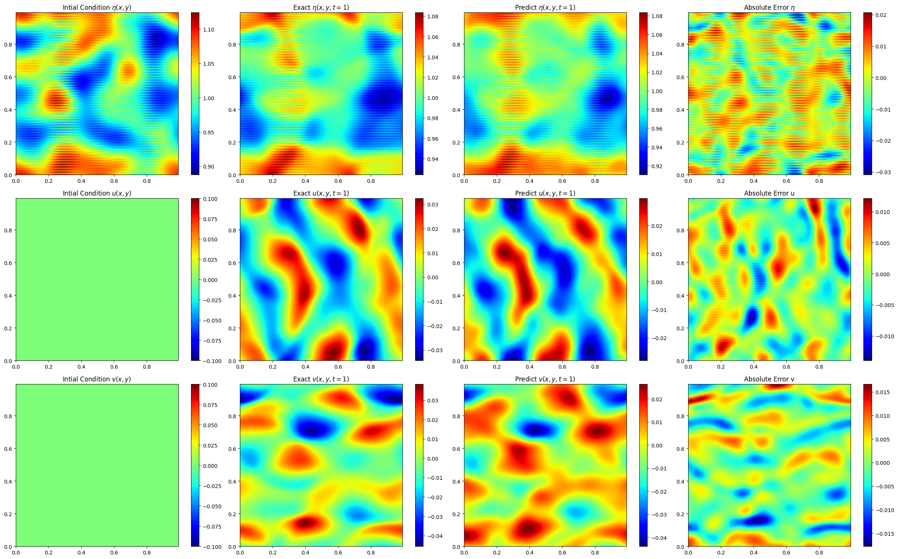

# Physics Informed FNO for Nonlinear Shallow Water Equations

This example demonstrates physics informing of a
data-driven model using numerical derivatives (PINO).

## Problem overview

To examine the properties of PINOs with 3 coupled nonlinear equations, we
examined the ability of the networks to reproduce the nonlinear shallow water
equations. These equations are applicable in several physical scenarios
including tsunami modeling.  We assumed that the total fluid column height
$\eta(x,y,t)$ was composed of a mean height plus some perturbation,
but the initial velocity fields $u(x,y,t)$ and $v(x,y,t)$ were initially
zero. These equations are given by

$$\begin{align}
\frac{\partial(\eta)}{\partial t}+\frac{\partial(\eta u)}{\partial x}+
\frac{\partial(\eta v)}{\partial y}&=0,  \\
\frac{\partial(\eta u)}{\partial t}+
\frac{\partial}{\partial x}\left(\eta u^{2}+\frac{1}{2} g
\eta^{2}\right)+
\frac{\partial(\eta u v)}{\partial y}&=\nu\left(u_{xx} + u_{yy}\right), \\
\frac{\partial(\eta v)}{\partial t}+\frac{\partial(\eta u v)}{\partial x}+
\frac{\partial}{\partial y}\left(\eta v^{2}+\frac{1}{2} g
\eta^{2}\right)&=\nu\left(v_{xx} + v_{yy}\right),
\end{align}$$

$$\begin{align}
\textrm{with} \quad \eta(x,y,0) = \eta_{0}(x,y),\ u(x,y,0)=0,\
v(x,y,0)=0,\ \quad
x,y \in[0,1), \ t \in[0,1],
\end{align}$$

where the gravitational coefficient $g=1$ and the viscosity coefficient
$\nu=0.002$ to prevent the formation of shocks. Below we plot how each of these
fields evolves in space and time according to the PINO predictions and the
simulated data.  We observe that the error in each of these cases is relatively small.

<!-- {: .center} -->


We will demonstrate the use of data loss and physics constraints,
specifically the equation residual loss, to create accurate predictions.
[PhysicsNeMo Sym](https://github.com/NVIDIA/physicsnemo-sym)
has utilities tailored for physics-informed machine learning. It also presents
abstracted APIs that allow users to think and model the problem from the lens of
equations, constraints, etc. In this example, we will only leverage the physics-informed
utilities to see how we can add physics to an existing data-driven model with ease while
still maintaining the flexibility to define our own training loop and other details.
For a more abstracted definition of these type of problems, where the training loop
definition and other things is taken care of implicitly, you may refer
[PhysicsNeMo Sym](https://github.com/NVIDIA/physicsnemo-sym)

## Dataset

The training and validation datasets for this example can be found on the
[PINO Applications Github page](https://github.com/shawnrosofsky/PINO_Applications).
The downloading and pre-processing of the data can also be done by running
the below set of commands:

```bash
python download_data.py
```

To demonstrate the usefulness of the Physics loss, we will deliberately choose a smaller
dataset size of 45 samples. In such regiemes, the effect of physics loss is more
evident, as it regularizes the model in the absence of large data.

## Model overview and architecture

In this example, we will use a Fourier Neural Operator (FNO). and then compute the
derivatives in a PINO style, using Numerical differentiation with Fourier derivatives.
With this example, we intend to demonstrate how to implement multiple
equations into the loss function.

In this example, we will also use the `PDE` class from PhysicsNeMo-Sym to symbolically define
the PDEs. This is very convinient and most natural way to define these PDEs and allows
us to print the equations to check for correctness. This also abstracts out the
complexity of converting the equation into a pytorch representation. PhysicsNeMo Sym also
provides several complex, well-tested PDEs like 3D Navier-Stokes, Linear elasticity,
Electromagnetics, etc. pre-defined which can be used directly in physics-informing
applications. We will also give you the option to choose between the
derivative functions from PhysicsNeMo-Sym or from the original paper.  

## Getting Started

To get started with the example, simply run,

```bash
python train_swe_nl_pino.py
```

## References

- [Applications of physics informed neural operators](https://arxiv.org/abs/2203.12634)
- [Fourier Neural Operator for Parametric Partial Differential Equations](https://arxiv.org/abs/2010.08895)
- [Physics-Informed Neural Operator for Learning Partial Differential Equations](https://arxiv.org/abs/2111.03794)
