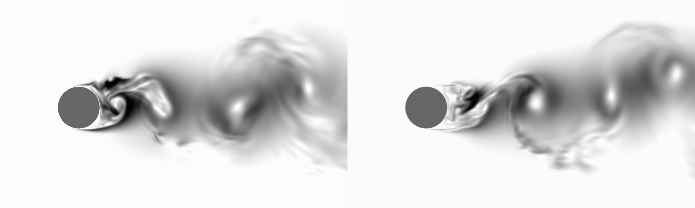

# A Diffusion model for a 2d Kármán vortex street about a fixed cylinder

This example uses a Pytorch implementation of DDPM which can be found [here](https://github.com/lucidrains/denoising-diffusion-pytorch/). 

## Problem overview

Turbulent flows are notoriously difficult to model. The structures involved can be found across a wide
range of temporal and spatial scales, and the high degree of non-linearity as well as sensitivity to the initial
conditions make this an especially challenging problem. In particular, even in the presence of statistical
or geometrical symmetries it is not possible to reduce the dimensionality of the problem (e.g. from three- to
two- dimensional) in numerical simulations.
A general analytic solution to the governing (Navier-Stokes) equations
remains elusive, requiring a variety of computational methods to obtain even numerical solutions. Scale-
resolving techniques, such as DNS and LES, strive to resolve the entire spectrum of length and time scales
present in the flow, or at least the energetically most significant part (as is the case for LES), whereas
conventional averaging approaches (such as Reynolds-averaged Navier-Stokes, or RANS) instead attempt to
fit a statistical model. Whilst the former approaches provide the highest possible modelling accuracy, the
latter are affected by inevitable loss of information, with non-generalisable closures, strongly affected by
flow typology and boundary conditions. Even in techniques such as RANS, which considerably reduce the
computational cost of complex simulations, they remain prohibitively high if a large number of computations
must be carried out in relatively short time, such as in rapid prototyping and design optimisation loops. This
makes the use of machine learning, especially generative probabilistic AI extremely promising, particularly
when only statistical distributions resulting from stochastic initial conditions are required. [1]

In this example, we apply a modern DDPM implementation [2] to a 2d Kármán vortex street about a fixed cylinder, and this model
is able to effectively capture the flow distribution.

## Dataset

We perform our experiments on the case of a flow around a cylinder at Reynolds number 3900, which is well studied in the literature.
The flow field is characterized by a Kármán vortex street developing in the wake of the cylinder. The vortex street consists of a characteristic coherent vortex system in which the rotational axes of the individual vortices are aligned with the cylinder axis.

The data set of grayscale images (see image below) was generated by post-processing the transient LES velocity field data using a projection mapping in the sense that the system remains ergodic on a reduced state space. Let $V(\xi,t)=(V_x(\xi,t),V_y(\xi,t),V_z(\xi,t))$ be the velocity field of the fluid. Then for our dataset, the gray scale shows the distribution of the absolute deviation of the local fluctuating velocity magnitude $c(\xi,t)=\sqrt{V_x(\xi,t)^2+V_y(\xi,t)^2+V_z (\xi,t)^2}$ at the location $\xi$ from its time average 
$c'(\xi,t) = |c(\xi,t) - \overline{c}(\xi)|$ with $~~\overline{c}(\xi)=\frac{1}{T}\int_0^Tc(\xi,t) \,\mathrm{d}t$.
For the numerical setup of the LES, see [3]. In total, the data set consists of $100,000$ images with a resolution of $1000 \times 600$ pixels.
The full data set is available at LINK.

## Model overview and architecture

The model is an implementation of DDPM combined with a transformer and shadowed by an Exponential Moving Average (EMA) model.
Due to the large number of parameters and slow training times involved, the model is also built with parallelisation across multiple GPUs in mind,
and is supported out of the box.
A UNet with five downsampling layers, interspersed with attention and ResNet blocks, is used to represent the decoder. 



## Getting Started

The scripts provided include code for training, sampling and preprocessing the dataset.
For training, to view the available command line arguments, run

```bash
python main.py -h
```

and for sampling

```bash
python sample.py -h
```

Arguments can be provided on the command line or in ```config.json```. For training, the only required argument is ```experiment_name```. 
For sampling, ```model``` is also required. 
Providing this argument to the training script resumes training from where you left off.

The dataset is automatically downloaded from [4], and further processing is applied upon extraction. This can be turned off in ```config.json```.

Depending on your particular setup, you may need to set the environment variables
```bash
export WORLD_SIZE=$N
export CUDA_VISIBLE_DEVICES=$N
```
for some `$N` equivalent to the number of available GPUs.

## References
 - [1] [Comparison of Generative Learning Methods for Turbulence Modeling](https://arxiv.org/abs/2411.16417)
 - [2] [Denoising Diffusion Probabilistic Models](https://proceedings.neurips.cc/paper/2020/file/4c5bcfec8584af0d967f1ab10179ca4b-Paper.pdf)
 - [3] [Generative Modelling of Turbulence](https://arxiv.org/abs/2112.02548)
 - [4] [Flow Around a Cylinder for Generative Learning](https://zenodo.org/records/13820259)