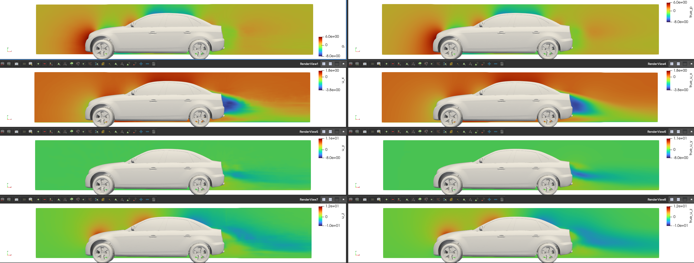

# XAeroNet: Scalable Foundational Neural Models for External Aerodynamics

## Problem overview

## Dataset
We trained our models using the DrivAerML dataset from the [CAE ML Dataset collection](https://caemldatasets.org/drivaerml/).
This high-fidelity, open-source (CC-BY-SA) public dataset is specifically designed
for automotive aerodynamics research. It comprises 500 parametrically morphed variants
of the widely utilized DrivAer notchback generic vehicle. Mesh generation and scale-resolving
computational fluid dynamics (CFD) simulations were executed using consistent and validated
automatic workflows that represent the industrial state-of-the-art. Geometries and comprehensive
aerodynamic data are published in open-source formats. For more technical details about this
dataset, please refer to their [paper](https://arxiv.org/pdf/2408.11969).

## Model overview and architecture

## Training the XAeroNet-S model

To train the XAeroNet-S model, follow these steps:

    1. Download the DrivAer ML dataset using the provided scripts.

    2. Navigate to the `surface` folder.

    3. Specify the configurations in `conf/config.yaml'. Make sure path to the dataset is specified correctly.

    4. Run `combine_stl_solids.py'. The STL files in the DriveML dataset consist of multiple solids. Those should be
       combined to a single solid to properly generate a point cloud on the surface using the Tesselated geometry module in Modulus.

    5. Run 'preprocessing.py'. This will prepare and save the partitioned graphs.

    6. Create a `partitions_validation` folder, and move the samples you wish to use for validation to that folder.

    7. Run 'compute_stats.py' to compute the global mean and standard deviation from the training samples.

    8. Run 'train.py' to start the training.

    9. Download the validation results (saved in form of point clouds in `.vtp` format), and visualize in Paraview.


## Training the XAeroNet-V model




## Logging

We mainly use TensorBoard for logging training and validation losses, as well as
the learning rate during training. You can also optionally use Weight & Biases to
log training metrics. To visualize TensorBoard running in a
Docker container on a remote server from your local desktop, follow these steps:

1. **Expose the Port in Docker:**
     Expose port 6006 in the Docker container by including
     `-p 6006:6006` in your docker run command.

2. **Launch TensorBoard:**
   Start TensorBoard within the Docker container:
     ```bash
     tensorboard --logdir=/path/to/logdir --port=6006
     ```

3. **Set Up SSH Tunneling:**
   Create an SSH tunnel to forward port 6006 from the remote server to your local machine:
     ```bash
     ssh -L 6006:localhost:6006 <user>@<remote-server-ip>
     ```
    Replace `<user>` with your SSH username and `<remote-server-ip>` with the IP address
    of your remote server. You can use a different port if necessary.

4. **Access TensorBoard:**
   Open your web browser and navigate to `http://localhost:6006` to view TensorBoard.

**Note:** Ensure the remote server’s firewall allows connections on port `6006`
and that your local machine’s firewall allows outgoing connections.


