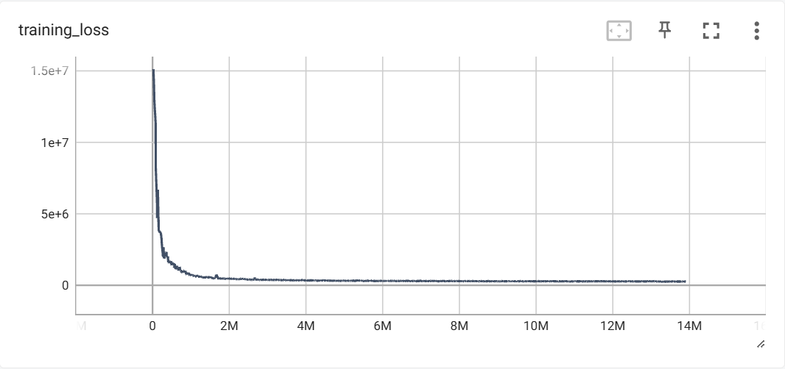

<!-- markdownlint-disable -->
# Generative Correction Diffusion Model (CorrDiff) for Km-scale Atmospheric Downscaling

## Table of Contents
- [Generative Correction Diffusion Model (CorrDiff) for Km-scale Atmospheric Downscaling](#generative-correction-diffusion-model-corrdiff-for-km-scale-atmospheric-downscaling)
  - [Table of Contents](#table-of-contents)
  - [Problem overview](#problem-overview)
  - [Getting started with the HRRR-Mini example](#getting-started-with-the-hrrr-mini-example)
    - [Preliminaries](#preliminaries)
    - [Configuration basics](#configuration-basics)
    - [Training the regression model](#training-the-regression-model)
    - [Training the diffusion model](#training-the-diffusion-model)
    - [Generation](#generation)
  - [Another example: Taiwan dataset](#another-example-taiwan-dataset)
    - [Dataset \& Datapipe](#dataset--datapipe)
    - [Training the models](#training-the-models)
    - [Sampling and Model Evaluation](#sampling-and-model-evaluation)
    - [Logging and Monitoring](#logging-and-monitoring)
  - [Training CorrDiff on a Custom Dataset](#training-corrdiff-on-a-custom-dataset)
    - [Defining a Custom Dataset](#defining-a-custom-dataset)
    - [Training configuration](#training-configuration)
    - [Generation configuration](#generation-configuration)
    - [FAQs](#faqs)
  - [References](#references)

## Problem overview

To improve weather hazard predictions without expensive simulations, a cost-effective
stochastic downscaling model, [CorrDiff](https://arxiv.org/abs/2309.15214), is trained
using high-resolution weather data
and coarser ERA5 reanalysis. CorrDiff employs a two-step approach with UNet and diffusion
to address multi-scale challenges, showing strong performance in predicting weather
extremes and accurately capturing multivariate relationships like intense rainfall and
typhoon dynamics, suggesting a promising future for global-to-km-scale machine learning
weather forecasts.

<p align="center">

</p>

## Getting started with the HRRR-Mini example

To get started with CorrDiff, we provide a simplified version called CorrDiff-Mini that combines:

1. A smaller neural network architecture that reduces memory usage and training time
2. A reduced training dataset, based on the HRRR dataset, that contains fewer samples (available at [NGC](https://catalog.ngc.nvidia.com/orgs/nvidia/teams/modulus/resources/modulus_datasets-hrrr_mini))

Together, these modifications reduce training time from thousands of GPU hours to around 10 hours on A100 GPUs. The simplified data loader included with CorrDiff-Mini also serves as a helpful example for training CorrDiff on custom datasets. Note that CorrDiff-Mini is intended for learning and educational purposes only - its predictions should not be used for real applications.

### Preliminaries
Start by installing Modulus (if not already installed) and copying this folder (`examples/generative/corrdiff`) to a system with a GPU available. Also download the CorrDiff-Mini dataset from [NGC](https://catalog.ngc.nvidia.com/orgs/nvidia/teams/modulus/resources/modulus_datasets-hrrr_mini).

### Configuration basics

CorrDiff training is managed through `train.py` and uses YAML configuration files powered by [Hydra](https://hydra.cc/docs/intro/). The configuration system is organized as follows:

- **Base Configurations**: Located in the `conf/base` directory
- **Configuration Files**:
  - **Training Configurations**:
    - GEFS-HRRR dataset (continental United States): 
      - `conf/config_training_gefs_hrrr_regression.yaml` - Configuration for training the regression model on GEFS-HRRR dataset
      - `conf/config_training_gefs_hrrr_diffusion.yaml` - Configuration for training the diffusion model on GEFS-HRRR dataset
    - HRRR-Mini dataset (smaller continental United States,):
      - `conf/config_training_hrrr_mini_regression.yaml` - Simplified regression model training setup for the HRRR-Mini example
      - `conf/config_training_hrrr_mini_diffusion.yaml` - Simplified diffusion model training setup for the HRRR-Mini example
    - Taiwan dataset:
      - `conf/config_training_taiwan_regression.yaml` - Configuration for training the regression model on Taiwan weather data
      - `conf/config_training_taiwan_diffusion.yaml` - Configuration for training the diffusion model on Taiwan weather data
    - Custom dataset:
      - `conf/config_training_custom.yaml` - Template configuration for training on custom datasets
  - **Generation Configurations**:
    - `conf/config_generate_taiwan.yaml` - Settings for generating predictions using Taiwan-trained models
    - `conf/config_generate_hrrr_mini.yaml` - Settings for generating predictions using HRRR-Mini models
    - `conf/config_generate_gefs_hrrr.yaml` - Settings for generating predictions using GEFS-HRRR models
    - `conf/config_generate_custom.yaml` - Template configuration for generation with custom trained models

To select a specific configuration, use the `--config-name` option when running the training script. Each training configuration file defines three main components:
1. Training dataset parameters
2. Model architecture settings
3. Training hyperparameters

You can modify configuration options in two ways:
1. **Direct Editing**: Modify the YAML files directly
2. **Command Line Override**: Use Hydra's `++` syntax to override settings at runtime

For example, to change the training batch size (controlled by `training.hp.total_batch_size`):
```bash
python train.py ++training.hp.total_batch_size=64  # Sets batch size to 64
```

This modular configuration system allows for flexible experimentation while maintaining reproducibility.

### Training the regression model

CorrDiff uses a two-step training process:
1. Train a deterministic regression model
2. Train a diffusion model using the pre-trained regression model

For the CorrDiff-Mini regression model, we use the following configuration components:

The top-level configuration file `config_training_hrrr_mini_regression.yaml` contains the most commonly modified parameters:
- `dataset`: Dataset type and paths (`hrrr_mini`, `gefs_hrrr`, `cwb`, or `custom`)
- `model`: Model architecture type (`regression`, `diffusion`, etc.)
- `model_size`: Model capacity (`normal` or `mini` for faster experiments)
- `training`: High-level training parameters (duration, batch size, IO settings)
- `wandb`: Weights & Biases logging configuration

This configuration automatically loads these specific files from `conf/base`:
- `dataset/hrrr_mini.yaml`: HRRR-Mini dataset parameters (data paths, variables)
- `model/regression.yaml`: Regression UNet architecture settings
- `model_size/mini.yaml`: Reduced model capacity settings for faster training
- `training/regression.yaml`: Training loop parameters specific to regression model

These base configuration files contain more detailed settings that are less commonly modified but give fine-grained control over the training process.

To begin training, execute the following command using [`train.py`](train.py):
```bash
python train.py --config-name=config_training_hrrr_mini_regression.yaml
```

**Training Details:**
- Duration: A few hours on a single A100 GPU
- Checkpointing: Automatically resumes from latest checkpoint if interrupted
- Multi-GPU Support: Compatible with `torchrun` or MPI for distributed training

> **💡 Memory Management**  
> The default configuration uses a batch size of 256 (controlled by `training.hp.total_batch_size`). If you encounter memory constraints, particularly on GPUs with limited memory, you can reduce the per-GPU batch size by setting `++training.hp.batch_size_per_gpu=64`. CorrDiff will automatically employ gradient accumulation to maintain the desired effective batch size while using less memory.

### Training the diffusion model

After successfully training the regression model, you can proceed with training the diffusion model. The process requires:

- A pre-trained regression model checkpoint
- The same dataset used for regression training
- Configuration file [`conf/config_training_hrrr_mini_diffusion.yaml`](conf/config_training_hrrr_mini_diffusion.yaml)

To start the diffusion model training, execute:
```bash
python train.py --config-name=config_training_hrrr_mini_diffusion.yaml \
  ++training.io.regression_checkpoint_path=</path/to/regression/model>
```
where `</path/to/regression/model>` should point to the saved regression checkpoint.

The training will generate checkpoints in the `checkpoints_diffusion` directory. Upon completion, the final model will be saved as `EDMPrecondSR.0.8000000.mdlus`.

### Generation

Once both models are trained, you can use [`generate.py`](generate.py) to create new predictions. The generation process requires:

**Required Files:**
- Trained regression model checkpoint
- Trained diffusion model checkpoint
- Configuration file [`conf/config_generate_hrrr_mini.yaml`](conf/config_generate_hrrr_mini.yaml)

Execute the generation command:
```bash
python generate.py --config-name="config_generate_hrrr_mini.yaml" \
  ++generation.io.res_ckpt_filename=</path/to/diffusion/model> \
  ++generation.io.reg_ckpt_filename=</path/to/regression/model>
```

The output is saved as a NetCDF4 file containing three groups:
- `input`: The original input data
- `truth`: The ground truth data for comparison
- `prediction`: The CorrDiff model predictions

You can analyze the results using the Python NetCDF4 library or visualization tools of your choice.

## Another example: Taiwan dataset

### Dataset & Datapipe

The Taiwan example demonstrates CorrDiff training on a high-resolution weather dataset conditioned on the low-resolution [ERA5 dataset](https://www.ecmwf.int/en/forecasts/dataset/ecmwf-reanalysis-v5). This dataset is available for non-commercial use under the [CC BY-NC-ND 4.0 license](https://creativecommons.org/licenses/by-nc-nd/4.0/legalcode.en).

**Dataset Access:**
- Location: [NGC Catalog - CWA Dataset](https://catalog.ngc.nvidia.com/orgs/nvidia/teams/modulus/resources/modulus_datasets_cwa)
- Download Command:
  ```bash
  ngc registry resource download-version "nvidia/modulus/modulus_datasets_cwa:v1"
  ```

### Training the models

The Taiwan example supports three types of models, each serving a different purpose:

1. **Regression Model**: Basic deterministic model
2. **Diffusion Model**: Full probabilistic model
3. **Patch-based Diffusion Model**: Memory-efficient variant that processes small spatial regions to improve scalability

The patch-based approach divides the target region into smaller subsets during both training and generation, making it particularly useful for memory-constrained environments or large spatial domains.

**Configuration Structure:**

The top-level configuration file `config_training_taiwan_regression.yaml` contains commonly modified parameters:
- `dataset`: Set to `cwb` for the Taiwan Central Weather Bureau dataset
- `model`: Model type (`regression`, `diffusion`, or `patched_diffusion`)
- `model_size`: Model capacity (`normal` recommended for Taiwan dataset)
- `training.hp`: Training duration and batch size settings
- `wandb`: Experiment tracking configuration

This configuration automatically loads these specific files from `conf/base`:
- `dataset/cwb.yaml`: Taiwan dataset parameters
- `model/regression.yaml` or `model/diffusion.yaml`: Model architecture settings
- `training/regression.yaml` or `training/diffusion.yaml`: Training parameters

When training the diffusion variants, you'll need to specify the path to your pre-trained regression checkpoint in `training.io.regression_checkpoint_path`. This is essential as the diffusion model learns to predict residuals on top of the regression model's predictions.

**Training Commands:**

For single-GPU training:
```bash
python train.py --config-name=config_training_taiwan_regression.yaml
```

For multi-GPU or multi-node training:
```bash
torchrun --standalone --nnodes=<NUM_NODES> --nproc_per_node=<NUM_GPUS_PER_NODE> train.py
```

To switch between model types, simply change the configuration name in the training command (e.g., `config_training_taiwan_diffusion.yaml` for the diffusion model).

### Sampling and Model Evaluation

The evaluation pipeline for CorrDiff models consists of two main components:

1. **Sample Generation** ([`generate.py`](generate.py)):
   Generates predictions and saves them in a netCDF file format. The process uses configuration settings from [`conf/config_generate.yaml`](conf/config_generate.yaml).
   ```bash
   python generate.py --config-name=config_generate_taiwan.yaml
   ```

2. **Performance Scoring** ([`score_samples.py`](score_samples.py)):
   Computes both deterministic metrics (like MSE, MAE) and probabilistic scores for the generated samples.
   ```bash
   python score_samples.py path=<PATH_TO_NC_FILE> output=<OUTPUT_FILE>
   ```

For visualization and analysis, you have several options:
- Use the plotting scripts in the [`inference`](inference/) directory
- Visualize results with [Earth2Studio](https://github.com/NVIDIA/earth2studio)
- Create custom visualizations using the NetCDF4 output structure

### Logging and Monitoring

CorrDiff supports two powerful tools for experiment tracking and visualization:

**TensorBoard Integration:**
TensorBoard provides real-time monitoring of training metrics when running in a Docker container:

1. Configure Docker:
   ```bash
   docker run -p 6006:6006 ...  # Include port forwarding
   ```

2. Start TensorBoard:
   ```bash
   tensorboard --logdir=/path/to/logdir --port=6006
   ```

3. Set up SSH tunnel (for remote servers):
   ```bash
   ssh -L 6006:localhost:6006 <user>@<remote-server-ip>
   ```

4. Access the dashboard at `http://localhost:6006`

**Weights & Biases Integration:**
CorrDiff also supports experiment tracking through Weights & Biases. To enable wandb logging:

1. Configure your wandb settings in [`conf/config_training_taiwan_diffusion.yaml`](conf/config_training_taiwan_diffusion.yaml):
   ```yaml
   wandb:
     mode: online           # Options: "online", "offline", "disabled"
     key: <your_api_key>   # Your wandb API key
     project: <project>     # Project name
     entity: <entity>      # Your wandb username or team
     name: <experiment>    # Experiment name
     watch_model: true     # Enable parameter tracking
   ```

2. Initialize wandb (first time only):
   ```bash
   wandb login
   ```

3. Training runs will automatically log to your wandb project, tracking:
   - Training and validation metrics
   - Model architecture details
   - System resource usage
   - Hyperparameters

You can access your experiment dashboard at `https://wandb.ai/<entity>/<project>`.

## Training CorrDiff on a Custom Dataset

This repository includes examples of **CorrDiff** training on specific datasets, such as **Taiwan** and **HRRR**. However, many use cases require training **CorrDiff** on a **custom high-resolution dataset**. The steps below outline the process.

### Defining a Custom Dataset

To train CorrDiff on a custom dataset, you need to implement a custom dataset class that inherits from `DownscalingDataset` defined in [`datasets/base.py`](./datasets/base.py). This base class defines the interface that all dataset implementations must follow.

**Required Implementation:**

1. Your dataset class must inherit from `DownscalingDataset` and implement its
   abstract methods, for example:
   - `longitude()` and `latitude()`: Return coordinate arrays
   - `input_channels()` and `output_channels()`: Define metadata for input/output variables
   - `time()`: Return time values
   - `image_shape()`: Return spatial dimensions
   - `__len__()`: Return total number of samples
   - `__getitem__()`: Return data for a given index

The most important method is `__getitem__`, which must return a tuple of tensors:
```python
def __getitem__(self, idx: int) -> Tuple[torch.Tensor, ...]:
    """
    Returns:
        Tuple containing:
        - img_clean: Target high-resolution data [output_channels, height, width]
        - img_lr: Input low-resolution data [input_channels, height, width]
        - labels: Additional labels/conditions [label_dim]
        - lead_time_label: (Optional) Lead time information [1]
    """
    # Your implementation here
    return img_clean, img_lr, labels, lead_time_label  # lead_time_label is optional
```

2. Configure your dataset in the YAML configuration file. Any parameters below
   will be passed to your dataset's `__init__` method. For example:
   ```yaml
   dataset:
       type: path/to/your/dataset.py::CustomDataset  # Path to file::class name
       # All parameters below will be passed to your dataset's __init__
       data_path: /path/to/your/data
       stats_path: /path/to/statistics.json  # Optional normalization stats
       input_variables: ["temperature", "pressure"]  # Example parameters
       output_variables: ["high_res_temperature"]
       invariant_variables: ["topography"]  # Optional static fields
       # Add any other parameters needed by your dataset class
   ```

**Important Notes:**
- The training script will automatically:
  1. Parse the `type` field to locate your dataset file and class
  2. Register your custom dataset class using `register_dataset()`
  3. Pass all other fields in the `dataset` section as kwargs to your class constructor
- All tensors should be properly normalized (use `normalize_input`/`normalize_output` methods if needed)
- Ensure consistent dimensions across all samples
- Channel metadata should accurately describe your data variables


For reference implementations of dataset classes, look at:
- [`datasets/hrrrmini.py`](./datasets/hrrrmini.py) - Simple example using NetCDF format
- [`datasets/cwb.py`](./datasets/cwb.py) - More complex example


### Training configuration

After implementing your custom dataset, you can proceed with the two-step training process followed by generation. The configuration system uses a hierarchical structure that balances ease of use with detailed control over the training process.

**Top-level Configuration** (`config_training_custom.yaml`):
This file serves as your primary interface for configuring the training process. It contains commonly modified parameters that can be set either directly in the file or through command-line overrides:

- `dataset`: Configuration for your custom dataset implementation, including paths and variables
- `model`: Core model settings, including type selection (`regression` or `diffusion`)
- `training`: High-level training parameters like batch size and duration
- `wandb`: Settings for experiment tracking and monitoring

**Fine-grained Control**:
The base configuration files in `conf/base/` provide detailed control over specific components. These files are automatically loaded based on your top-level choices:

- `model/*.yaml`: Contains architecture-specific settings for network depth, attention mechanisms, and embedding configurations
- `training/*.yaml`: Defines training loop behavior, including optimizer settings and checkpoint frequency
- `model_size/*.yaml`: Provides preset configurations for different model capacities

While direct modification of these base files is typically unnecessary, any
parameter can be overridden using Hydra's `++` syntax. For example, to reduce
the learning rate to 0.0001:

```bash
python train.py --config-name=config_training_custom.yaml ++training.hp.lr=0.0001
```

This configuration system allows you to start with sensible defaults while maintaining the flexibility to customize any aspect of the training process.

You can directly modify the training configuration file to change the dataset,
model, and training parameters, or use Hydra's `++` syntax to override
them. Once the regression model is trained, proceed with training the diffusion
model. During training, you can fine-tune various parameters. The most commonly adjusted parameters include:

- `training.hp.total_batch_size`: Controls the total batch size across all GPUs
- `training.hp.batch_size_per_gpu`: Adjusts per-GPU memory usage
- `training.hp.patch_shape_x/y`: Sets dimensions for patch-based training
- `training.hp.training_duration`: Defines total training steps
- `training.hp.lr_rampup`: Controls learning rate warmup period

> **Starting with a Small Model**  
> When developing a new dataset implementation, it is recommended to start with a smaller model for faster iteration and debugging. You can do this by setting `model_size: mini` in your configuration file:
> ```yaml
> defaults:
>     - model_size: mini  # Use smaller architecture for testing
> ```
> This is similar to the model used in the HRRR-Mini example and can
> significantly reduce testing time. After debugging, you can switch
> back to the full model by setting the `model_size` setting to `normal`.

> **Note on Patch Size Selection**  
> When implementing a patch-based training, choosing the right patch size is critical for model performance. The patch dimensions are controlled by `patch_shape_x` and `patch_shape_y` in your configuration file. To determine optimal patch sizes:
> 1. Calculate the auto-correlation function of your data using the provided utilities in [`inference/power_spectra.py`](./inference/power_spectra.py):
>    - `average_power_spectrum()`
>    - `power_spectra_to_acf()`
> 2. Set patch dimensions to match or exceed the distance at which auto-correlation approaches zero
> 3. This ensures each patch captures the full spatial correlation structure of your data
>
> This analysis helps balance computational efficiency with the preservation of important physical relationships in your data.

### Generation configuration

After training both models successfully, you can use CorrDiff's generation pipeline to create predictions. The generation system follows a similar hierarchical configuration structure as training.

**Top-level Configuration** (`config_generate_custom.yaml`):
This file serves as the main interface for controlling the generation process. It defines essential parameters that can be modified either directly or through command-line overrides.

**Fine-grained Control**:
The base configuration files in `conf/base/generation` provide fine-grained control over
the generation process. For example, `sampling/stochastic.yaml` controls the
stochastic sampling process (noise scheduling, number of sampling steps,
classifier-free guidance settings). While these base configurations are typically used as-is, you can override any
parameter directly in the configuration file or using Hydra's `++` syntax. For
example to increase the number of ensembles generated per input, you can run:

```bash
python generate.py --config-name=config_generate_custom.yaml \
  ++generation.io.res_ckpt_filename=/path/to/diffusion/checkpoint.mdlus \
  ++generation.io.reg_ckpt_filename=/path/to/regression/checkpoint.mdlus \
  ++dataset.type=path/to/your/dataset.py::CustomDataset \
  ++generation.num_ensembles=10
```

Key generation parameters that can be adjusted include for example:

- `generation.num_ensembles`: Number of samples to generate per input
- `generation.patch_shape_x/y`: Patch dimensions for patch-based generation

The generated samples are saved in a NetCDF file with three main components:
- Input data: The original low-resolution inputs
- Ground truth: The actual high-resolution data (if available)
- Predictions: The model-generated high-resolution outputs

### FAQs

1. **Is it preferable to re-train from a pre-trained checkpoint or train from scratch?**  
   Pre-trained checkpoints are available through NVIDIA AI Enterprise. For example, a trained model for the continental United States on the GEFS-HRRR dataset is available [here](https://build.nvidia.com/nvidia/corrdiff/modelcard). It is generally recommended to start training from a checkpoint rather than from scratch if the following conditions are met:
   - Your custom dataset covers a region included in the training data of the checkpoint (e.g., a sub-region of the continental United States for the checkpoint mentioned above).
   - At most half of the variables in your dataset are also included in the training data of the checkpoint.

   Training from scratch is recommended for all other cases.

2. **How many samples are needed to train a CorrDiff model?**  
   The more, the better. As a rule of thumb, at least 50,000 samples are necessary.  
   *Note: For patch-based diffusion, each patch can be counted as a sample.*

3. **How many GPUs are required to train CorrDiff?**  
   A single GPU is sufficient as long as memory is not exhausted, but this may
   result in extremely slow training. To accelerate training, CorrDiff
   leverages distributed data parallelism. The total training wall-clock time
   roughly decreases linearly with the number of GPUs. Most CorrDiff training
   examples have been conducted with 64 A100 GPUs. If you encounter an
   out-of-memory error, reduce `batch_size_per_gpu` or, for
   patch-based diffusion models, decrease the patch size—ensuring it remains
   larger than the auto-correlation distance.

4. **How long does it take to train CorrDiff on a custom dataset?**  
   Training CorrDiff on the continental United States dataset required
   approximately 5,000 A100 GPU hours. This corresponds to roughly 80 hours of
   wall-clock time with 64 GPUs. You can expect the cost to scale
   linearly with the number of samples available.

5. **What are CorrDiff's current limitations for custom datasets?**  
   The main limitation of CorrDiff is the maximum _downscaling ratio_ it can
   achieve. For a purely spatial super-resolution task (where input and output variables are the same), CorrDiff can reliably achieve a maximum resolution scaling of ×16. If the task involves inferring new output variables, the maximum reliable spatial super-resolution is ×11.

6. **What does a successful training look like?**  
   In a successful training run, the loss function should decrease monotonically, as shown below:  
  <p align="center">

</p>

7. **Which hyperparameters are most important?**  
   One of the most crucial hyperparameters is the patch size for a patch-based
   diffusion model (`patch_shape_x` and `patch_shape_y` in the configuration file). A larger
   patch size increases computational cost and GPU memory requirements, while a
   smaller patch size may lead to a loss of physical information. The patch
   size should not be smaller than the auto-correlation distance, which can be
   determined using the auto-correlation plotting utility. Other important hyperparameters include:

   - Training duration (`training.hp.training_duration`): Total number of
     samples to process during training. Values between 1M and 30M samples are
     typical, depending on the size of the dataset and on the type of model
     (regression or diffusion).
   - Learning rate ramp-up (`training.hp.lr_rampup`): Number of samples over
     which learning rate gradually increases. In some cases, `lr_rampup=0` is
     sufficient, but if training is unstable, it may be necessary to increase
     it. Values between 0 and 200M samples are typical.
   - Learning rate (`training.hp.lr`): Base learning rate that controls how
     quickly model parameters are updated. It may be decreased if training is
     unstable, and increased if training is slow.
   - Batch size per GPU (`training.hp.batch_size_per_gpu`): Number of samples
     processed in parallel on each GPU. It needs to be reduced if you encounter
     an out-of-memory error.


## References

- [Residual Diffusion Modeling for Km-scale Atmospheric Downscaling](https://arxiv.org/pdf/2309.15214.pdf)
- [Elucidating the design space of diffusion-based generative models](https://openreview.net/pdf?id=k7FuTOWMOc7)
- [Score-Based Generative Modeling through Stochastic Differential Equations](https://arxiv.org/pdf/2011.13456.pdf)
