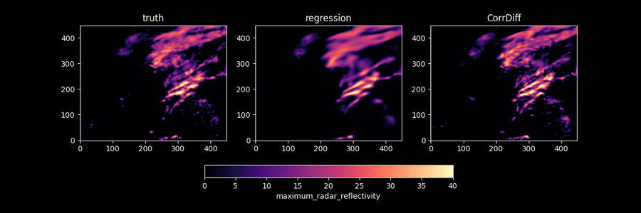

<!-- markdownlint-disable -->
## Generative Correction Diffusion Model (CorrDiff) for Km-scale Atmospheric Downscaling

## Problem overview

Predictions of weather hazard require expensive km-scale simulations driven by coarser
global inputs. Here, a cost-effective stochastic downscaling model is trained from a
high-resolution 2-km weather model over Taiwan conditioned on 25-km ERA5 reanalysis.
To address the multi-scale machine learning challenges of weather data, we employ a
two-step approach Corrector Diffusion (CorrDiff), where a UNet prediction of the mean
is corrected by a diffusion step. Akin to Reynolds decomposition in fluid dynamics,
this isolates generative learning to the stochastic scales. CorrDiff exhibits skillful
RMSE and CRPS and faithfully recovers spectra and distributions even for extremes.
Case studies of coherent weather phenomena reveal appropriate multivariate relationships
reminiscent of learnt physics: the collocation of intense rainfall and sharp gradients
in fronts and extreme winds and rainfall bands near the eyewall of typhoons.
Downscaling global forecasts successfully retains many of these benefits, foreshadowing
the potential of end-to-end, global-to- km-scales machine learning weather predictions.

Refer to the [CorrDiff preprint](https://arxiv.org/abs/2309.15214) for more details.

<p align="center">

</p>


## Dataset

The input (conditioning) dataset is taken from
[ERA5 reanalysis](https://www.ecmwf.int/en/forecasts/dataset/ecmwf-reanalysis-v5),
a global dataset at spatial resolution of about 25km and a temporal resolution of 1h.
The target dataset used in this
study is a subset of the proprietary RWRF model data (Radar Data
Assimilation with WRFDA 1). The RWRF model is one of the operational regional Numerical
Weather Prediction (NWP) models developed by CWA, which focuses on radar Data
Assimilation (DA) in the vicinity of Taiwan. The WRF - CWA system uses a nested 2km
domain in a 10km that is driven by a global model (GFS) as boundary conditions.

To facilitate training, we interpolate the input data onto the curvirectangular grid of
CWA with bilinear interpolation (with a rate of 4x), which results in 36 × 36 pixels
over the region of Taiwan. Each sample in the input dataset consists of 20 channels. 
This includes four pressure levels (500 hPa, 700 hPa,
850 hPa, and 925 hPa) with four corresponding variables: temperature, eastward and
northward components horizontal wind vector, and Geopotential Height. Additionally,
the dataset includes single level variables such as 2 meter Temperature,
10 meter wind vector, and the total column water vapor. 

The target dataset covers a duration of 52 months, specifically from January 2018 to
April 2022. It has a temporal frequency of one hour and a spatial resolution of 2km.
We use only the inner (nested) 2km domain, which has 448 × 448 pixels, projected using
the Lambert conformal conical projection method around Taiwan.
The geographical extent of the dataset spans from approximately 116.371°E to 125.568°E
in longitude and 19.5483°N to 27.8446°N in latitude. We sub-selected 4 channels
(variables) as the target variables, that are
most relevant for practical forecasting: temperature at 2 meter above the surface,
the horizontal winds at 10 meter above the surface and the 1h maximum radar
reflectivity - a surrogate of expect precipitation.
Notably, the radar reflectivity channel is not present in the input data and needs to
be predicted based on the other channels, making its prediction strictly generative.

To avoid over-fitting we divide the data into training and testing sets. Three years of
data 2018-2020 are used for training (2,4154 samples total). For testing we use the
full fourth year, 2021, as well as the first four months (January to April) of 2022.

The Zarr dataset used for training and testing the CorrDiff model is available for
non-commercial use under the [CC BY-NC-ND 4.0 license](https://creativecommons.org/licenses/by-nc-nd/4.0/legalcode.en)
and can be downloaded from https://catalog.ngc.nvidia.com/orgs/nvidia/teams/modulus/resources/cwa_dataset.

## Model overview and architecture

The CorrDiff model has a two-step learning approach. To ensure compatibility and
consistency, we employ the same UNet architecture used in
[EDM (Elucidated Diffusion Models)](https://github.com/NVlabs/edm)
for both the regression and diffusion networks. See
[this tutorial](https://github.com/NVIDIA/modulus/tree/main/examples/generative/diffusion)
to learn about the EDM diffusion models. This architecture is based on the UNet model
proposed in [this paper](https://proceedings.neurips.cc/paper_files/paper/2019/file/3001ef257407d5a371a96dcd947c7d93-Paper.pdf).
We enhance the UNet by increasing its size to include 6 encoder layers and 6 decoder
layers. For time embedding in the diffusion process, we utilize Fourier-based position
embedding. However, in the regression network, time embedding is disabled.
No data augmentation techniques are employed during
training. Overall, the UNet architecture comprises 80 million parameters.
Additionally, we introduce 4 channels for sinusoidal positional embedding.
During the training phase, we use the Adam optimizer with a learning rate of
$2 \times 10−4$, $\beta_1 = 0.9$, and $\beta_2 = 0.99$.
Exponential moving averages (EMA) with a rate of $\nu = 0.5$ are
applied, and dropout with a rate of $0.13$ is utilized. The regression network solely
receives the input conditioning channels. On the other hand,
the diffusion training incorporates the 20 input conditioning channels from the
coarse-resolution ERA5 data, which are concatenated with 4 noise channels to generate
the output for each denoiser. For diffusion training,
we adopt the Elucidated Diffusion Model (EDM), a continuous-time diffusion model. 
During training, EDM randomly selects the noise variance such that
$log(\sigma(t))) ~ N(0, 1.22)$ and aims to denoise the samples per
mini-batch. EDM is trained for 100 million steps, while the regression network is
trained for 30 million steps.
The training process is distributed across 16 DGX nodes, each equipped with 8 A100 GPUs,
utilizing data parallelism and a total batch size of 512. The total training time for
regression and diffusion models was 7 days that amounts to approximately 21,504
GPU-hours. For sampling purposes, we employ the second-order stochastic sampler
provided by EDM. This sampler performs 18 steps, starting from a maximum noise variance
of $\sigma_{max} = 800$ and gradually decreasing it to a minimum noise variance of
$\sigma_{min} = 0.002$. We adopt the rest of hyperparamaters from [EDM](https://github.com/NVlabs/edm).

<p align="center">

</p>

## Getting Started

To train the regression model on a single GPU, run

```bash
python train.py --config-name=config_train_regression.yaml

```

Once the regression model is trained, put the checkpoints in the `checkpoints/regression.mdlus` directory.
Next, to train the diffusion mode on a single GPU, run

```bash
python train.py --config-name=config_train_diffusion.yaml
```

This will launch a CorrDiff training using the base configs specified in
the config files. Configs can be changed directly in the YAML file,
or can be overwritten in the command line. For example, to run the training with a 
total batch size of 64, run

```bash
python train.py --config-name=config_train_regression.yaml batch=64
```

Data parallelism is also supported with multi-GPU runs. To launch a multi-GPU training,
run

```bash
mpirun -np <num_GPUs> python train.py --config-name=<config_train_diffusion or config_train_regression>
```

If running in a docker container, you may need to include the `--allow-run-as-root` in
the multi-GPU run command.

Support for weights and biases logging will be added in a subsequent update.

### Sampling and Model Evaluation

Model evaluation is split into two components. generate.py creates a netCDF file
that can be further analyzed and `plot_samples.py` makes plots from it.

To generate samples and save output in a netCDF file, run:

```bash
python generate.py
```
This will use the base configs specified in the `conf/config_generate.yaml` file.

Next, to plot one-sample for all the times (row=variable, col=sample, file=time), run:

```bash
python plot_single_sample.py samples.nc samples_image_dir
```

To plot multiple samples for all times (row=time, col=sample, file=variable), run:

```bash
python plot_multiple_samples.py samples.nc samples_image_dir
```

Finally, to compute scalar deterministic and probabilistic scores, run:

```bash
python score_samples.py samples.nc
```

  
## References

- [Residual Diffusion Modeling for Km-scale Atmospheric Downscaling](https://arxiv.org/pdf/2309.15214.pdf)
- [Elucidating the design space of diffusion-based generative models](https://openreview.net/pdf?id=k7FuTOWMOc7)
- [Score-Based Generative Modeling through Stochastic Differential Equations](https://arxiv.org/pdf/2011.13456.pdf)
