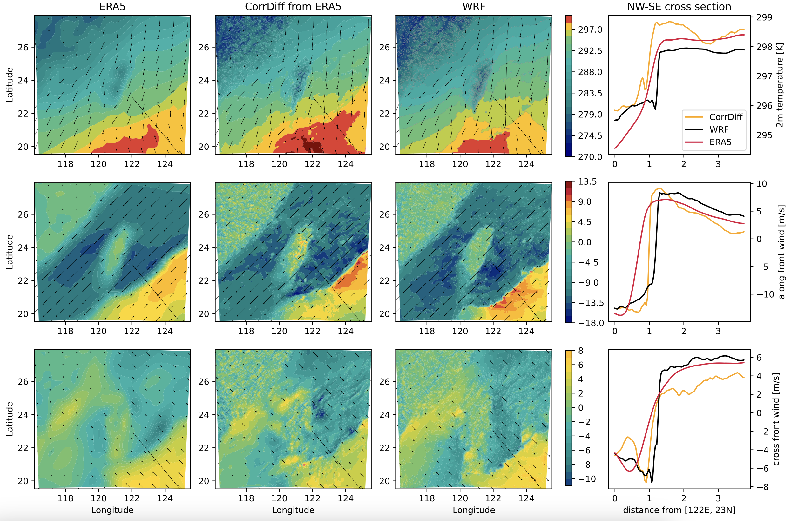

<!-- markdownlint-disable -->
# Generative Correction Diffusion Model (CorrDiff) for Km-scale Atmospheric Downscaling

## Problem overview

To improve weather hazard predictions without expensive simulations, a cost-effective
stochasticdownscaling model, [CorrDiff](https://arxiv.org/abs/2309.15214), is trained
using high-resolution weather data
and coarser ERA5 reanalysis. CorrDiff employs a two-step approach with UNet and diffusion
to address multi-scale challenges, showing strong performance in predicting weather
extremes and accurately capturing multivariate relationships like intense rainfall and
typhoon dynamics, suggesting a promising future for global-to-km-scale machine learning
weather forecasts.

<p align="center">

</p>

## Getting started

To build custom CorrDiff versions, you can get started by training the "Mini" version of CorrDiff, which uses smaller training samples and a smaller network to reduce training costs from thousands of GPU hours to around 10 hours on A100 GPUs while still producing reasonable results. It also includes a simple data loader that can be used as a baseline for training CorrDiff on custom datasets.

### Preliminaries
Start by installing PhysicsNeMo (if not already installed) and copying this folder (`examples/generative/corrdiff`) to a system with a GPU available. Also download the CorrDiff-Mini dataset from [NGC](https://catalog.ngc.nvidia.com/orgs/nvidia/teams/modulus/resources/modulus_datasets-hrrr_mini).

### Configuration basics

CorrDiff training is handled by `train.py` and controlled by YAML configuration files handled by [Hydra](https://hydra.cc/docs/intro/). Prebuilt configuration files are found in the `conf` directory. You can choose the configuration file using the `--config-name` option. The main configuration file specifies the training dataset, the model configuration and the training options. The details of these are given in the corresponding configuration files. To change a configuration option, you can either edit the configuration files or use the Hydra command line overrides. For example, the training batch size is controlled by the option `training.hp.total_batch_size`. We can override this from the command line with the `++` syntax: `python train.py ++training.hp.total_batch_size=64` would set run the training with the batch size set to 64.

### Training the regression model
To train the CorrDiff-Mini regression model, we use the main configuration file [config_training_mini_regression.yaml](conf/config_training_mini_regression.yaml). This includes the following components:
* The HRRR-Mini dataset: [conf/dataset/hrrrmini.yaml](conf/dataset/hrrrmini.yaml)
* The GEFS-HRRR dataset: [conf/dataset/hrrrmini.yaml](conf/dataset/gefs_hrrr.yaml)
* The CorrDiff-Mini regression model: [conf/model/corrdiff_regression_mini.yaml](conf/model/corrdiff_regression_mini.yaml)
* The CorrDiff-Mini regression training options: [conf/training/corrdiff_regression_mini.yaml](conf/training/corrdiff_regression_mini.yaml)
* The CorrDiff-GEFS-HRRR regression training options: [conf/model/corrdiff_regression_mini.yaml](conf/training/config_training_gefs_regression.yaml)
  
To start the training, run:
```bash
python train.py --config-name=config_training_mini_regression.yaml ++dataset.data_path=</path/to/dataset>/hrrr_mini_train.nc ++dataset.stats_path=</path/to/dataset>/stats.json
```
where you should replace both instances of `</path/to/dataset>` with the absolute path to the directory containing the downloaded HRRR-Mini dataset.

The training will require a few hours on a single A100 GPU. If training is interrupted, it will automatically continue from the latest checkpoint when restarted. Multi-GPU and multi-node training are supported and will launch automatically when the training is run in a `torchrun` or MPI environment.

The results, including logs and checkpoints, are saved by default to `outputs/mini_generation/`. You can direct the checkpoints to be saved elsewhere by setting: `++training.io.checkpoint_dir=</path/to/checkpoints>`.

> **_Out of memory?_** CorrDiff-Mini trains by default with a batch size of 256 (set by `training.hp.total_batch_size`). If you're using a single GPU, especially one with a smaller amout of memory, you might see out-of-memory error. If that happens, set a smaller batch size per GPU, e.g.: `++training.hp.batch_size_per_gpu=64`. CorrDiff training will then automatically use gradient accumulation to train with an effective batch size of `training.hp.total_batch_size`.

### Training the diffusion model

The pre-trained regression model is needed to train the diffusion model. Assuming you trained the regression model for the default 2 million samples, the final checkpoint will be `checkpoints_regression/UNet.0.2000000.mdlus`.
Save the final regression checkpoint into a new location, then run:
```bash
python train.py --config-name=config_training_mini_diffusion.yaml ++dataset.data_path=</path/to/dataset>/hrrr_mini_train.nc ++dataset.stats_path=</path/to/dataset>/stats.json ++training.io.regression_checkpoint_path=</path/to/regression/model>
```
where `</path/to/regression/model>` should point to the saved regression checkpoint.

Once the training is completed, copy the latest checkpoint (`checkpoints_diffusion/EDMPrecondSR.0.8000000.mdlus`) to a file.

### Generation

Use the `generate.py` script to generate samples with the trained networks:
```bash
python generate.py --config-name="config_generate_mini.yaml" ++generation.io.res_ckpt_filename=</path/to/diffusion/model> ++generation.io.reg_ckpt_filename=</path/to/regression/model> ++generation.io.output_filename=</path/to/output/file>
```
where `</path/to/regression/model>` and `</path/to/diffusion/model>` should point to the regression and diffusion model checkpoints, respectively, and `</path/to/output/file>` indicates the output NetCDF4 file.

You can open the output file with e.g. the Python NetCDF4 library. The inputs are saved in the `input` group of the file, the ground truth data in the `truth` group, and the CorrDiff prediction in the `prediction` group.

## Configs

The `conf` directory contains the configuration files for the model, data,
training, etc. The configs are given in YAML format and use the `omegaconf`
library to manage them. Several example configs are given for training
different models that are regression, diffusion, and patched-based diffusion
models.
The default configs are set to train the regression model.
To train the other models, please adjust `conf/config_training.yaml`
according to the comments. Alternatively, you can create a new config file
and specify it using the `--config-name` option.


## Dataset & Datapipe

In this example, CorrDiff training is demonstrated on the Taiwan dataset,
conditioned on the [ERA5 dataset](https://www.ecmwf.int/en/forecasts/dataset/ecmwf-reanalysis-v5).
We have made this dataset available for non-commercial use under the
[CC BY-NC-ND 4.0 license](https://creativecommons.org/licenses/by-nc-nd/4.0/legalcode.en)
and can be downloaded from [https://catalog.ngc.nvidia.com/orgs/nvidia/teams/modulus/resources/modulus_datasets_cwa](https://catalog.ngc.nvidia.com/orgs/nvidia/teams/modulus/resources/modulus_datasets_cwa)
by `ngc registry resource download-version "nvidia/modulus/modulus_datasets_cwa:v1"`.
The datapipe in this example is tailored specifically for the Taiwan dataset.
A light-weight datapipe for the HRRR dataset is also available and can be used
with the CorrDiff-mini model.
For other datasets, you will need to create a custom datapipe.
You can use the lightweight HRRR datapipe as a starting point for developing your new one.


## Training the models


There are several models available for training in this example, including
a regression, a diffusion, and a patched-based diffusion model.
The Patch-based diffusion model uses small subsets of the target region during
both training and generation to enhance the scalability of the model.
Apart from the dataset configs the main configs for training are `model`,
`training`, and `validation`. These can be adjusted accordingly depending on
whether you are training the regression, diffusion, or the patch-based
diffusion model. Note that training the varients of the diffusion model
requres a trained regression checkpoint, and the path to that checkpoint should
be included in the `conf/training/corrdiff_diffusion.yaml ` file.
Therefore, you should start with training
a regression model, followed by training a diffusion model. To choose which model
to train, simply change the configs in `conf/config_training.yaml`.

For training the regression model, your `config_training.yaml` should be:

```
hydra:
  job:
    chdir: true
    name: regression
  run:
    dir: ./outputs/${hydra:job.name}

defaults:

  # Dataset
  - dataset/cwb_train

  # Model
  - model/corrdiff_regression

  # Training
  - training/corrdiff_regression

  # Validation
  - validation/basic
  ```

Similarly, for taining of the diffusion model, you should have:

```
hydra:
  job:
    chdir: true
    name: diffusion
  run:
    dir: ./outputs/${hydra:job.name}

defaults:

  # Dataset
  - dataset/cwb_train

  # Model
  - model/corrdiff_diffusion

  # Training
  - training/corrdiff_diffusion

  # Validation
  - validation/basic
```

To train the model, run

```python train.py```

You can monitor the training progress using TensorBoard.
Open a new terminal, navigate to the example directory, and run:

```tensorboard --logdir=outputs/<job_name>```

If using a shared cluster, you may need to forward the port to see the tensorboard logs.
Data parallelism is supported. Use `torchrun`
To launch a multi-GPU or multi-node training:

```torchrun --standalone --nnodes=<NUM_NODES> --nproc_per_node=<NUM_GPUS_PER_NODE> train.py```

### Sampling and Model Evaluation

Model evaluation is split into two components. `generate.py` creates a netCDF file
for the generated outputs, and `score_samples.py` computes deterministic and probablistic
scores.

To generate samples and save output in a netCDF file, run:

```bash
python generate.py
```
This will use the base configs specified in the `conf/config_generate.yaml` file.

Next, to score the generated samples, run:

```bash
python score_samples.py path=<PATH_TO_NC_FILE> output=<OUTPUT_FILE>
```

Some legacy plotting scripts are also available in the `inference` directory.
You can also bring your checkpoints to [earth2studio]<https://github.com/NVIDIA/earth2studio>
for further anaylysis and visualizations.

## Logging

We use TensorBoard for logging training and validation losses, as well as
the learning rate during training. To visualize TensorBoard running in a
Docker container on a remote server from your local desktop, follow these steps:

1. **Expose the Port in Docker:**
     Expose port 6006 in the Docker container by including
     `-p 6006:6006` in your docker run command.

2. **Launch TensorBoard:**
   Start TensorBoard within the Docker container:
     ```bash
     tensorboard --logdir=/path/to/logdir --port=6006
     ```

3. **Set Up SSH Tunneling:**
   Create an SSH tunnel to forward port 6006 from the remote server to your local machine:
     ```bash
     ssh -L 6006:localhost:6006 <user>@<remote-server-ip>
     ```
    Replace `<user>` with your SSH username and `<remote-server-ip>` with the IP address
    of your remote server. You can use a different port if necessary.

4. **Access TensorBoard:**
   Open your web browser and navigate to `http://localhost:6006` to view TensorBoard.

**Note:** Ensure the remote server’s firewall allows connections on port `6006`
and that your local machine’s firewall allows outgoing connections.


## References

- [Residual Diffusion Modeling for Km-scale Atmospheric Downscaling](https://arxiv.org/pdf/2309.15214.pdf)
- [Elucidating the design space of diffusion-based generative models](https://openreview.net/pdf?id=k7FuTOWMOc7)
- [Score-Based Generative Modeling through Stochastic Differential Equations](https://arxiv.org/pdf/2011.13456.pdf)
