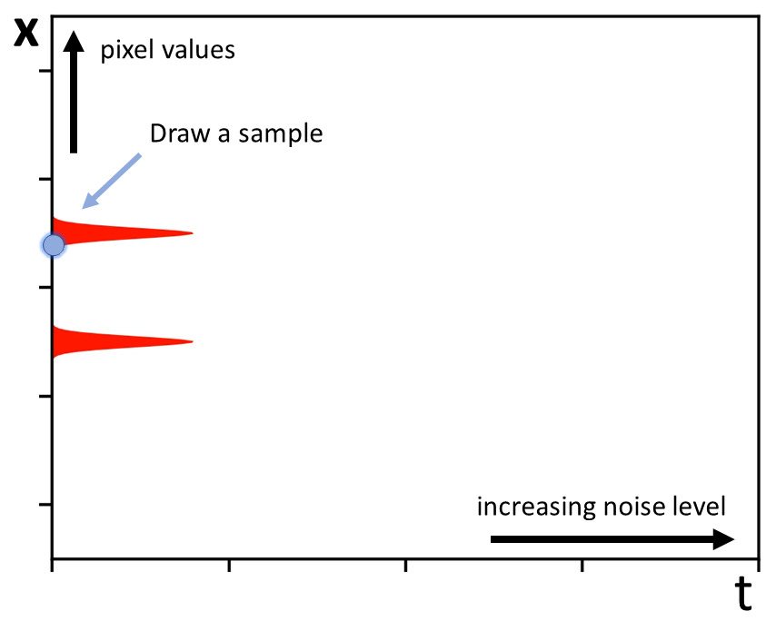

<!-- markdownlint-disable MD033 -->

# Denoising Diffusion

Denoising diffusion has recently emerged as the foremost method in the field of
generative modeling. It stands as a formidable contender against other generative
models, including Generative Adversarial Networks (GANs). Furthermore,
these models underpin remarkable AI products such as
[DALL-E 2](https://openai.com/dall-e-2) and [Imagen](https://imagen.research.google/).
While diffusion models enjoy robust theoretical underpinnings, their theoretical
foundation offers only limited practical insights. In this tutorial, we will delve
into the practical elements that drive these models and establish a common framework
to determine the optimal practices for various choices.

At its core, the concept of diffusion models revolves around initiating with random
noise and passing it through a denoiser, typically implemented as a Convolutional
Neural Network (CNN). Through a series of iterative steps, ranging from 50 to 2000
iterations, this process gradually eliminates noise, ultimately revealing a random
image hidden beneath the initial noise

## Formulation of denoising diffusion via ordinary/stochastic differential equations

Before delving into practical considerations, it is essential to explore the
foundational principles behind the formulation of diffusion models, which are typically
structured using ordinary or stochastic differential equations. A significant portion
of this section draws upon the insights from the paper titled
[Score-Based Generative Modeling through Stochastic Differential Equations](https://arxiv.org/pdf/2011.13456.pdf).

To illustrate the underlying concepts, let's consider a simplified 1D toy example that
mirrors the essential processes involved when dealing with real images. Real image data
resides in a high-dimensional space of pixel values. For instance, specifying a
megapixel image requires a million pixel values. In this case, we are visualizing it
in 1D, even though our dataset is one-dimensional, the analogy remains valid.

On the vertical axis, we represent pixel values, with different images corresponding
to distinct points in this vertical dimension. The horizontal axis denotes time, and
we incrementally increase the noise level over time. The core idea here is that we have
a dataset comprising samples, and our objective is to train or formulate a model
capable of generating additional examples that resemble the dataset. The dataset is
illustrated by the bimodal density in red within this toy example.

Consider drawing a sample from this dataset, hypothetically representing an image from
it. If we imagine this dataset as a collection of pictures of cats and dogs, we can use
this scenario as a stepping stone toward understanding the denoising diffusion approach.
Specifically, we explore what transpires when we gradually introduce noise to this
image.

In this example, the process corresponds to taking a random walk within the pixel value
space. The image gradually deteriorates until it transforms into pure white noise.
When multiple samples are involved, they collectively converge toward this
indistinguishable white noise distribution.

Analyzing these trajectories reveals the emergence of a density in the XT plane.
If we were to visualize this density, it would appear as follows:

On the far-left end of the spectrum, we have the original probability density of
the data. As time progresses, this density becomes gradually diffused and blurred,
ultimately leading to a state where, after a sufficient duration, all data converges
to a normally distributed, effectively indistinguishable white noise.

The fundamental concept behind denoising diffusion methods is that the distribution
at this final stage is easy to sample from. These methods enable the reverse journey
in time, retracing the path back to the original distribution from a random sample.
This process effectively implements the gradual denoising of the image.

This yields a random sample from the data distribution. Similarly, when dealing with
multiple samples, they collectively approach the data distribution at time zero.

We can understand this formulation in terms of Stochastic Differential Equations (SDE).
The simplest SDE that describes the forward approach, where noise is added, states that
over an infinitesimal time interval, the change in the image is simply a random white
noise:

$$
d\mathbf{x} = d\omega
$$

When we take small steps, a small amount of white noise is added at each step, causing
the image to evolve randomly over time. Although there are more general versions of
this equation, we will keep it simple for now. Importantly, there exists a reverse
version of the same SDE, crucial to the entire diffusion framework:

$$
d\mathbf{x} = - \nabla_{\mathbf{x}} \log p_t(\mathbf{x})dt + d\omega_{\mathbf{x}}
$$

This SDE introduces a stochastic component, but additionally, it includes a
deterministic drift component related to the density of the data at any given time and
its gradient. In essence, this term attracts the point toward the data's location at
each time step. This well-known function is referred to as the score function and
possesses the valuable property that it can be evaluated through denoising:

$$
\left( D(\mathbf{x}; \sigma) - \mathbf{x} \right) / \sigma^2
$$

If we have an optimal $L_2$ denoiser, denoted as $D$, then this equation allows us to
evaluate the term. Notably, this eliminates the need to have access to the generally
intractable density function $p$; instead, having some form of denoiser suffices.
In practice, this is often approximated using a Convolutional Neural Network (CNN).
In essence, this is where the CNN is integrated into these models.

[Song et al. 2021](https://arxiv.org/pdf/2011.13456.pdf) introduced an alternative
approach to formulate diffusion models as deterministic Ordinary Differential
Equations (ODEs):

$$
d\mathbf{x} = - \frac{1}{2} \nabla_{\mathbf{x}} \log p_t(\mathbf{x})dt
$$

This formulation solely consists of a score-based term and does not involve a random
walk component.

Qualitatively, the evolution of the image follows a distinct pattern. Rather than
randomly perturbing the image, it exhibits a gradual transition from noise to the clean
image. Armed with this insight, we can overlay these ideal trajectories on top of the
density. These trajectories are known as flow curves, and they represent the solutions
to the ODE. In practice, the ODE is solved through discretization in time. Given an
initial sample, we take finite-length time steps that aim to follow these trajectories.

Zooming in, the process involves determining how much the image should change over a
time interval $dx$ for a given change in time $dt$. These steps are repeated until time
zero is reached, resulting in the generated sample.

In SDEs, noise is also injected at each of these steps, but we'll explore that aspect
later. For now, let's focus on analyzing the ODE formulation as it provides valuable
insights into the dynamics of this stepping procedure.

This concludes the background on previous works related to ODEs/SDEs for diffusion in a
nutshell. While the theory is illuminating, it also imposes certain constraints on how
the ODE or SDE must operate to recover the correct distribution. However, many questions
and design choices remain, such as those related to sampling, stochasticity, and network
training. These questions include considerations like the choice of ODE/PDE solver, step
length, the need for stochasticity, the amount of noise to inject, scaling signals,
predicting signals or noise, and determining loss weighting.

In the remainder of this tutorial, we will address these questions based on insights
from the EDM Paper: [Elucidating the Design Space of Diffusion-Based
Generative Models](https://arxiv.org/pdf/2206.00364.pdf). The approach taken in this
paper involves dissecting key previous works to understand their components and design
choices, particularly focus on
[Score-Based Generative Modeling through Stochastic Differential Equations](https://arxiv.org/pdf/2011.13456.pdf),
[Denoising Diffusion Probabilistic Models](https://arxiv.org/pdf/2010.02502.pdf), and
[Improved Denoising Diffusion Probabilistic Models](https://arxiv.org/pdf/2010.02502.pdf).

The former work presents the Variance Preserving (VP) and Variance Exploding (VE)
methods, which are fundamentally different in terms of architectures, stepping
schedules, training methods, and more. The latter two are the DDPM and iDDPM methods.
By analyzing these methods and their specific design choices related to sampling,
preconditioning, training, and more, we aim to construct a comprehensive table of best
practices for each of these design choices.

The ultimate goal is to develop a table where each entry represents an optimized design
choice, drawing from the theory presented in the paper. It's important to note that all
these design choices are independent and can be studied in isolation.

To assess the generation quality, the
[Fréchet Inception Distance (FID)](https://en.wikipedia.org/wiki/Fr%C3%A9chet_inception_distance)
is a widely used metric in generative modeling. The remainder of this tutorial will be
divided into two parts: Part 1 covering deterministic sampling and Part 2 exploring
preconditioning and training. The detailed examination of neural network architectures
for diffusion models falls outside the scope of this tutorial. Let's begin with
deterministic sampling!

## Deterministic Sampling

In this section, we aim to understand the best approach for formulating and solving the
ODE when we have a pre-trained neural network denoiser. The central challenge here is
the presence of discretization error. The discrete trajectory obtained through discrete
sampling deviates from the ideal trajectory.

As illustrated, the discrete samples do not precisely align with the ideal trajectory,
leading to generated samples that are incorrectly distributed in practice. This can
result in visually poor samples or incorrect variations. The most straightforward
solution to address this discretization error is to use shorter steps.

However, it is desirable to minimize the number of steps since each step involves
network evaluations, which constitute the primary computational cost in this sampling
process. Examining previous works, we observe that the step sizes used are not of the
same length. Generally, longer steps are employed at high noise levels, while relatively
shorter steps are used at low noise levels.

This concept can be generalized into a family of polynomial step length discretizations
where the step lengths follow a polynomial curve. This encapsulates the notion of
squeezing and stretching towards time zero. It allows for empirical studies by
conducting a grid search over the exponents to determine what provides the best
results. With this approach, we can fill in the first row of our table.
While the specific formulas may appear complex, in the EDM formula, a polynomial
progression with the optimal exponent set to seven is found to be a broad optimum.
The precise value doesn't significantly impact the results, as anything in the ballpark
of five to ten works well.

The next step, which is fairly intuitive to those familiar with ODEs, is to employ
higher-order solvers. The basic Euler scheme mentioned earlier is somewhat simplistic,
as it follows the trajectory locally. However, when there's significant curvature in
the trajectory, the steps tend to deviate. This issue can be mitigated by using
higher-order methods that incorporate substepping strategies. Extra steps are taken to
correct the naive steps, but this increases computational expenses. EDM's evaluation
has led to the conclusion that the second-order Heun method strikes an excellent
balance between computational cost and accuracy. The Heun step is formulated as follows:

After performing the Euler step, an additional step is taken at the point where it
landed. However, this additional step is then moved back to the original position,
and the actual step is calculated as the average of the original Euler step and this
correction step. This approach closely follows the underlying trajectory and adds
another entry to our table:

Now, let's examine another design choice, which is the noise schedule. There are
various noise schedules available in the literature. For instance, this corresponds
to the straightforward variance-exploding scheme that adds noise at a constant rate:

$$
\sigma(t) = \sqrt{(t)}
$$

As we add noise at a constant rate, the variance grows linearly over time, which
implies that the standard deviation increases as the square root of time. We are
particularly interested in the standard deviation as a function of time.

This schedule also corresponds to DDIM:

$$
\sigma(t) = t
$$

Here, the standard deviation itself increases at a constant rate, resulting in different
trajectories with varying noise levels.

Another approach is to scale the distributions, such as the variance-preserving
schedules that introduce a scaling term that changes over time. The goal is to constrain
the noisy data density to remain within a horizontal tunnel of unit standard deviation
as time progresses:

There are numerous options for scaling and noise schedules, but fundamentally, they all
represent warps of the XT plane. These schedules do not alter the underlying densities
but rather distort the trajectories in different ways:

Given these observations, EDM has formulated a generalized ODE, expressed as follows:

$$
d\mathbf{x} = \left[ \dot{s}(t) / s(t) - {s(t)}^2 \dot{\sigma}(t)
\sigma(t) \nabla_{\mathbf{x}} \log p(\mathbf{x}/s(t);\sigma(t)) \right] dt
$$

The key point is that EDM parameterizes this ODE in terms of the sigma and scale
functions, which define the desired noise levels at different time instances and the
appropriate scaling. This approach provides a clear representation of the trajectory
shapes. However, it raises questions about whether all these choices are equally
effective.

The question then becomes, are some schedules better than others, and if so, what makes
them better? To explore this, let's consider higher noise levels, where we introduce
a substantial amount of noise:

In this scenario, we interpolate between different schedules and examine the
relationship between the ideal continuous trajectory and the tangent approximations.
We observe that for certain schedules, the approximation is particularly accurate,
while for others, it is less precise. Notably, the linear schedule, where the standard
deviation grows linearly with time and no scaling function is used, stands out as an
excellent choice. This schedule shares similarities with DDIM and offers several
advantages.

In the linear schedule, ideal trajectories become linear straight lines pointing toward
the data as the noise level increases. Another interpretation is that if we shoot a
tangent all the way toward time zero from our sample, it will land at the point
corresponding to the denoiser's output, which is essentially a blurred version of the
output image. It represents the average of all possible images compatible with the
current noisy image, and we can expect this to change slowly over time:

As we step toward time zero, only minor corrections to the tangent's direction are
needed because it remains almost the same image throughout. As a result, fewer steps
are required in practice because the tangent remains nearly correct over time. This is
the rationale behind EDM's recommendation that the standard deviation should grow
linearly with time. These insights contribute to the completion of the last two rows in
the sampling portion of the EDM table:

## Preconditioning and training

In the next part, we will delve into the preconditioning and training of these models,
specifically focusing on addressing questions related to handling vastly different
scales of noisy and noise-free data. For instance, when adding noise to clean data,
the noisy data may have a standard deviation much larger than the original data, and
both types of data need to be fed into the same network. This requires careful
consideration of scaling.

Another critical question is what the network should be trained to predict: the signal
or the noise. Additionally, there are questions about how training efforts should be
allocated, including whether to train for many epochs at low noise levels and how to
weight the losses. Concerns about the network potentially memorizing the dataset also
need to be addressed through augmentation.

To recap and elaborate on denoising score matching, the ODE presented in the previous
section essentially indicates that at each step, the image is modified by moving it
toward higher or lower data density at the current noise level. A scale factor
determines the rate of this movement:

$$
d\mathbf{x} = - \dot{\sigma}(t) \sigma(t) \nabla_{\mathbf{x}} \log p_t(\mathbf{x}; \sigma(t))dt
$$

The score function, which provides the direction toward the data, can be evaluated
without direct access to the density function $p$ by using the denoiser. The denoiser
is expected to be $L_2$ optimal and is typically approximated using a CNN. The training
of the denoiser involves taking a random training sample and introducing noise of a
random strength. The noisy image is then passed through the denoiser, which typically
contains CNN layers. The output is compared to the clean image using a mean squared
loss.

However, there is significant flexibility in how the internals of the denoiser are
implemented. To handle vastly different signal scales, input and output weighting is
applied to normalize the signal magnitudes. Specifically, for the inputs, the magnitude
of the noisy input image is scaled to a standardized size, often chosen to be a unit
standard deviation, with knowledge of the noise level. Neglecting this scaling can lead
to unreasonable results in many cases. Similarly, at the output, scaling is applied to
ensure that the CNN layers output values with unit standard deviation. The idea is not
to convert the output to a unit standard deviation but to set the task of the CNN in a
way that it always deals with standardized inputs and outputs.

There is also the aspect of loss weighting. Each time the loss is evaluated, the penalty
of the loss can be scaled to modulate the magnitude of the gradient feedback reaching
the network layers during training. This can be set to the reciprocal of the output
weight to normalize the backpropagation gradients at initialization. We will examine
this in more detail later.

The network can explicitly learn to predict the noise-free image or the noise itself.
In the latter case, the predicted noise can be subtracted from the input to obtain the
denoised image. This can be achieved through a skip connection, where the CNN's task
implicitly becomes predicting the differential required for noise subtraction.
This effectively means that the CNN is tasked with predicting the noise. The weighting
of the skip connection can also be adjusted. If the weight is set to zero, the skip
connection is disabled, and only the noise is predicted. This weighting can be further
generalized to represent intermediate mixtures of the image and the noise, for example.

Now let's address the open question regarding the skip
weight. This weight is closely related to the output scaling because both need to be
adjusted in a way that is compatible with the skip weight and the constraint that the
network must predict a unit standard deviation output.

This forms a system of two unknowns: the skip weight and output weight, with the
constraint that the output must have a unit standard deviation. Ideally, we would like
another constraint to narrow down the choices for these two weights. To do that, we can
focus on the output of the network, which contributes to the denoising result. Any
errors it makes will be amplified by the output scaling and affect the sampling
trajectory directly.

The second constraint, therefore, should be related to the skip weight. Ideally, the
skip weight should be set in a way that minimizes the output weight. This ensures that
any errors made by the CNN are downweighted, rather than upweighted. Let's gain some
practical intuition about what this means.

At very low noise levels, the inputs to the denoiser consist mostly of the signal, and
the noise is a very tiny portion. In this scenario, it makes sense to let the clean
image pass through the skip connection rather than having the CNN predict it. Instead,
the focus should be on the challenging task of correcting the small amount of noise.
If errors are made here, they will be downweighted since the noise is small.

Conversely, at high noise levels, the input to the denoiser is mostly uninformative
about the clean image. In this case, we should not rely on the skip connection at all
and should override it with the CNN's prediction, which means setting the skip to zero
to predict the signal.

With this understanding, we can smoothly transition between noise-level-dependent
curves that go from one (predicting noise) to zero (predicting the signal). This
transition can be represented as an explicit formula, and we can now fill in the rows
for skip scaling, output scaling, and input scaling in the design table.

Now, let's address the question of at which noise levels the network should be trained,
which is also related to loss weighting. There are many different noise levels in the
samples, and backpropagating the loss from each of these noise levels can lead to
situations where the gradient feedback is imbalanced. To equalize these gradient
magnitudes, loss weighting is used.

The role of loss weighting is to push the solution with a roughly constant magnitude of
loss, independent of the noise level. The sampling frequency, then, specifies at which
noise levels the network should be trained more. This is an empirical choice. The EDM
paper provides a helpful figure with the noise level on the horizontal axis and the loss
value on the vertical axis.

The loss value is initially set to one at initialization using loss weighting. Over
time, the loss at different noise levels converges towards a curve that expresses where
training progress can be made. We cannot make much progress at the very low noise levels
or at very high noise levels, but there's a regime in the middle where progress can be
achieved. Training progress should be made proportional to the shape of this
distribution of training samples.

This concludes the last part of the tutorial. In summary, we have presented a tutorial
on EDM's modular design of diffusion models. Training, sampling, and network
architectures are not tightly coupled, but rather consist of a selection of different
individual design choices that can and should be evaluated in isolation. By carefully
considering this design, we can significantly improve results, even transforming
existing methods with average performance into highly effective ones.

## Authors

- Mohammad Amin Nabian, NVIDIA
- Miika Aittala, NVIDIA

## Acknowledgement

A special expression of gratitude goes out to the authors of EDM for generously
contributing the content used in this tutorial:

- Tero Karras, NVIDIA
- Miika Aittala, NVIDIA
- Timo Aila, NVIDIA
- Samuli Laine, NVIDIA

## References

- [Elucidating the design space of diffusion-based generative models](https://openreview.net/pdf?id=k7FuTOWMOc7)
- [Score-Based Generative Modeling through Stochastic Differential Equations](https://arxiv.org/pdf/2011.13456.pdf)
- [Denoising Diffusion Probabilistic Models](https://arxiv.org/pdf/2010.02502.pdf)
- [Improved Denoising Diffusion Probabilistic Models](https://arxiv.org/pdf/2010.02502.pdf)
- [Diffusion Models Beat GANs on Image Synthesis](https://arxiv.org/pdf/2105.05233.pdf)
