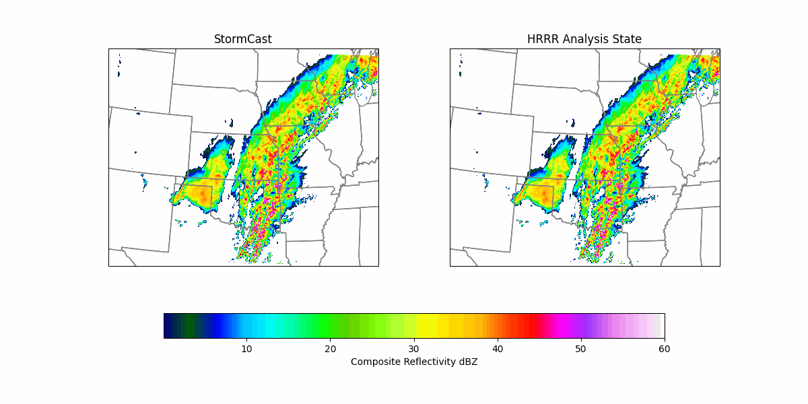

<!-- markdownlint-disable -->
## StormCast: Kilometer-Scale Convection Allowing Model Emulation using Generative Diffusion Modeling

## Problem overview

Convection-allowing models (CAMs) are essential tools for forecasting severe thunderstorms and 
mesoscale convective systems, which are responsible for some of the most extreme weather events. 
By resolving kilometer-scale convective dynamics, these models provide the precision needed for 
accurate hazard prediction. However, modeling the atmosphere at this scale is both challenging
and expensive.

This example demonstrates how to run training and simple inference for [StormCast](https://arxiv.org/abs/2408.10958),
a generative diffusion model designed to emulate NOAA’s High-Resolution Rapid Refresh (HRRR) model, a 3km 
operational CAM. StormCast autoregressively predicts multiple atmospheric state variables with remarkable
accuracy, demonstrating ability to replicate storm dynamics, observed radar reflectivity, and realistic
atmospheric structure via deep learning-based CAM emulation. StormCast enables high-resolution ML-driven
regional weather forecasting and climate risk analysis.

<p align="center">

</p>

The design of StormCast relies on two neural networks:
 1. A regression model, which provides a deterministic estimate of the next HRRR timestep given the previous timestep's HRRR and background ERA5 states
 2. A diffusion model, which is given the previous HRRR timestep as well as the estimate from the regression model, and provides a correction to the regression model estimate to produce a final high-quality prediction of the next high-resolution atmospheric state.

Much like other data-driven weather models, StormCast can make longer forecasts (more than one timestep) during inference by feeding its predictions back into the model as input for the next step (autoregressive rollout). The regression and diffusion components are trained separately (with the diffusion model training requiring a regression model as prerequisite), then coupled together in inference. Note in the above description, we specifically name HRRR and ERA5 as the regional high-resolution and global coarse-resolution data sources/targets, respectively, but the StormCast setting should generalize to any regional/global coupling of interest.


## Getting started

### Preliminaries
Start by installing PhysicsNeMo (if not already installed) and copying this folder (`examples/generative/stormcast`) to a system with a GPU available. Also, prepare a combined HRRR/ERA5 dataset in the form specified in `utils/data_loader_hrrr_era5.py` (**Note: subsequent versions of this example will include more detailed dataset preparation instructions**).

### Configuration basics

StormCast training is handled by `train.py`, configured using [hydra](https://hydra.cc/docs/intro/) based on the contents of the `config` directory. Hydra allows for YAML-based modular and hierarchical configuration management and supports command-line overrides for quick testing and experimentation. The `config` directory includes the following subdirectories:
 - `dataset`: specifies the resolution, number of variables, and other parameters of the dataset
 - `model`: specifies the model type and model-specific hyperparameters
 - `sampler`: specifies hyperparameters used in the sampling process for diffusion models
 - `training`: specifies training-specific hyperparameters and settings like checkpoint/log frequency and where to save training outputs
 - `inference` specifies inference-specific settings like which initial condition to run, which model checkpoints to use, etc.
 - `hydra`: specifies basic hydra settings, like where to store outputs (based on the training or inference outputs directories)

Also in the `config` directory are several top-level configs which show how to train a `regression` model or `diffusion` model, and run inference (`stormcast-inference`). One can select any of these by specifying it as a config name at the command line (e.g., `--config-name=regression`); optionally one can also override any specific items of interest via command line args, e.g.:
```bash
python train.py --config-name regression training.batch_size=4
```

More extensive configuration modifications can be made by creating a new top-level configuration file similar to `regression` or `diffusion`. See `diffusion.yaml` for an example of how to specify a top-level config that uses default configuration settings with additional custom modifications added on top.

Note any diffusion model you train will need a pretrained regression model to use, so there are two config items that must be defined to train a diffusion model:
  1. `model.use_regession_net = True`
  2. `model.regression_weights` set to the path of a PhysicsNeMo (`.mdlus`) checkpoint with model weights for the regression model. These are saved in the checkpoints directory during training.

Once again, the reference `diffusion.yaml` top-level config shows an example of how to specify these settings.

At runtime, hydra will parse the config subdirectory and command line over-rides into a runtime configuration object `cfg`, which will have all settings accessible via both attribute or dictionary-like interfaces. For example, the total training batch size can be accessed either as `cfg.training.batch_size` or `cfg['training']['batch_size']`.

### Training the regression model
To train the StormCast regression model, we simply specify the example `regression` config and an optional name for the training experiment. On a single GPU machine, for example, run:
```bash
python train.py --config-name regression training.experiment_name=regression
```

This will initialize training experiment and launch the main training loop, which is defined in `utils/trainer.py`. Outputs (training logs, checkpoints, etc.) will be saved to a directory specified by the following `training` config items:
```yaml
training.outdir: 'rundir' # Root path under which to save training outputs
training.experiment_name: 'stormcast' # Name for the training experiment
training.run_id: '0' # Unique ID to use for this training run 
training.rundir: ./${training.outdir}/${training.experiment_name}/${training.run_id} # Path where experiement outputs will be saved
```

As you can see, the `training.run_id` setting can be used for distinguishing between different runs of the same configuration. The final training output directory is constructed by composing together the `training.outdir` root path (defaults to `rundir`), the `training.experiment_name`, and the `training.run_id`. 

### Training the diffusion model

The method for launching a diffusion model training looks almost identical, and we just have to change the configuration name appropriately. However, since we need a pre-trained regression model for the diffusion model training, the specified config must include the settings mentioned above in [Configuration Basics](#configuration-basics) to provide network weights for the regression model. With that, launching diffusion training looks something like:
```bash
python train.py --config-name diffusion training.experiment_name=diffusion
```

Note that the full training pipeline for StormCast is fairly lengthy, requiring about 120 hours on 64 NVIDIA H100 GPUs. However, more lightweight trainings can still produce decent models if the diffusion model is not trained for as long. 

Both regression and diffusion training can be distributed easily with data parallelism via `torchrun` or other launchers (e.g., SLURM `srun`). One just needs to ensure the configuration being run has a large enough batch size to be distributed over the number of available GPUs/processes. The example `regression` and `diffusion` configs just use a batch size of 1 for simplicity, but new configs can be easily added [as described above](#configuration-basics). For example, distributed training over 8 GPUs on one node would look something like:
```bash
torchrun --standalone --nnodes=1 --nproc_per_node=8 train.py --config-name <your_distributed_training_config>
```

### Inference

A simple demonstrative inference script is given in `inference.py`, which is also configured using hydra in a manner similar to training. The reference `stormcast_inference` config shows an example inference config, which looks largely the same as a training config except the output directory is now controlled by the settings from `inference` rather than `training` config:
```yaml
inference.outdir: 'rundir' # Root path under which to save inference outputs
inference.experiment_name: 'stormcast-inference' # Name for the inference experiment being run
inference.run_id: '0' # Unique identifier for the inference run
inference.rundir: ./${inference.outdir}/${inference.experiment_name}/${inference.run_id} # Path where experiment outputs will be saved
```

To run inference, simply do:
```bash
python inference.py --config-name <your_inference_config>
```

This will load regression and diffusion models from directories specified by `inference.regression_checkpoint` and `inference.diffusion_checkpoint` respectively; each of these should be a path to a PhysicsNeMo checkpoint (`.mdlus` file) from your training runs. The `inference.py` script will use these models to run a forecast and save outputs as a `zarr` file along with a few plots saved as `png` files. We also recommend bringing your checkpoints to [earth2studio](https://github.com/NVIDIA/earth2studio)
for further analysis and visualizations.


## Dataset

In this example, StormCast is trained on the [HRRR dataset](https://rapidrefresh.noaa.gov/hrrr/),
conditioned on the [ERA5 dataset](https://www.ecmwf.int/en/forecasts/dataset/ecmwf-reanalysis-v5).
The datapipe in this example is tailored specifically for the domain and problem setting posed in the 
[original StormCast preprint](https://arxiv.org/abs/2408.10958), namely a subset of HRRR and ERA5 variables
in a region over the Central US with spatial extent 1536km x 1920km.


A custom dataset object is defined in `utils/data_loader_hrrr_era5.py`, which loads temporally-aligned samples from HRRR and ERA5, interpolated to the same grid and normalized appropriately. This data pipeline requries the HRRR and ERA5 data to abide by a specific `zarr` format and for other datasets, you will need to create a custom datapipe. The table below lists the variables used to train StormCast -- in total there are 26 ERA5 variables used and 99 HRRR variables (along with 2 static HRRR invariants, the land/water mask and orography).

#### ERA5 Variables
| Parameter                             | Pressure Levels (hPa)     | Height Levels (m) |
|---------------------------------------|---------------------------|--------------------|
| Zonal Wind (u)                        | 1000, 850, 500, 250       | 10                 |
| Meridional Wind (v)                   | 1000, 850, 500, 250       | 10                 |
| Geopotential Height (z)               | 1000, 850, 500, 250       | None               |
| Temperature (t)                       | 1000, 850, 500, 250       | 2                  |
| Humidity (q)                          | 1000, 850, 500, 250       | None               |
| Total Column of Water Vapour (tcwv)   | Integrated                | -                  |
| Mean Sea Level Pressure (mslp)        | Surface                   | -                  |
| Surface Pressure (sp)                 | Surface                   | -                  |


#### HRRR Variables
| Parameter                             | Hybrid Model Levels (Index)                               | Height Levels (m) |
|---------------------------------------|-----------------------------------------------------------|--------------------|
| Zonal Wind (u)                        | 1, 2, 3, 4, 5, 6, 7, 8, 9, 10, 11, 13, 15, 20, 25, 30    | 10                 |
| Meridional Wind (v)                   | 1, 2, 3, 4, 5, 6, 7, 8, 9, 10, 11, 13, 15, 20, 25, 30    | 10                 |
| Geopotential Height (z)               | 1, 2, 3, 4, 5, 6, 7, 8, 9, 10, 11, 13, 15, 20, 25, 30    | None               |
| Temperature (t)                       | 1, 2, 3, 4, 5, 6, 7, 8, 9, 10, 11, 13, 15, 20, 25, 30    | 2                  |
| Humidity (q)                          | 1, 2, 3, 4, 5, 6, 7, 8, 9, 10, 11, 13, 15, 20, 25, 30    | None               |
| Pressure (p)                          | 1, 2, 3, 4, 5, 6, 7, 8, 9, 10, 11, 13, 15, 20            | None               |
| Max. Composite Radar Reflectivity     | -                                                         | Integrated         |
| Mean Sea Level Pressure (mslp)        | -                                                         | Surface            |
| Orography                             | -                                                         | Surface            |
| Land/Water Mask                       | -                                                         | Surface            |


## Logging

These scripts use Weights & Biases for experiment tracking, which can be enabled by setting `training.log_to_wandb=True`. Academic accounts are free to create at [wandb.ai](https://wandb.ai/).
Once you have an account set up, you can adjust `entity` and `project` in `train.py` to the appropriate names for your `wandb` workspace.


## References

- [Kilometer-Scale Convection Allowing Model Emulation using Generative Diffusion Modeling](https://arxiv.org/abs/2408.10958)
- [Elucidating the design space of diffusion-based generative models](https://openreview.net/pdf?id=k7FuTOWMOc7)
- [Score-Based Generative Modeling through Stochastic Differential Equations](https://arxiv.org/pdf/2011.13456.pdf)

