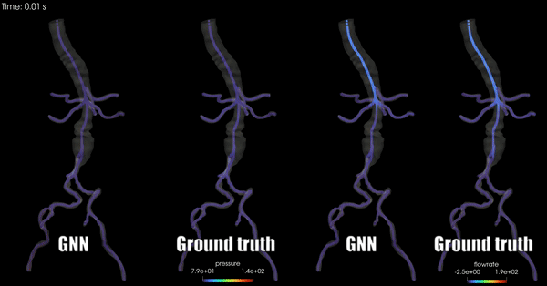
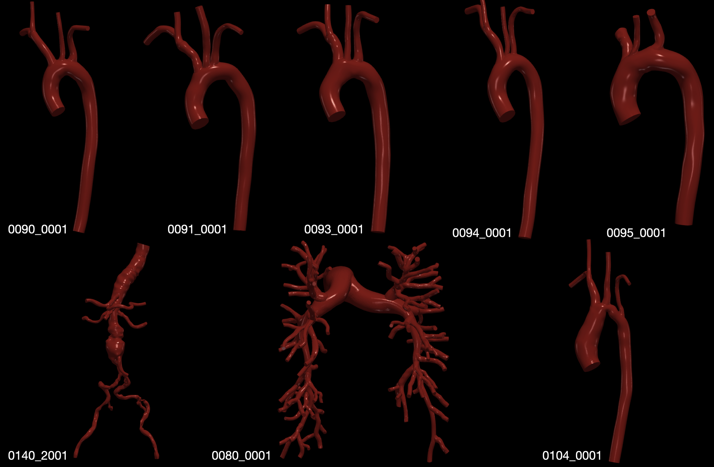

# MeshGraphNet for Reduced-Order cardiovascular simulations

This example implements the one-dimensional Reduced-Order model based on
MeshGraphNet presented in the paper [Learning Reduced-Order Models for Cardiovascular
Simulations with Graph Neural Networks](https://arxiv.org/abs/2303.07310)
(Pegolotti et al, 2023).

## Contributor

The main contributor for this work is Luca Pegolotti who was part of the
Cardiovascular Biomechanics Computation Lab at Stanford University.

## Problem overview

Three-dimensional simulations of the Navier-Stokes equations are the gold standard
when it comes to modeling blood flow in arteries. However, these simulations are
typically expensive, and a common way to alleviate the computational burden of
evaluating physiological quantities of interest (e.g., pressure and flow rate) is
using Reduced-Order models. For example, one-dimensional Reduced-Order models
approximate the geometry of arteries as a composition of segments,
the centerlines of the vessels, and the pressure and flow rate along the centerlines
are found by solving special one-dimensional Partial Differential Equations (PDEs).
These models are sometimes inaccurate due to their simplyfing assumptions.

We developed a one-dimensional Reduced-Order model able to mimic
three-dimensional simulations accurately. The model is based on MeshGraphNet and
trained on simulation of the 3D Navier-Stokes equations. As shown in the [original
reference](https://arxiv.org/abs/2303.07310), the model outperforms one-dimensional
models in complex patient-specific cases featuring many junctions and/or
pathological conditions.



## Dataset

The dataset is composed of 310 simulations obtained on 8 different
patient-specific models available in the [Vascular Model Repository](www.vascularmodel.com).
Each simulation is stored as a `.vtp` file containing pressure and flow rate information
at points located in the centerlines of the models and at different timesteps.
The three-dimensional simulations were set up using [SimVascular](www.simvascular.org),
an open-software software package for cardiovascular modeling and simulation, and
run on 128 dual-socket AMD(R) EPYC 7742 cores of the San Diego Super Computing
Center (SDSC) Expanse cluster. The simulations were obtained by varying inflow
and outflow boundary conditions of each patient-specific model randomly.



## Model overview and architecture

The base architecture is MeshGraphNet (see references for details). The node features
of the graph neural network are:

- pressure and flow rate at a particular timestep
- cross-sectional area
- tangent to the centerline
- node type
- cardiac cycle period in seconds
- diastolic pressure
- systolic pressure
- RCR boundary condition parameters (only for outlet nodes)
- loading variable (used to differentiate between an initial loading stage and
the actual simulation phase)

The edge features are:

- relative position of two nodes (in 3D)
- distance between two nodes
- edge type

The output of MeshGraphNet is the update in pressure and flow rate to get to the
next timestep.

In order to deal with one-dimensional data, we made some modification to the
original MeshGraphNet implementation. Most notably, we added special edges
that connect boundary nodes to the interior one, to speed up the boundary
condition information transfer.

Note: the default configuration for the architecture specified in `config.yaml`
defines 64 as the dimension for hidden layers and outputs of encoder, processor
and decoder. The results in the original paper were obtained by using 64 neurons
in the hiddenl layers of each part of the network, and 16 neurons for the output
layers of encoder and processor. This slight change in architecture does not
influences the performance of the network dramatically.

## Getting Started

To download the dataset (the vtp simulation files):

```bash
pip install gdown
cd raw_dataset
bash download_dataset.sh
```

After downloading the dataset, an intermediate step necessary to run MeshGraphNet
is converting the simulation files into graphs compatible with DGL. This can be
done with:

```bash
cd ..
python generate_graphs.py
```

This will create a new `graphs` folder in `raw_dataset`. To train the model:

```bash
python train.py
```

We currently support cpu and single-gpu training. The training parameters can be
modified in `config.yaml`. An important parameter is `training.geometries`,
which can take the values `healthy`, `pathological`, `mixed`.
Here, `healthy` and `pathological` refer to the geometries used in
Section 5.1 and 5.2 of the paper; `mixed` considers all geometries.

To perform inference on a given model:

```bash
python inference.py
```

The name of the model needs to be specified in `config.yaml`. Please refer to
the list of graphs in `raw_dataset\graphs` for the possible graphs to use for
inference.

## References

- [Learning Mesh-Based Simulation with Graph Networks](https://arxiv.org/abs/2010.03409)
- [Learning Reduced-Order Models for Cardiovascular Simulations with Graph Neural Networks](https://arxiv.org/abs/2303.07310)

## License

The geometric data from the VMR is subject to license. See
[here](https://vascularmodel.com/FAQs.html) for more information.
