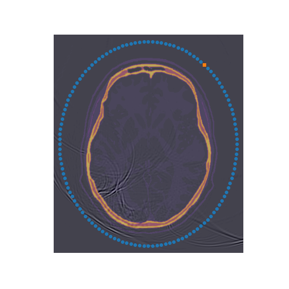
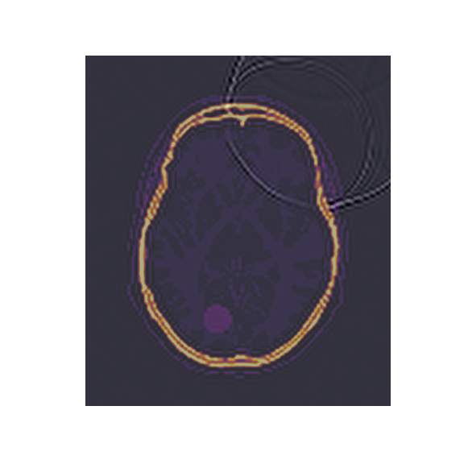
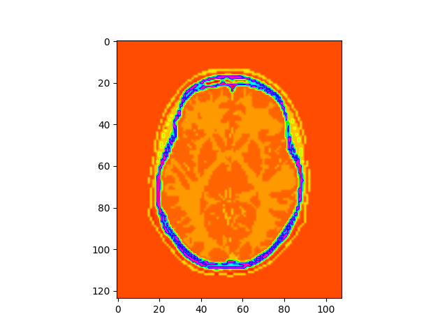
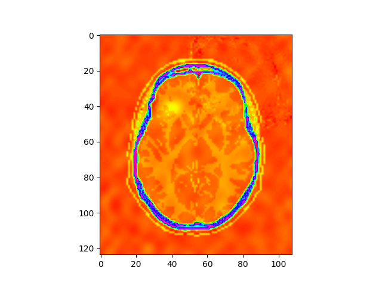

# Fourier Neural Operator for Brain anomaly detection

In this demonstration, we utilize the Fourier Neural Operator (FNO) for medical imaging.
We design an approximate acoustic wavefield propagator,
by instructing the FNO with simulated 2D acoustic wavefields.
This trained model is then employed for anomaly detection.
By using the trained operator,
we can transform data misfit into gradients, pinpointing anomalies.
This method offers the advantage of simplifying the gradient computation process.

## Problem overview

Rapid detection of strokes has been a challenge,
due to the large size of the imaging equipment (i.e., MRI),
hard to fit in an ambulance. As a result,
patients typically receive a diagnosis upon reaching the hospital.
This delay complicates timely intervention within
the crucial window of under 10 minutes,
often referred to as the "golden time."

Recently, scientists from Imperial College London
and UCL have developed a new brain imaging method,
using acoustic waves, inspired by seismic imaging techniques.
This compact and potentially portable technology offers
a quicker alternative to traditional MRI, especially beneficial
for immediate diagnosis like in stroke cases.
Tested in a helmet-like device on a healthy individual, the results are promising.
If successful in broader human trials,
it could transform emergency neurological care
by providing rapid, high-resolution scans.

Although the seismic-inspired medical imaging technique shows potential,
it demands significant computational power and
has a longer processing time than the ideal timeframe.
To expedite predictions, we utilize the Fourier Neural Operator (FNO)
to develop a substitute for the acoustic wave propagator.
After adequate training, we can use the trained surrogate operator
to simulate the wavefield much more quickly
than simulators that rely on numerical methods,
such as finite difference.
We then employ this propagator to create a mapping
from data misfit for brain anomaly detection.

We developed a surrogate 2D acoustic wave propagator and
utilized it for anomaly detecton for gradient comuptation
which potentially enables the rapid stroke detection.
This model is based on FNO and trained on simulation of 2D acoustic wavefields
obtained by using [Devito](https://github.com/devitocodes/devito),
a Python package to implement optimized stencil computation.

## Dataset

The dataset consists of an acoustic wavefield set with a total of 100 timesteps.
Baseline brain velocity model includes skull is provided by Imperial College London,
Department of Earth Science and Engineering and ITIS foundation.
We simulated 32 distinct brain velocity models by altering
the position of the circular anomaly.
These timesteps were then divided into 20 and 80 steps.
The FNO design was trained to forecast the subsequent 80 timesteps
based on the initial 20 timesteps - input wavefield.
The simulations were obtained by using 2D acoustic
wave propagator in [Devito](https://github.com/devitocodes/devito)

To request access to the full dataset, please reach out to the
[NVIDIA PhysicsNeMo team](mailto:physicsnemo-team@nvidia.com).

<!-- markdownlint-disable -->
<p align="center">
  
  <br>
  <i>Example of training dataset: A simulated wavefield overlaid with a velocity model of the brain</i>
</p>
<!-- markdownlint-enable -->

## Model overview and architecture

The base architecture is FNOarch, in particular 3D FNO implementation is used.
The FNO model takes the initial 20 timesteps of the wavefield and 2D velocity
as input and produces the subsequent 80 timesteps as output.

<!-- markdownlint-disable -->
<p align="center">
  
  <br>
  <i>Example of output of surrogate FNO model - prediction of output wavefield overlaid with a velocity model of the brain</i>
</p>
<!-- markdownlint-enable -->

The trained surrogate FNO model is used to compute gradient from the data misfit.
Leveraging automatic differentiation (Autodiff in Pytorch),
we can effortlessly determine the adjustments needed to identify
both the size and position of the anomaly.

<!-- markdownlint-disable -->
<p align="center">
  
&nbsp; &nbsp; &nbsp; &nbsp;
  
  <i> Left: Initial velocity model. Right: Update Model using the surrogate FNO, emphasizing the anomaly. </i>
</p>
<!-- markdownlint-enable -->

## Getting Started

To train the model:

```bash
python train_FNO.py
```

To initiate training across multiple GPUs (Data Parallelism), run:

```bash
mpirun -np <Number of GPUs> python train_FNO.py
```

If running inside a docker container, you may need to include the `--allow-run-as-root`
in the multi-GPU run command.

To use trained FNO for gradient computation, load starting dataset and then run:

```bash
python invert.py
```

## References

- [Fourier Neural Operator for Parametric Partial Differential Equations](https://arxiv.org/abs/2010.08895)
- [Full-waveform inversion imaging of the human brain](https://www.nature.com/articles/s41746-020-0240-8)
