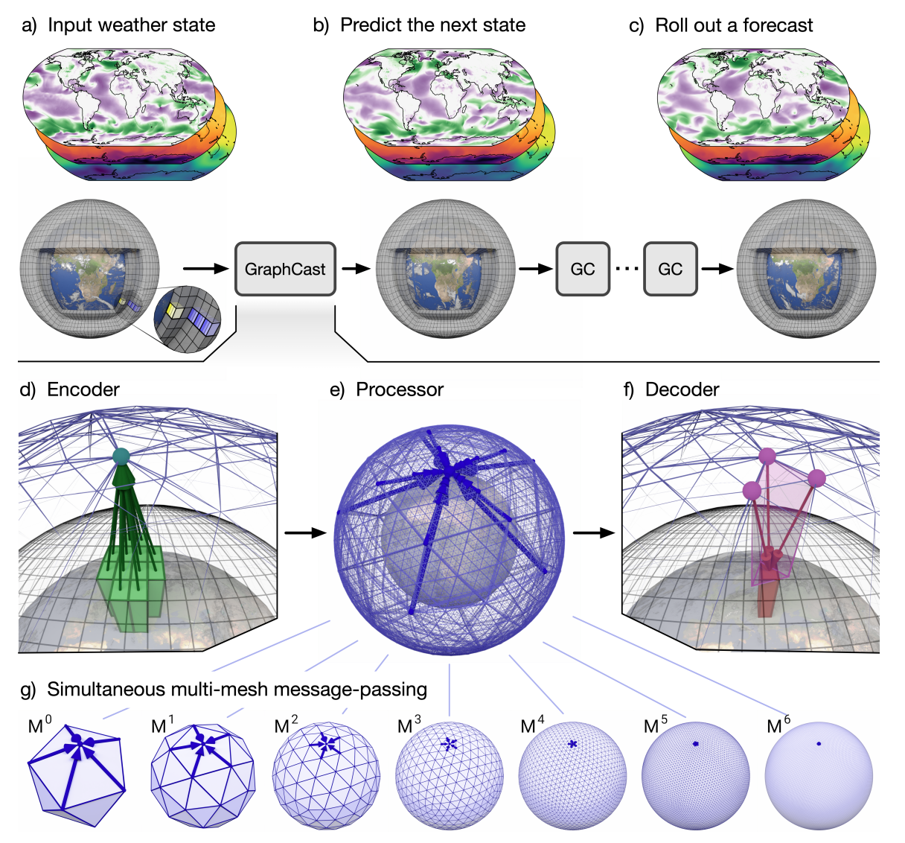

# GraphCast for weather forecasting

A re-implementation of the DeepMind's
[GraphCast](https://arxiv.org/abs/2212.12794) model in PhysicsNeMo.

## Problem overview

GraphCast is a multi-scale graph neural network-based autoregressive model. It is
trained on historical weather data from ECMWF's ERA5 reanalysis archive. GraphCast
generates predictions at 6-hour time steps for a set of surface and atmospheric
variables. This prediction covers a 0.25-degree latitude-longitude grid,
providing approximately 25 x 25 kilometer resolution at the equator.

## Dataset

The model is trained on a 73-channel subset of the ERA5 reanalysis data on single levels
and pressure levels that are pre-processed and stored into HDF5 files.
Additional static channels such as land-sea mask and geopotential,
and the cosine zenith
angle are also used.
The ERA5 dataset can be downloaded [here](https://cds.climate.copernicus.eu/cdsapp#!/dataset/reanalysis-era5-single-levels?tab=overview).
A curated 20-channel subset of the ERA5 training data in HDF5 format is hosted at the
National Energy Research Scientific Computing Center (NERSC). For convenience
[it is available to all via Globus](https://app.globus.org/file-manager?origin_id=945b3c9e-0f8c-11ed-8daf-9f359c660fbd&origin_path=%2F~%2Fdata%2F).
You will need a Globus account and will need to be logged in to your account in order
to access the data.  You may also need the [Globus Connect](https://www.globus.org/globus-connect)
to transfer data.

## Model overview and architecture

GraphCast leverages a deep learning architecture that integrates a message-passing
Graph Neural Network (GNN) with a classic
encoder-processor-decoder paradigm. This configuration facilitates the model to first
encode the initial atmospheric state through
the encoder. Subsequently, the processor, a deep GNN with multiple layers, extracts
salient features and captures long-range dependencies
within the data on a multi-scale mesh representing the Earth. This mesh, typically an
icosahedron, incorporates edges of varying scales,
enabling the model to effectively learn atmospheric processes across diverse spatial
extents from large-scale
pressure systems to localized wind patterns. Finally, the decoder translates the processed
information into a future weather forecast.
This GNN-based approach deviates from conventional grid-structured models, offering a more
flexible framework for modeling intricate
interactions between geographically separated atmospheric variables.



Please refer to the [reference paper](https://arxiv.org/abs/2212.12794) to learn about
the model architecture. The above image is taken from the reference paper.

## Getting Started

To train the model on a single GPU, run

```bash
python train_graphcast.py
```

This will launch a GraphCast training with up to 12 steps of fine-tuning using the base
configs specified in the `config.yaml` file.

Data parallelism is also supported with multi-GPU runs. To launch a multi-GPU training using
MPI, run:

```bash
mpirun -np <num_GPUs> --allow-run-as-root python train_graphcast.py
```

To launch a multi-GPU training using torchrun, run:

```bash
torchrun --standalone --nnodes=<num_nodes> --nproc_per_node=<num_GPUs> python train_graphcast.py
```

To try out GraphCast without access to the ERA5 dataset, you can simply use a synthetic dataset:

```bash
python train_graphcast.py synthetic_dataset=true
```

We suggest setting `num_samples_per_year_train` to a small number when using the
synthetic dataset for better performance and avoiding OOM errors.

Progress and loss logs can be monitored using Weights & Biases. This requires to have an
active Weights & Biases account. You also need to provide your API key. There are
multiple ways for providing the API key but you can simply export it as an environment
variable

```bash
export WANDB_API_KEY=<your_api_key>
```

The URL to the dashboard will be displayed in the terminal after the run is launched.

If needed, Weights & Biases can be disabled by

```bash
export WANDB_MODE='disabled'
```

or simply change the config:

```bash
python train_graphcast.py wb_mode=disabled
```

## Performance and memory optimizations

This re-implementation of GraphCast offers several optimizations to improve performance and
reduce the memory overhead, including

- [Gradient checkpointing](https://pytorch.org/docs/stable/checkpoint.html): Gradient
checkpointing is a memory-saving technique used in
deep learning to efficiently train large neural networks by selectively storing only a
few activations (checkpoints) during the forward
pass. This reduces the memory required to hold all intermediate activations. During the
backward pass, activations that were not stored
are recomputed from the nearest checkpoints as needed, which trades off memory usage for
increased computation. This method is particularly
useful for training large models that would otherwise exceed the memory capacity of GPUs,
enabling the training of deeper or larger networks
by fitting them into the available memory resources. This implementation offers flexible
gradient checkpointing
configurations to choose from depending on the memory requirements.

- Activation recomputing: Recomputes activation in backward to save memory. Currently,
only SiLU is supported.

- Fused SiLU activation: This imolementation supports [nvfuser](https://github.com/NVIDIA/Fuser)
frontend implmentation
of SiLU backward as a fused kernel and with activations recomputation.

- Concatenation trick: This is used to reduce the memory overhead of applying an MLP to
the concatenated edge and source and destination
node features. See the [DGL documentation](https://docs.dgl.ai/guide/message-efficient.html)
formore details.

- Fused Adam optimizer: This implementation supports using Adam optimizer with fused
kernels from the
[Apex](https://github.com/NVIDIA/apex) package. Apex is pre-installed in the PhysicsNeMo
docker containers.

- Fused layer norm: This implementation supports using layernorm with fused kernels
from the [Transformer Engine](https://github.com/NVIDIA/TransformerEngine) package.
Transformer Engine is pre-installed in the PhysicsNeMo docker containers.

- [Cugraph-ops](https://docs.rapids.ai/api/cugraph/nightly/graph_support/cugraphops_support/)
backend: cugraph-ops aims to be a low-level,
framework agnostic library providing commonly used computational primitives for
GNNs and other graph operations. This implementation supports both DGL and
Cugraph-ops backends.

## References

- [GraphCast: Learning skillful medium-range global weather forecasting](https://arxiv.org/abs/2212.12794)
