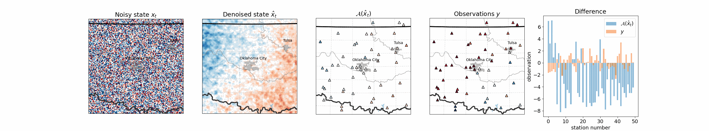

# Generative Data Assimilation of Sparse Weather Station Observations at Kilometer Scales

Peter Manshausen, Yair Cohen, Jaideep Pathak, Mike Pritchard, Piyush Garg, Morteza
Mardani, Karthik Kashinath, Simon Byrne, Noah Brenowitz

[https://arxiv.org/abs/2406.16947](https://arxiv.org/abs/2406.16947), in submission.



*Constructing an atmospheric state from noise, guided by observations. The noisy state
is denoised with the trained model, the denoised state evaluated with the observation
operator A, and from the difference with the observations supplied, the posterior score
is calculated. This score is used to update the noisy state, and the process is
repeated for N denoising steps.*

## Problem Overview

Data assimilation (DA) is the process of incorporating observational data into the full model
state. For numerical weather forecasting models, data assimilation is used to incorporate
weather station data into the initial model state. This can be a costly process, requiring
multiple evaluations of the computationally-expensive forecast to adjust the model state.

Score-based data assimilation (SDA), proposed by [Rozet and Louppe](https://arxiv.org/abs/2306.10574),
adapts the inference procedure of an unconditional generative diffusion model to
generate model states conditional on observations, without retraining the model. We
apply this to the context of a complex regional km-scale weather model, by training an
unconditional diffusion model on the output of the
[High Resolution Rapid Refresh (HRRR)](https://rapidrefresh.noaa.gov/hrrr/) reanalysis
product. Using SDA, we then incorporate sparse weather station data from the
[Integrated Surface Database (ISD)](https://www.ncei.noaa.gov/products/land-based-station/integrated-surface-database)
into the inference phase to produce maps of precipitation and surface winds.

Preliminary skill analysis shows the approach already outperforms a naive baseline of the
High-Resolution Rapid Refresh system itself. By incorporating observations from 40 weather
stations, 10% lower RMSEs on left-out stations are attained. Despite some lingering
imperfections such as insufficiently disperse ensemble DA estimates, we find the results
overall an encouraging proof of concept, and the first at km-scale. It is a ripe time to
explore extensions that combine increasingly ambitious regional state generators with an
increasing set of in situ, ground-based, and satellite remote sensing data streams.

## Project Structure

The project is organized into the following directories:

- `obs/`: Notebooks for ISD data processing and comparison to HRRR data
- `paper_figures/`: Scripts to reproduce the figures from the paper
- `sda/`: Code from the original SDA paper with minor adaptations
- `training/`: Scripts for training the model

## Getting Started

### Installation

Install required packages:

```bash
pip install -r requirements.txt
```

### Configuration Files

Machine-specific configuration files can be created in the `configs` directory,
defining the following variables:

```python
isd_path = "<path to isd data>"
path_to_pretrained = "<path to the pretrained model>"
path_to_model_state = "<path to model state from a training checkpoint>"
path_to_hrrr = "<path to Zarr file containing 2017 HRRR data>"
station_locations = "<path to station_locations_on_grid.nc generated by preprocess_isd.py>"
path_to_isp = "<path to ISD csv data>"
val_station_path = "<path to validation station locations generated by val_stations.py>"
```

See `configs/base.py` for an example configuration. Both `station_locations` and
`val_station_path` are checked into the code for simplicity.

### Data

#### High-Resolution Rapid Refresh (HRRR)

HRRR data is used for training and model evaluation. Data from 2018-2020 is used for training,
and 2017 is used for model evaluation. The model is trained on a 128x128 section of Oklahoma,
offset by (834, 353), using the following channels:

- 10 metre U wind component (`10u`)
- 10 metre V wind component (`10v`)
- Total precipitation (`tp`)

The training and inference scripts requires the data be converted into a Zarr format before
use, with one file per year of data. Example dimensions for the `2017.zarr` are shown below:

```bash
<xarray.Dataset> Size: 3GB
Dimensions:    (time: 8760, channel: 6, y: 128, x: 128)
Coordinates:
* channel    (channel) object 48B '10u' '10v' 'gust' 'tp' 'sp' 'refc'
* time       (time) datetime64[ns] 70kB 2017-01-01T01:00:00 ... 2018-01-01
Dimensions without coordinates: y, x
Data variables:
    HRRR       (time, channel, y, x) float32 3GB dask.array<chunksize=(1, 6, 128, 128), meta=np.ndarray>
    latitude   (y, x) float32 66kB dask.array<chunksize=(128, 128), meta=np.ndarray>
```

#### Integrated Surface Database (ISD)

ISD data is used for inference. ISD data can be obtained from the
[NOAA Data Search](https://www.ncei.noaa.gov/access/search/data-search/global-hourly?bbox=37.197,-99.640,33.738,-95.393&pageNum=1&startDate=2017-01-01T23:59:59&endDate=2022-01-01T00:00:00&dataTypes=AA1&dataTypes=WND)
and downloaded in CSV format.

To download multiple stations:

1. Click "+Select All > Proceed to Cart"
2. Enter email
3. Hit submit
4. You will receive an email with a download link

The data then needs to be gridded to the model grid and interpolated to a common time
frequency. This is done using [obs/preprocess_isd.py](obs/preprocess_isd.py).

### Training

Training scripts are in the `training` directory. Configuration is handled via the YAML files
in the `training/config` directory. For example:

```bash
cd training
python3 train_diffusions.py \
  --outdir /expts \
  --tick 100 \
  --config_file ./config/hrrr.yaml \
  --config_name unconditional_diffusion_downscaling_a2s_v3_1_oklahoma \
  --log_to_wandb True \
  --run_id 0
```

With `log_to_wandb=True`, you'll want to specify your `wandb` entity and project in
`train_diffusions.py`.

### Inference

For an example of inferencing on both subsampled HRRR and ISD data, run the
[example_inference.py](example_inference.py) script. It requires the ISD and HRRR data, as
well as the state file of the trained model.

For running a full inference of the model across an entire year, use the `full_inference.py`
script. The output filename is specified within that script.

The code to reproduce the paper figures is in the [paper_figures/](paper_figures/) directory.
To score the output of `full_inference.py`, use the `score_inference.py` script:

```bash
cd paper_figures
python score_inference.py figure_data/scores/<_my_regen_model_name>
python score_inference.py -g truth figure_data/scores/hrrr
```

The aggregated scoring metrics (Fig. 7) can be plotted by specifying the
`scoring_target` in `figure-07/fig_metrics.py`, and running it will generate PDFs of
the figures.
